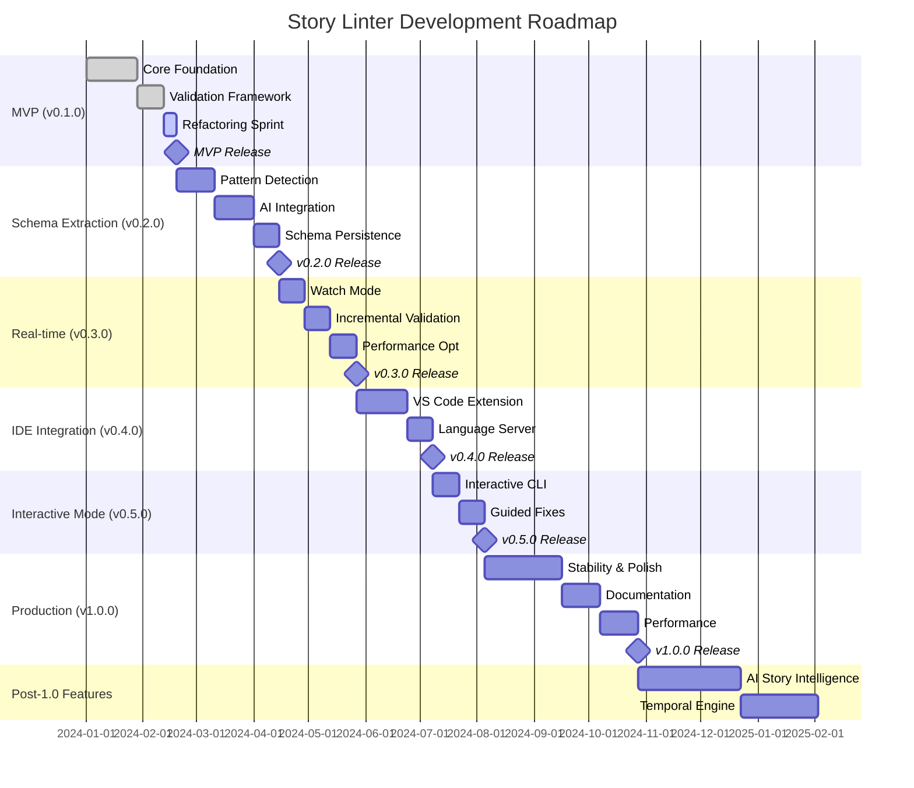
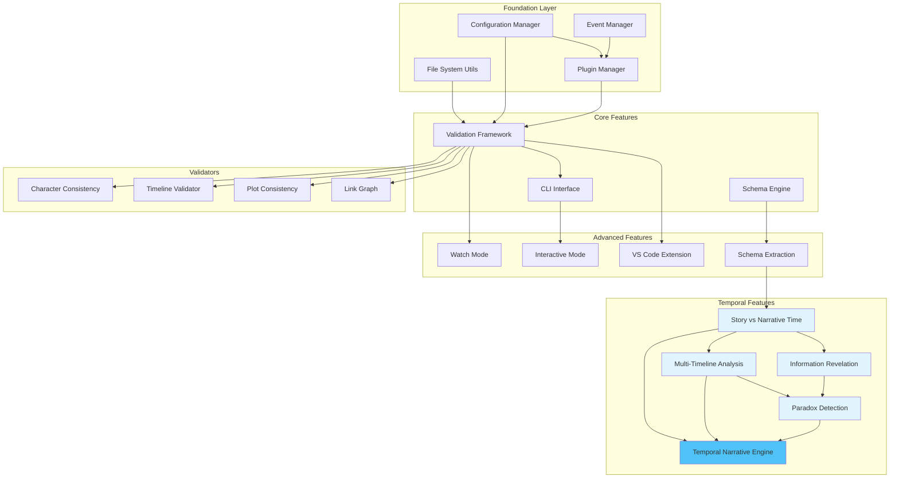
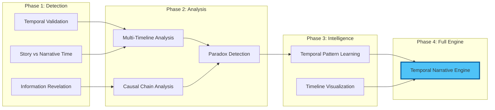

# Story Linter Development Roadmap

## 🎯 Vision

Story Linter aims to be the "TypeScript for stories" - providing automated validation to help writers maintain consistency across complex narratives through a modular, plugin-based architecture.

## 📍 Current Status (Week 6 of MVP)

- **Phase**: MVP Development
- **Status**: Feature-complete but requires refactoring
- **Blockers**: Major SOLID principle violations, lacking dependency injection
- **Next Steps**: 5-day refactoring sprint before MVP release

## 🚀 Development Timeline

## 🔗 Feature Dependencies

## 📊 Milestone Overview

### ✅ MVP (v0.1.0) - Weeks 1-8
**Status**: Feature-complete, needs refactoring

**Completed Features**:
- ✅ Basic file processing
- ✅ Configuration system (.story-linter.yml)
- ✅ Validation framework
- ✅ Character consistency validator
- ✅ Link graph validator
- ✅ CLI interface (basic)

**Refactoring Required** (5 days):
- 🔧 Apply dependency injection
- 🔧 Fix SOLID violations
- 🔧 Implement proper TDD
- 🔧 Remove tight coupling

### 🔮 Schema Extraction (v0.2.0) - Weeks 9-17
**The Game Changer**: Learn patterns from existing narratives

**Key Features**:
- AI-powered pattern detection
- Automatic rule generation
- Confidence scoring system
- Schema persistence

**Dependencies**: MVP completion, AI service integration

### ⚡ Real-time Validation (v0.3.0) - Weeks 18-24
**Developer Experience**: Watch mode and incremental validation

**Key Features**:
- File watch mode
- Incremental validation
- Smart caching
- Performance optimization

**Dependencies**: Stable validation framework

### 🛠️ IDE Integration (v0.4.0) - Weeks 25-31
**Where Writers Work**: Native VS Code integration

**Key Features**:
- VS Code extension
- Real-time error highlighting
- Quick fixes
- Hover information

**Dependencies**: Language Server Protocol implementation

### 🎮 Interactive Mode (v0.5.0) - Weeks 32-36
**Guided Experience**: Help writers fix issues

**Key Features**:
- Interactive CLI wizard
- Guided error resolution
- Learning from corrections
- Pattern suggestions

**Dependencies**: Mature validation engine

### 🏁 Production Ready (v1.0.0) - Weeks 37-48
**Enterprise Ready**: Stability, performance, documentation

**Key Features**:
- Comprehensive documentation
- Performance optimization
- Enterprise features
- Plugin ecosystem

**Success Criteria**:
- <100ms validation for average novel
- 99.9% crash-free sessions
- Complete API documentation
- 10+ community plugins

## 🚀 Post-1.0 Roadmap

### 🧠 AI Story Intelligence (v1.1.0)
- Deep narrative understanding
- Style analysis
- Theme tracking
- Emotion mapping

### ⏰ Temporal Narrative Engine (v1.2.0)
Building on our decomposed temporal features:

### 🌐 Cloud Services (v1.3.0)
- Team collaboration
- Cloud validation
- Version control integration
- Analytics dashboard

## 📈 Success Metrics

### Technical Metrics
- **Performance**: <100ms for 100k word novel
- **Accuracy**: <0.1% false positive rate
- **Reliability**: 99.9% uptime
- **Scalability**: Support 1M+ word epics

### Adoption Metrics
- **Users**: 10,000+ active writers
- **Plugins**: 50+ community plugins
- **Integrations**: Major writing tools
- **Community**: Active Discord/Forum

## 🛠️ Development Philosophy

1. **Test-Driven Development**: Write tests first, always
2. **SOLID Principles**: Clean, maintainable code
3. **Plugin Architecture**: Extensible by design
4. **Performance First**: Fast validation is critical
5. **User-Centric**: Built for writers, by writers

## 🤝 Contributing

See [CONTRIBUTING.md](./CONTRIBUTING.md) for guidelines on:
- Code standards
- Testing requirements
- Plugin development
- Feature proposals

## 📅 Release Cadence

- **Major versions**: Every 12-16 weeks
- **Minor versions**: Every 4-6 weeks
- **Patches**: As needed for critical fixes
- **Nightly builds**: Available for testing

---

*Last updated: February 2024*
*Next milestone: MVP Release (Week 8)*