# Feature Dependencies & Implementation Order

## Dependency Graph

```mermaid
graph TD
    %% Core Foundation
    CONFIG[Configuration System<br/>🔥🔥 2-3 weeks] --> FRAMEWORK[Validation Framework<br/>🔥🔥🔥 4-5 weeks]
    UTILS[File Utils<br/>🔥 1 week] --> FRAMEWORK
    
    %% Schema System
    FRAMEWORK --> SCHEMA[Schema Extraction<br/>🔥🔥🔥🔥 6-8 weeks]
    CONFIG --> SCHEMA
    
    %% CLI Layer
    FRAMEWORK --> CLI[CLI Interface<br/>🔥🔥 2-3 weeks]
    SCHEMA --> CLI
    CONFIG --> CLI
    
    %% Modes
    CLI --> WATCH[Watch Mode<br/>🔥🔥 2 weeks]
    FRAMEWORK --> WATCH
    
    SCHEMA --> INTERACTIVE[Interactive Mode<br/>🔥🔥🔥 3 weeks]
    CLI --> INTERACTIVE
    
    %% Validators (Plugins)
    FRAMEWORK --> CHAR[Character Validator<br/>🔥🔥 2 weeks]
    SCHEMA --> CHAR
    
    FRAMEWORK --> TIME[Timeline Validator<br/>🔥🔥 2 weeks]
    SCHEMA --> TIME
    
    FRAMEWORK --> PLOT[Plot Thread Tracker<br/>🔥🔥🔥 3 weeks]
    SCHEMA --> PLOT
    
    %% Advanced Features
    FRAMEWORK --> VSCODE[VS Code Extension<br/>🔥🔥🔥 4 weeks]
    CLI --> VSCODE
    WATCH --> VSCODE
    
    SCHEMA --> AI[AI Integration<br/>🔥🔥🔥🔥🔥 8-10 weeks]
    FRAMEWORK --> AI
    
    SCHEMA --> VIZ[Story Visualization<br/>🔥🔥🔥🔥 6 weeks]
    FRAMEWORK --> VIZ
    
    %% Styling
    classDef foundation fill:#e1f5fe,stroke:#01579b,stroke-width:3px
    classDef core fill:#f3e5f5,stroke:#4a148c,stroke-width:3px
    classDef plugin fill:#e8f5e9,stroke:#1b5e20,stroke-width:2px
    classDef advanced fill:#fff3e0,stroke:#e65100,stroke-width:2px
    
    class CONFIG,UTILS,FRAMEWORK foundation
    class SCHEMA,CLI,WATCH,INTERACTIVE core
    class CHAR,TIME,PLOT plugin
    class VSCODE,AI,VIZ advanced
```



## Implementation Phases

### Phase 1: Foundation (3-4 weeks)
Build the core infrastructure that everything depends on.

| Feature | Duration | Team Size | Priority |
|---------|----------|-----------|----------|
| File Utils | 1 week | 1 dev | Critical |
| Configuration System | 2-3 weeks | 1 dev | Critical |

**Deliverables**: Basic file operations, config loading, testing setup

### Phase 2: Core Framework (4-5 weeks)
The heart of the validation system.

| Feature | Duration | Team Size | Priority |
|---------|----------|-----------|----------|
| Validation Framework | 4-5 weeks | 1-2 devs | Critical |

**Deliverables**: Plugin system, validation engine, base APIs

### Phase 3: Intelligence Layer (8-10 weeks)
Can be partially parallelized with CLI development.

| Feature | Duration | Team Size | Priority |
|---------|----------|-----------|----------|
| Schema Extraction | 6-8 weeks | 2 devs | Critical |
| CLI Interface | 2-3 weeks | 1 dev | Critical |

**Deliverables**: Pattern detection, learning system, basic CLI

### Phase 4: Enhanced Modes (5 weeks)
Improve user experience with advanced modes.

| Feature | Duration | Team Size | Priority |
|---------|----------|-----------|----------|
| Interactive Mode | 3 weeks | 1 dev | High |
| Watch Mode | 2 weeks | 1 dev | High |

**Deliverables**: Real-time validation, interactive schema building

### Phase 5: Initial Validators (4-6 weeks)
First set of validators to prove the system.

| Feature | Duration | Team Size | Priority |
|---------|----------|-----------|----------|
| Character Validator | 2 weeks | 1 dev | High |
| Timeline Validator | 2 weeks | 1 dev | Medium |
| Plot Thread Tracker | 3 weeks | 1 dev | Medium |

**Deliverables**: Working validators, validation examples

### Phase 6: IDE Integration (4 weeks)
Bring validation into the writing environment.

| Feature | Duration | Team Size | Priority |
|---------|----------|-----------|----------|
| VS Code Extension | 4 weeks | 1-2 devs | Medium |

**Deliverables**: Real-time validation in VS Code

### Phase 7: Advanced Features (14-16 weeks)
Future enhancements that build on the solid foundation.

| Feature | Duration | Team Size | Priority |
|---------|----------|-----------|----------|
| Story Visualization | 6 weeks | 2 devs | Low |
| AI Integration | 8-10 weeks | 2-3 devs | Low |

**Deliverables**: Visual story maps, AI-powered suggestions

## Critical Path

The minimum viable product (MVP) path:

```
File Utils (1w) → Config System (2w) → Validation Framework (4w) → 
Schema Extraction (6w) + CLI Interface (2w) → Character Validator (2w)

Total MVP Timeline: ~15-17 weeks (1 developer)
Parallel MVP Timeline: ~11-13 weeks (2 developers)
```

## Resource Allocation

### Single Developer Approach (Sequential)
- **Timeline**: 35-40 weeks for all features
- **Pros**: Consistent vision, lower coordination
- **Cons**: Slower delivery, single point of failure

### Two Developer Approach (Parallel)
- **Timeline**: 20-25 weeks for all features
- **Developer 1**: Foundation → Framework → Schema Extraction → AI
- **Developer 2**: CLI → Validators → VS Code → Visualization
- **Pros**: Faster delivery, specialization
- **Cons**: Coordination overhead

### Three Developer Approach (Optimal)
- **Timeline**: 15-18 weeks for all features
- **Developer 1**: Core systems (Framework, Schema)
- **Developer 2**: User interfaces (CLI, Interactive, VS Code)
- **Developer 3**: Validators and advanced features
- **Pros**: Parallel development, fastest delivery
- **Cons**: Higher coordination, consistency challenges

## Risk Dependencies

### High-Risk Dependencies
1. **Schema Extraction → Everything**: If pattern detection doesn't work well, entire system suffers
2. **Framework Performance**: Slow framework makes everything slow
3. **Configuration Complexity**: Over-complex config hurts adoption

### Mitigation Strategies
1. **Prototype Schema Extraction Early**: Build proof-of-concept in week 1
2. **Performance Budget**: Set clear performance targets
3. **User Testing**: Get feedback on config design early

## Technology Dependencies

### External Libraries
- **Critical**: unified, remark, commander.js
- **Important**: inquirer, ora, chalk
- **Optional**: ml.js, three.js (for visualization)

### Development Tools
- **Required**: TypeScript, Node.js 16+, npm/yarn
- **Testing**: Vitest, Playwright (for CLI tests)
- **Build**: ESBuild, Rollup

## Feature Toggles

Enable gradual rollout and testing:

```yaml
features:
  schemaExtraction: true
  interactiveMode: true
  aiIntegration: false  # Experimental
  visualization: false  # Beta
  cloudSync: false      # Future
```

## Success Metrics by Phase

### Phase 1-2 (Foundation)
- All tests passing
- < 100ms config load time
- Plugin hello world working

### Phase 3-4 (Core Features)
- 85%+ pattern detection accuracy
- < 500ms CLI response time
- 90%+ code coverage

### Phase 5-6 (Validators & IDE)
- < 10s full novel validation
- < 50ms VS Code response
- 5+ example projects

### Phase 7 (Advanced)
- 60fps visualization
- < 2s AI suggestions
- 95%+ user satisfaction