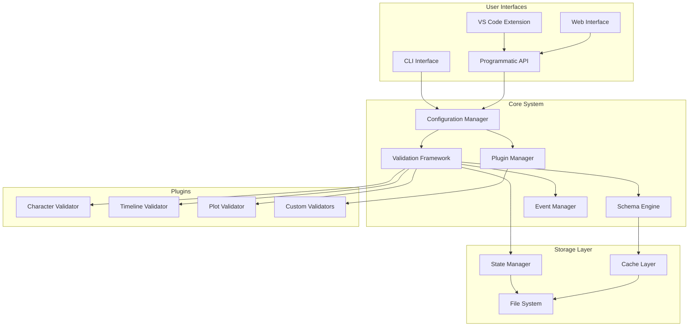

# Story Linter Architecture

## Overview

Story Linter is designed as a modular, extensible narrative validation framework. The architecture prioritizes flexibility, performance, and ease of use while maintaining a clean separation of concerns.

## Design Principles

1. **Plugin-Based Extensibility**: Core functionality with pluggable validators
2. **Performance First**: Incremental validation, smart caching, parallel processing
3. **Developer Experience**: Simple API, clear abstractions, TypeScript-first
4. **Progressive Enhancement**: Start simple, add complexity as needed
5. **Platform Agnostic**: Works in CLI, editors, CI/CD, web

## System Architecture



## Architecture Documentation

### Core Components
- [Configuration Manager](./core-components/configuration-manager.md) - Central configuration handling
- [Validation Framework](./core-components/validation-framework.md) - Core validation engine
- [Schema Engine](./core-components/schema-engine.md) - Pattern extraction and learning
- [Plugin Manager](./core-components/plugin-manager.md) - Plugin loading and lifecycle
- [Event Manager](./core-components/event-manager.md) - System-wide event handling

### Data Flow
- [Validation Flow](./data-flow/validation-flow.md) - How validation works
- [Schema Extraction Flow](./data-flow/schema-extraction-flow.md) - Pattern learning process

### Plugin Architecture
- [Plugin Interface](./plugin-architecture/plugin-interface.md) - How to create plugins
- [Plugin Loading](./plugin-architecture/plugin-loading.md) - Plugin discovery and initialization

### Performance Strategies
- [Incremental Validation](./performance-strategies/incremental-validation.md) - Validate only what changed
- [Parallel Processing](./performance-strategies/parallel-processing.md) - Multi-core utilization
- [Smart Caching](./performance-strategies/smart-caching.md) - Intelligent result caching

### Error Handling
- [Error Hierarchy](./error-handling/error-hierarchy.md) - Structured error types
- [Error Recovery](./error-handling/error-recovery.md) - Graceful failure handling

### Security Considerations
- [Plugin Sandboxing](./security/plugin-sandboxing.md) - Isolating plugin execution
- [Input Validation](./security/input-validation.md) - Preventing malicious input
- [Schema Security](./security/schema-security.md) - Protecting narrative patterns

### Extensibility Points
- [Custom Validators](./extensibility/custom-validators.md) - Adding new validators
- [Schema Patterns](./extensibility/schema-patterns.md) - Custom pattern extraction
- [Output Formatters](./extensibility/output-formatters.md) - Custom result formatting
- [Storage Backends](./extensibility/storage-backends.md) - Alternative storage

### Testing Strategy
- [Unit Testing](./testing/unit-testing.md) - Component isolation
- [Integration Testing](./testing/integration-testing.md) - Component interaction
- [End-to-End Testing](./testing/end-to-end-testing.md) - Full workflows
- [Plugin Testing](./testing/plugin-testing.md) - Testing plugins

### Deployment Architecture
- [NPM Packages](./deployment/npm-packages.md) - Package structure
- [Docker Support](./deployment/docker-support.md) - Container deployment
- [CI/CD Integration](./deployment/ci-cd-integration.md) - Automated workflows

### Future Considerations
- [Web Assembly](./future/web-assembly.md) - Performance optimization
- [Language Server Protocol](./future/language-server-protocol.md) - Editor integration
- [Cloud Services](./future/cloud-services.md) - SaaS deployment
- [Machine Learning](./future/machine-learning.md) - AI integration

## Directory Structure

```
story-linter/
├── packages/
│   ├── core/                    # Core functionality
│   │   ├── src/
│   │   ├── tests/
│   │   └── package.json
│   ├── cli/                     # CLI interface
│   │   ├── src/
│   │   ├── tests/
│   │   └── package.json
│   ├── validators/              # Built-in validators
│   │   ├── character/
│   │   ├── timeline/
│   │   ├── plot/
│   │   └── package.json
│   ├── schema-extraction/       # Schema engine
│   │   ├── src/
│   │   ├── tests/
│   │   └── package.json
│   └── vscode-extension/        # VS Code integration
│       ├── src/
│       ├── tests/
│       └── package.json
├── examples/                    # Example projects
│   ├── gitscrolls/
│   ├── fantasy-series/
│   └── screenplay/
├── docs/                        # Documentation
├── scripts/                     # Build scripts
├── .github/                     # CI/CD
├── package.json                 # Root package
├── tsconfig.json               # TypeScript config
└── lerna.json                  # Monorepo config
```

