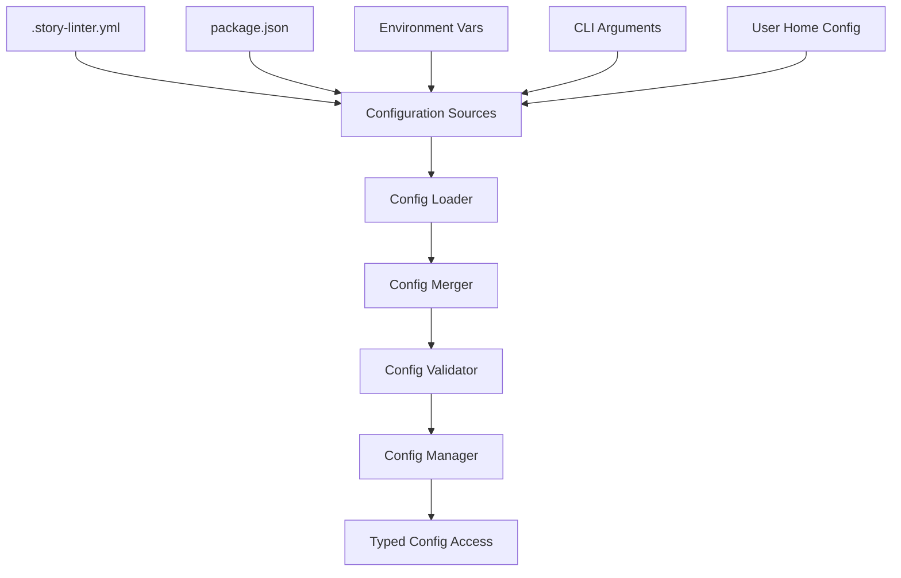

# Configuration Manager

## Purpose

The Configuration Manager is the central hub for all configuration in Story Linter. It handles loading, merging, validating, and providing typed access to configuration from multiple sources.

## Responsibilities

1. **Load and merge configuration files** from multiple sources
2. **Validate configuration schema** using Zod
3. **Provide typed configuration access** throughout the system
4. **Handle environment variables** and runtime overrides
5. **Support configuration inheritance** and extension

## Architecture



## Key Files

```
src/core/configuration/
├── config-manager.ts      # Main configuration manager
├── config-loader.ts       # File loading logic
├── config-merger.ts       # Configuration merging
├── config-validator.ts    # Schema validation
├── config-schema.ts       # Zod schemas
├── defaults.ts           # Default configuration
└── types.ts              # TypeScript types
```

## Implementation

### Configuration Manager

```typescript
export class ConfigurationManager {
  private config: StoryLinterConfig;
  private schema: z.ZodSchema<StoryLinterConfig>;
  private sources: ConfigSource[];
  
  constructor(options?: ConfigOptions) {
    this.schema = configSchema;
    this.sources = this.initializeSources(options);
  }
  
  async load(): Promise<void> {
    // Load from all sources
    const configs = await Promise.all(
      this.sources.map(source => source.load())
    );
    
    // Merge configurations
    const merged = this.merger.merge(configs);
    
    // Validate final config
    this.config = this.validator.validate(merged, this.schema);
  }
  
  get<T extends keyof StoryLinterConfig>(
    key: T
  ): StoryLinterConfig[T] {
    return this.config[key];
  }
  
  getPlugin<T>(pluginName: string): T {
    return this.config.plugins[pluginName] as T;
  }
}
```

### Configuration Schema

```typescript
import { z } from 'zod';

export const configSchema = z.object({
  // Project settings
  project: z.object({
    name: z.string().optional(),
    root: z.string().default('.'),
    include: z.array(z.string()).default(['**/*.md']),
    exclude: z.array(z.string()).default(['node_modules/**'])
  }),
  
  // Validation settings
  validation: z.object({
    severity: z.enum(['error', 'warning', 'info']).default('error'),
    failOn: z.enum(['error', 'warning', 'none']).default('error'),
    parallel: z.boolean().default(true),
    cache: z.boolean().default(true)
  }),
  
  // Plugin configuration
  plugins: z.record(z.string(), z.any()).default({}),
  
  // Output settings
  output: z.object({
    format: z.enum(['pretty', 'json', 'junit', 'github']).default('pretty'),
    file: z.string().optional(),
    verbose: z.boolean().default(false)
  }),
  
  // Schema settings
  schema: z.object({
    path: z.string().default('.narrative-schema.json'),
    autoExtract: z.boolean().default(false),
    confidence: z.number().min(0).max(1).default(0.8)
  })
});
```

### Configuration Sources

```typescript
interface ConfigSource {
  priority: number;
  load(): Promise<Partial<StoryLinterConfig>>;
}

class FileConfigSource implements ConfigSource {
  priority = 10;
  
  constructor(private path: string) {}
  
  async load(): Promise<Partial<StoryLinterConfig>> {
    if (!await fs.exists(this.path)) {
      return {};
    }
    
    const content = await fs.readFile(this.path, 'utf-8');
    return this.parse(content);
  }
  
  private parse(content: string): Partial<StoryLinterConfig> {
    if (this.path.endsWith('.yml') || this.path.endsWith('.yaml')) {
      return yaml.parse(content);
    }
    if (this.path.endsWith('.json')) {
      return JSON.parse(content);
    }
    throw new Error(`Unsupported config format: ${this.path}`);
  }
}

class EnvironmentConfigSource implements ConfigSource {
  priority = 20;
  
  async load(): Promise<Partial<StoryLinterConfig>> {
    const config: any = {};
    
    // Map environment variables to config
    if (process.env.STORY_LINTER_FORMAT) {
      config.output = { format: process.env.STORY_LINTER_FORMAT };
    }
    
    return config;
  }
}
```

### Configuration Merger

```typescript
export class ConfigMerger {
  merge(configs: ConfigWithPriority[]): StoryLinterConfig {
    // Sort by priority (higher number = higher priority)
    const sorted = configs.sort((a, b) => a.priority - b.priority);
    
    // Deep merge configurations
    return sorted.reduce((merged, config) => {
      return deepMerge(merged, config.value);
    }, getDefaultConfig());
  }
  
  private deepMerge(target: any, source: any): any {
    if (isObject(target) && isObject(source)) {
      for (const key in source) {
        if (isObject(source[key])) {
          if (!target[key]) target[key] = {};
          this.deepMerge(target[key], source[key]);
        } else {
          target[key] = source[key];
        }
      }
    }
    return target;
  }
}
```

## Configuration Loading Order

1. **Default configuration** (built-in)
2. **Global configuration** (`~/.story-linter/config.yml`)
3. **Project configuration** (`.story-linter.yml`)
4. **Package.json** (`storyLinter` field)
5. **Environment variables** (`STORY_LINTER_*`)
6. **CLI arguments** (highest priority)

## Usage Examples

### Basic Usage

```typescript
const configManager = new ConfigurationManager();
await configManager.load();

// Get typed configuration
const format = configManager.get('output').format;
const plugins = configManager.get('plugins');
```

### Plugin Configuration

```yaml
# .story-linter.yml
plugins:
  character-consistency:
    enabled: true
    evolution:
      track: true
      strict: false
  
  timeline:
    enabled: true
    dateFormat: "YYYY-MM-DD"
```

### Environment Override

```bash
# Override output format
STORY_LINTER_FORMAT=json story-linter validate

# Override validation severity
STORY_LINTER_SEVERITY=warning story-linter validate
```

## Error Handling

```typescript
export class ConfigurationError extends StoryLinterError {
  constructor(
    message: string,
    public file?: string,
    public details?: z.ZodError
  ) {
    super(message, 'CONFIG_ERROR');
  }
}

// Usage
try {
  await configManager.load();
} catch (error) {
  if (error instanceof ConfigurationError) {
    console.error(`Configuration error in ${error.file}:`);
    console.error(error.details?.format());
  }
}
```

## Best Practices

1. **Always validate configuration** against schema
2. **Provide sensible defaults** for all settings
3. **Support multiple formats** (YAML, JSON)
4. **Clear error messages** for invalid config
5. **Type safety** throughout the system
6. **Configuration inheritance** for monorepos
7. **Hot reload** support for development

## Future Enhancements

1. **Remote configuration** loading
2. **Configuration migration** tools
3. **Interactive configuration** wizard
4. **Configuration validation** CLI command
5. **Configuration inheritance** improvements
6. **Plugin configuration** discovery