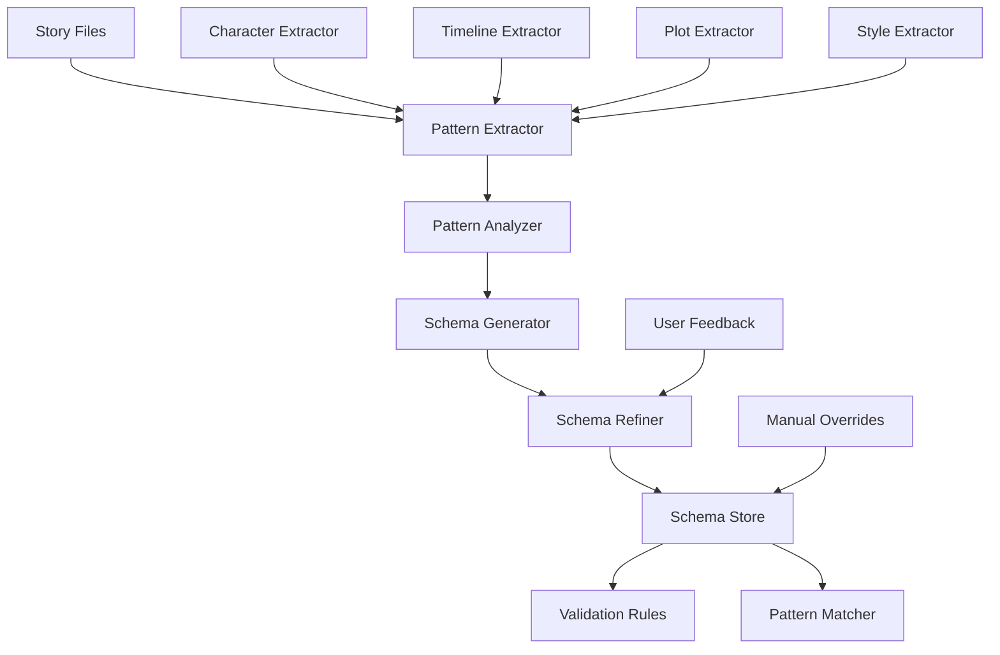

# Schema Engine

## Purpose

The Schema Engine is responsible for automatically extracting narrative patterns from existing content, learning story structure, and providing intelligent validation based on detected patterns. It enables Story Linter to adapt to each project's unique narrative style.

## Responsibilities

1. **Pattern extraction** from narrative content
2. **Schema generation** and refinement
3. **Confidence scoring** for detected patterns
4. **Schema evolution** over time
5. **Pattern matching** during validation
6. **Schema persistence** and versioning

## Architecture



## Key Files

```
src/core/schema-engine/
├── schema-engine.ts          # Main engine
├── pattern-extractor.ts      # Pattern extraction
├── pattern-analyzer.ts       # Pattern analysis
├── schema-generator.ts       # Schema generation
├── schema-refiner.ts        # Schema refinement
├── confidence-scorer.ts     # Confidence calculation
├── schema-store.ts         # Persistence layer
└── extractors/
    ├── character-extractor.ts
    ├── timeline-extractor.ts
    ├── plot-extractor.ts
    └── style-extractor.ts
```

## Implementation

### Schema Engine Core

```typescript
export class SchemaEngine {
  private extractors: PatternExtractor[];
  private analyzer: PatternAnalyzer;
  private generator: SchemaGenerator;
  private refiner: SchemaRefiner;
  private store: SchemaStore;
  
  constructor(config: SchemaConfig) {
    this.extractors = this.initializeExtractors(config);
    this.analyzer = new PatternAnalyzer(config);
    this.generator = new SchemaGenerator(config);
    this.refiner = new SchemaRefiner(config);
    this.store = new SchemaStore(config.path);
  }
  
  async extract(files: string[]): Promise<NarrativeSchema> {
    // Extract patterns from files
    const patterns = await this.extractPatterns(files);
    
    // Analyze patterns
    const analyzed = await this.analyzer.analyze(patterns);
    
    // Generate schema
    const schema = await this.generator.generate(analyzed);
    
    // Refine with existing schema
    const refined = await this.refiner.refine(schema, this.store.load());
    
    // Save schema
    await this.store.save(refined);
    
    return refined;
  }
  
  async learn(feedback: ValidationFeedback): Promise<void> {
    const schema = await this.store.load();
    const updated = await this.refiner.applyFeedback(schema, feedback);
    await this.store.save(updated);
  }
}
```

### Pattern Extractor Interface

```typescript
export interface PatternExtractor {
  name: string;
  extract(content: string, metadata: FileMetadata): Promise<Pattern[]>;
}

export interface Pattern {
  type: string;
  value: any;
  confidence: number;
  location: Location;
  metadata?: Record<string, any>;
}
```

### Character Pattern Extractor

```typescript
export class CharacterExtractor implements PatternExtractor {
  name = 'character';
  
  async extract(content: string, metadata: FileMetadata): Promise<Pattern[]> {
    const patterns: Pattern[] = [];
    
    // Extract character names
    const names = await this.extractNames(content);
    for (const name of names) {
      patterns.push({
        type: 'character.name',
        value: name.value,
        confidence: name.confidence,
        location: name.location
      });
    }
    
    // Extract character descriptions
    const descriptions = await this.extractDescriptions(content);
    for (const desc of descriptions) {
      patterns.push({
        type: 'character.description',
        value: {
          character: desc.character,
          traits: desc.traits,
          appearance: desc.appearance
        },
        confidence: desc.confidence,
        location: desc.location
      });
    }
    
    // Extract relationships
    const relationships = await this.extractRelationships(content);
    for (const rel of relationships) {
      patterns.push({
        type: 'character.relationship',
        value: {
          source: rel.source,
          target: rel.target,
          type: rel.type
        },
        confidence: rel.confidence,
        location: rel.location
      });
    }
    
    return patterns;
  }
  
  private async extractNames(content: string): Promise<NamePattern[]> {
    // Use NLP to identify proper nouns that appear as characters
    const names: NamePattern[] = [];
    
    // Simple heuristic: capitalized words that appear multiple times
    const wordFrequency = new Map<string, number>();
    const words = content.match(/\b[A-Z][a-z]+\b/g) || [];
    
    for (const word of words) {
      wordFrequency.set(word, (wordFrequency.get(word) || 0) + 1);
    }
    
    // Consider words appearing 3+ times as potential character names
    for (const [word, count] of wordFrequency) {
      if (count >= 3) {
        names.push({
          value: word,
          confidence: Math.min(count / 10, 1),
          location: { file: '', line: 0, column: 0 }
        });
      }
    }
    
    return names;
  }
}
```

### Pattern Analyzer

```typescript
export class PatternAnalyzer {
  analyze(patterns: Pattern[]): AnalyzedPatterns {
    const grouped = this.groupPatterns(patterns);
    const scored = this.scorePatterns(grouped);
    const correlated = this.correlatePatterns(scored);
    
    return {
      patterns: correlated,
      statistics: this.calculateStatistics(correlated),
      confidence: this.calculateOverallConfidence(correlated)
    };
  }
  
  private groupPatterns(patterns: Pattern[]): GroupedPatterns {
    const groups = new Map<string, Pattern[]>();
    
    for (const pattern of patterns) {
      if (!groups.has(pattern.type)) {
        groups.set(pattern.type, []);
      }
      groups.get(pattern.type)!.push(pattern);
    }
    
    return groups;
  }
  
  private scorePatterns(grouped: GroupedPatterns): ScoredPatterns {
    const scored = new Map<string, ScoredPattern[]>();
    
    for (const [type, patterns] of grouped) {
      const scoredPatterns = patterns.map(pattern => ({
        ...pattern,
        score: this.calculatePatternScore(pattern, patterns)
      }));
      
      scored.set(type, scoredPatterns);
    }
    
    return scored;
  }
  
  private calculatePatternScore(
    pattern: Pattern,
    allPatterns: Pattern[]
  ): number {
    // Consider frequency, consistency, and confidence
    const frequency = allPatterns.filter(p => 
      JSON.stringify(p.value) === JSON.stringify(pattern.value)
    ).length / allPatterns.length;
    
    return pattern.confidence * frequency;
  }
}
```

### Schema Generator

```typescript
export class SchemaGenerator {
  generate(analyzed: AnalyzedPatterns): NarrativeSchema {
    const schema: NarrativeSchema = {
      version: '1.0.0',
      generated: new Date().toISOString(),
      confidence: analyzed.confidence,
      patterns: {}
    };
    
    // Generate character schema
    schema.patterns.characters = this.generateCharacterSchema(
      analyzed.patterns.get('character')
    );
    
    // Generate timeline schema
    schema.patterns.timeline = this.generateTimelineSchema(
      analyzed.patterns.get('timeline')
    );
    
    // Generate plot schema
    schema.patterns.plot = this.generatePlotSchema(
      analyzed.patterns.get('plot')
    );
    
    return schema;
  }
  
  private generateCharacterSchema(
    patterns?: ScoredPattern[]
  ): CharacterSchema {
    if (!patterns) return {};
    
    const characters: CharacterSchema = {};
    
    // Group patterns by character
    const byCharacter = new Map<string, ScoredPattern[]>();
    
    for (const pattern of patterns) {
      if (pattern.type === 'character.name') {
        const name = pattern.value as string;
        if (!byCharacter.has(name)) {
          byCharacter.set(name, []);
        }
      }
    }
    
    // Build character definitions
    for (const [name, charPatterns] of byCharacter) {
      characters[name] = {
        name,
        aliases: this.extractAliases(charPatterns),
        traits: this.extractTraits(charPatterns),
        relationships: this.extractRelationships(charPatterns),
        confidence: this.averageConfidence(charPatterns)
      };
    }
    
    return characters;
  }
}
```

### Schema Refiner

```typescript
export class SchemaRefiner {
  refine(
    newSchema: NarrativeSchema,
    existingSchema?: NarrativeSchema
  ): NarrativeSchema {
    if (!existingSchema) {
      return newSchema;
    }
    
    // Merge schemas with confidence weighting
    const refined: NarrativeSchema = {
      version: newSchema.version,
      generated: newSchema.generated,
      confidence: this.combineConfidence(
        newSchema.confidence,
        existingSchema.confidence
      ),
      patterns: {}
    };
    
    // Merge each pattern type
    for (const patternType of Object.keys(newSchema.patterns)) {
      refined.patterns[patternType] = this.mergePatterns(
        newSchema.patterns[patternType],
        existingSchema.patterns[patternType]
      );
    }
    
    return refined;
  }
  
  applyFeedback(
    schema: NarrativeSchema,
    feedback: ValidationFeedback
  ): NarrativeSchema {
    const updated = { ...schema };
    
    // Adjust confidence based on feedback
    if (feedback.type === 'false-positive') {
      // Reduce confidence for the pattern
      this.adjustPatternConfidence(
        updated,
        feedback.pattern,
        -0.1
      );
    } else if (feedback.type === 'false-negative') {
      // Add or strengthen the pattern
      this.addPattern(
        updated,
        feedback.pattern,
        0.8
      );
    }
    
    return updated;
  }
}
```

### Schema Store

```typescript
export class SchemaStore {
  constructor(private path: string) {}
  
  async load(): Promise<NarrativeSchema | undefined> {
    try {
      const content = await fs.readFile(this.path, 'utf-8');
      return JSON.parse(content);
    } catch (error) {
      return undefined;
    }
  }
  
  async save(schema: NarrativeSchema): Promise<void> {
    // Create backup
    await this.backup();
    
    // Save new schema
    await fs.writeFile(
      this.path,
      JSON.stringify(schema, null, 2)
    );
    
    // Save versioned copy
    await this.saveVersion(schema);
  }
  
  private async backup(): Promise<void> {
    const exists = await fs.exists(this.path);
    if (exists) {
      const backup = `${this.path}.backup`;
      await fs.copyFile(this.path, backup);
    }
  }
  
  private async saveVersion(schema: NarrativeSchema): Promise<void> {
    const versionDir = path.dirname(this.path) + '/.schema-versions';
    await fs.mkdir(versionDir, { recursive: true });
    
    const timestamp = new Date().toISOString().replace(/:/g, '-');
    const versionPath = `${versionDir}/schema-${timestamp}.json`;
    
    await fs.writeFile(
      versionPath,
      JSON.stringify(schema, null, 2)
    );
  }
}
```

## Schema Format

```typescript
interface NarrativeSchema {
  version: string;
  generated: string;
  confidence: number;
  patterns: {
    characters?: CharacterSchema;
    timeline?: TimelineSchema;
    plot?: PlotSchema;
    style?: StyleSchema;
  };
}

interface CharacterSchema {
  [name: string]: {
    name: string;
    aliases: string[];
    traits: {
      physical: string[];
      personality: string[];
      background: string[];
    };
    relationships: {
      [otherCharacter: string]: string;
    };
    confidence: number;
  };
}
```

## Usage Example

```typescript
// Extract schema from existing content
const engine = new SchemaEngine(config);
const schema = await engine.extract([
  'chapter-1.md',
  'chapter-2.md',
  'chapter-3.md'
]);

// Use schema for validation
const validator = new CharacterValidator(schema);
const issues = await validator.validate('chapter-4.md', content);

// Learn from feedback
await engine.learn({
  type: 'false-positive',
  pattern: {
    type: 'character.name',
    value: 'Smith' // Common word incorrectly identified as character
  }
});
```

## Best Practices

1. **Incremental learning**: Update schema as new content is added
2. **Confidence thresholds**: Only use high-confidence patterns
3. **Manual overrides**: Allow users to correct patterns
4. **Version control**: Track schema changes over time
5. **Privacy**: Don't extract sensitive information
6. **Performance**: Cache extracted patterns

## Future Enhancements

1. **Machine learning models** for better extraction
2. **Cross-project learning** from similar stories
3. **Interactive refinement** UI
4. **Pattern templates** for common genres
5. **Schema inheritance** for series
6. **Real-time extraction** during writing