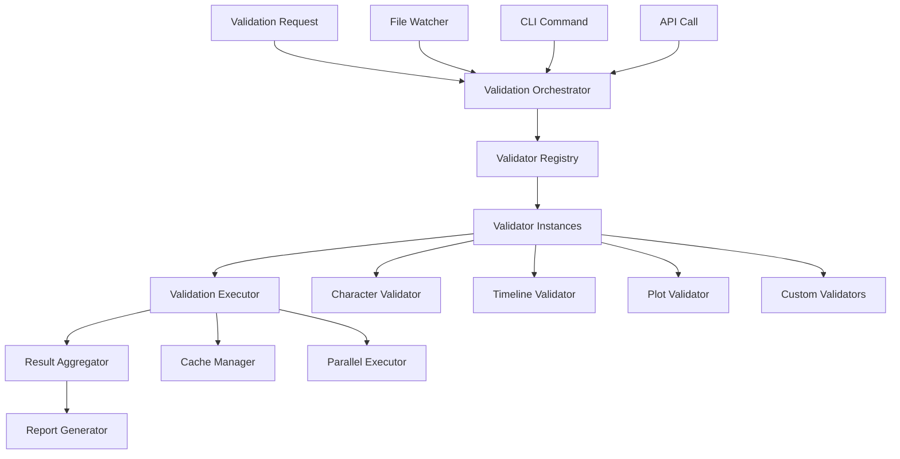

# Validation Framework

## Purpose

The Validation Framework is the core engine that orchestrates all validation operations in Story Linter. It manages validator lifecycle, coordinates validation runs, handles results aggregation, and provides hooks for extensibility.

## Responsibilities

1. **Validator registration and lifecycle management**
2. **Validation orchestration and scheduling**
3. **Result aggregation and reporting**
4. **Error handling and recovery**
5. **Performance optimization** (caching, parallel execution)
6. **Event emission** for validation lifecycle

## Architecture



## Key Files

```
src/core/validation/
├── validation-framework.ts    # Main framework
├── validator-registry.ts      # Validator management
├── validation-orchestrator.ts # Orchestration logic
├── validation-executor.ts     # Execution engine
├── result-aggregator.ts       # Result collection
├── cache-manager.ts          # Caching logic
├── parallel-executor.ts      # Parallel execution
└── types.ts                  # TypeScript types
```

## Implementation

### Validation Framework Core

```typescript
export class ValidationFramework {
  private registry: ValidatorRegistry;
  private orchestrator: ValidationOrchestrator;
  private executor: ValidationExecutor;
  private eventEmitter: EventEmitter;
  
  constructor(config: ValidationConfig) {
    this.registry = new ValidatorRegistry();
    this.orchestrator = new ValidationOrchestrator(config);
    this.executor = new ValidationExecutor(config);
    this.eventEmitter = new EventEmitter();
  }
  
  async validate(options: ValidationOptions): Promise<ValidationResult> {
    this.emit('validation:start', options);
    
    try {
      // Get files to validate
      const files = await this.orchestrator.getFiles(options);
      
      // Get active validators
      const validators = this.registry.getActiveValidators();
      
      // Execute validation
      const results = await this.executor.execute(files, validators);
      
      // Aggregate results
      const aggregated = this.aggregator.aggregate(results);
      
      this.emit('validation:complete', aggregated);
      return aggregated;
      
    } catch (error) {
      this.emit('validation:error', error);
      throw error;
    }
  }
  
  registerValidator(validator: Validator): void {
    this.registry.register(validator);
    this.emit('validator:registered', validator);
  }
}
```

### Validator Interface

```typescript
export interface Validator {
  name: string;
  version: string;
  description: string;
  
  // Lifecycle hooks
  initialize?(context: ValidationContext): Promise<void>;
  beforeValidation?(files: string[]): Promise<void>;
  validate(file: string, content: string, context: ValidationContext): Promise<ValidationIssue[]>;
  afterValidation?(results: ValidationResult[]): Promise<void>;
  cleanup?(): Promise<void>;
  
  // Configuration
  defaultConfig?: Record<string, any>;
  schema?: z.ZodSchema;
  
  // Capabilities
  supports: {
    fileTypes: string[];
    incremental?: boolean;
    parallel?: boolean;
    caching?: boolean;
  };
}
```

### Validation Executor

```typescript
export class ValidationExecutor {
  private cache: CacheManager;
  private parallelExecutor: ParallelExecutor;
  
  constructor(private config: ValidationConfig) {
    this.cache = new CacheManager(config.cache);
    this.parallelExecutor = new ParallelExecutor(config.parallel);
  }
  
  async execute(
    files: string[],
    validators: Validator[]
  ): Promise<ValidationResult[]> {
    const results: ValidationResult[] = [];
    
    // Initialize validators
    await this.initializeValidators(validators);
    
    // Execute validation
    if (this.config.parallel) {
      results.push(...await this.executeParallel(files, validators));
    } else {
      results.push(...await this.executeSequential(files, validators));
    }
    
    // Cleanup validators
    await this.cleanupValidators(validators);
    
    return results;
  }
  
  private async executeParallel(
    files: string[],
    validators: Validator[]
  ): Promise<ValidationResult[]> {
    const tasks = files.flatMap(file =>
      validators.map(validator => ({
        file,
        validator,
        task: () => this.validateFile(file, validator)
      }))
    );
    
    return this.parallelExecutor.execute(tasks);
  }
  
  private async validateFile(
    file: string,
    validator: Validator
  ): Promise<ValidationResult> {
    // Check cache
    const cached = await this.cache.get(file, validator.name);
    if (cached && !this.hasFileChanged(file, cached)) {
      return cached.result;
    }
    
    // Read file content
    const content = await fs.readFile(file, 'utf-8');
    
    // Create validation context
    const context = this.createContext(file);
    
    // Execute validation
    const issues = await validator.validate(file, content, context);
    
    // Create result
    const result: ValidationResult = {
      file,
      validator: validator.name,
      issues,
      timestamp: Date.now()
    };
    
    // Cache result
    await this.cache.set(file, validator.name, result);
    
    return result;
  }
}
```

### Result Aggregator

```typescript
export class ResultAggregator {
  aggregate(results: ValidationResult[]): AggregatedResult {
    const aggregated: AggregatedResult = {
      totalFiles: new Set(results.map(r => r.file)).size,
      totalIssues: 0,
      issuesBySeverity: {
        error: 0,
        warning: 0,
        info: 0
      },
      issuesByValidator: {},
      issuesByFile: {},
      results
    };
    
    for (const result of results) {
      aggregated.totalIssues += result.issues.length;
      
      // Group by severity
      for (const issue of result.issues) {
        aggregated.issuesBySeverity[issue.severity]++;
      }
      
      // Group by validator
      if (!aggregated.issuesByValidator[result.validator]) {
        aggregated.issuesByValidator[result.validator] = [];
      }
      aggregated.issuesByValidator[result.validator].push(...result.issues);
      
      // Group by file
      if (!aggregated.issuesByFile[result.file]) {
        aggregated.issuesByFile[result.file] = [];
      }
      aggregated.issuesByFile[result.file].push(...result.issues);
    }
    
    return aggregated;
  }
}
```

### Parallel Executor

```typescript
export class ParallelExecutor {
  private pool: WorkerPool;
  
  constructor(config: ParallelConfig) {
    this.pool = new WorkerPool({
      workers: config.workers || os.cpus().length,
      workerScript: path.join(__dirname, 'validation-worker.js')
    });
  }
  
  async execute<T>(tasks: Task<T>[]): Promise<T[]> {
    const queue = new TaskQueue(tasks);
    const results: T[] = [];
    
    // Process tasks in parallel
    await Promise.all(
      Array(this.pool.size).fill(0).map(async () => {
        while (!queue.isEmpty()) {
          const task = queue.next();
          if (task) {
            const result = await this.pool.execute(task);
            results.push(result);
          }
        }
      })
    );
    
    return results;
  }
}
```

## Validation Flow

1. **Request Reception**: CLI, API, or file watcher triggers validation
2. **File Discovery**: Find files matching include/exclude patterns
3. **Validator Selection**: Get enabled validators for file types
4. **Execution Planning**: Determine parallel vs sequential execution
5. **Validation Execution**: Run validators on files
6. **Result Collection**: Gather issues from all validators
7. **Result Aggregation**: Combine and summarize results
8. **Report Generation**: Format results for output

## Error Handling

```typescript
export class ValidationError extends StoryLinterError {
  constructor(
    message: string,
    public validator: string,
    public file: string,
    public cause?: Error
  ) {
    super(message, 'VALIDATION_ERROR');
  }
}

// Error recovery
async function validateWithRecovery(
  file: string,
  validator: Validator
): Promise<ValidationResult> {
  try {
    return await validator.validate(file, content, context);
  } catch (error) {
    // Log error
    logger.error(`Validator ${validator.name} failed on ${file}`, error);
    
    // Return error as issue
    return {
      file,
      validator: validator.name,
      issues: [{
        severity: 'error',
        message: `Validator error: ${error.message}`,
        line: 0,
        column: 0,
        code: 'VALIDATOR_ERROR'
      }]
    };
  }
}
```

## Performance Optimizations

1. **Incremental Validation**: Only validate changed files
2. **Parallel Processing**: Multi-core validation
3. **Smart Caching**: Cache validation results
4. **Lazy Loading**: Load validators on demand
5. **Streaming**: Process large files in chunks

## Event System

```typescript
// Available events
interface ValidationEvents {
  'validation:start': (options: ValidationOptions) => void;
  'validation:file:start': (file: string) => void;
  'validation:file:complete': (file: string, result: ValidationResult) => void;
  'validation:complete': (result: AggregatedResult) => void;
  'validation:error': (error: Error) => void;
  'validator:registered': (validator: Validator) => void;
  'cache:hit': (file: string, validator: string) => void;
  'cache:miss': (file: string, validator: string) => void;
}

// Usage
framework.on('validation:file:complete', (file, result) => {
  console.log(`Validated ${file}: ${result.issues.length} issues`);
});
```

## Best Practices

1. **Fail fast**: Stop on first critical error
2. **Graceful degradation**: Continue on validator errors
3. **Clear reporting**: Detailed issue descriptions
4. **Performance monitoring**: Track validation times
5. **Memory management**: Stream large files
6. **Extensibility**: Easy validator registration

## Future Enhancements

1. **Distributed validation**: Multi-machine processing
2. **Intelligent scheduling**: Priority-based validation
3. **Machine learning**: Predict validation hotspots
4. **Real-time validation**: As-you-type validation
5. **Validation profiles**: Pre-configured validator sets
6. **Custom reporters**: Pluggable report formats