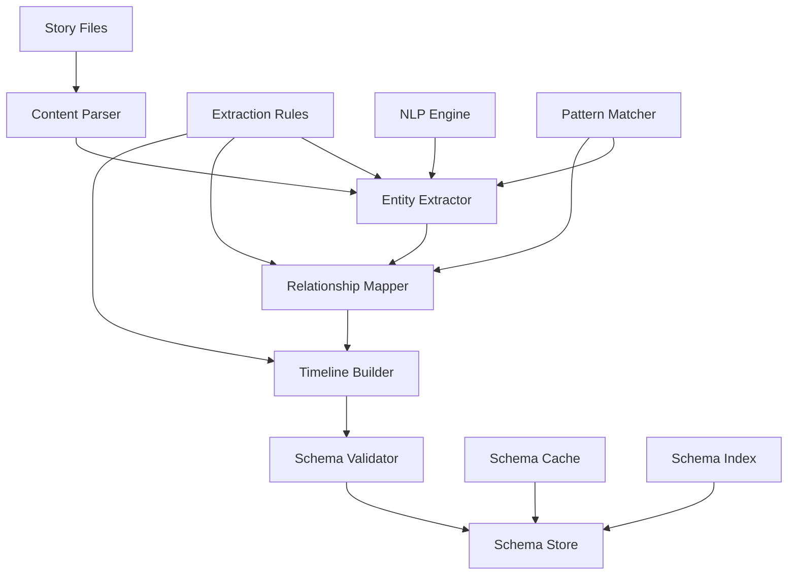

# Schema Extraction Data Flow

## Overview

This document details the data flow for extracting narrative schemas from story files. Schema extraction is a critical process that builds a structured understanding of the narrative elements, enabling sophisticated validation and analysis.

## High-Level Flow



## Extraction Pipeline Stages

### 1. Content Parsing

```typescript
interface ContentParsingFlow {
  async parse(file: StoryFile): Promise<ParsedContent> {
    // Read raw content
    const raw = await this.readFile(file.path)
    
    // Parse markdown structure
    const ast = this.markdownParser.parse(raw)
    
    // Extract structured elements
    const elements = this.extractElements(ast)
    
    // Segment content
    const segments = this.segmentContent(elements)
    
    return {
      file,
      ast,
      elements,
      segments,
      metadata: this.extractMetadata(ast)
    }
  }
  
  private extractElements(ast: AST): Elements {
    return {
      headings: this.extractHeadings(ast),
      paragraphs: this.extractParagraphs(ast),
      dialogue: this.extractDialogue(ast),
      descriptions: this.extractDescriptions(ast),
      annotations: this.extractAnnotations(ast)
    }
  }
}
```

### 2. Entity Extraction

```typescript
interface EntityExtractionFlow {
  async extractEntities(
    content: ParsedContent
  ): Promise<ExtractedEntities> {
    const entities: ExtractedEntities = {
      characters: [],
      locations: [],
      items: [],
      concepts: []
    }
    
    // Rule-based extraction
    const ruleBasedEntities = await this.applyExtractionRules(content)
    this.mergeEntities(entities, ruleBasedEntities)
    
    // NLP-based extraction
    const nlpEntities = await this.nlpExtraction(content)
    this.mergeEntities(entities, nlpEntities)
    
    // Pattern-based extraction
    const patternEntities = await this.patternExtraction(content)
    this.mergeEntities(entities, patternEntities)
    
    // Post-processing
    await this.resolveEntityReferences(entities)
    await this.normalizeEntities(entities)
    await this.validateEntities(entities)
    
    return entities
  }
}
```

### 3. Character Extraction Detail

```typescript
interface CharacterExtractionFlow {
  async extractCharacters(
    segments: ContentSegment[]
  ): Promise<Character[]> {
    const characters = new Map<string, Character>()
    
    for (const segment of segments) {
      // Direct mentions
      const mentions = await this.findCharacterMentions(segment)
      
      for (const mention of mentions) {
        const character = await this.processCharacterMention(
          mention,
          segment
        )
        
        // Merge with existing or create new
        if (characters.has(character.id)) {
          this.mergeCharacterData(
            characters.get(character.id)!,
            character
          )
        } else {
          characters.set(character.id, character)
        }
      }
      
      // Dialogue attribution
      const dialogue = await this.extractDialogue(segment)
      await this.attributeDialogue(dialogue, characters)
      
      // Action attribution
      const actions = await this.extractActions(segment)
      await this.attributeActions(actions, characters)
    }
    
    return Array.from(characters.values())
  }
  
  private async processCharacterMention(
    mention: Mention,
    context: ContentSegment
  ): Promise<Character> {
    return {
      id: this.generateCharacterId(mention),
      name: mention.text,
      aliases: await this.findAliases(mention, context),
      attributes: await this.extractAttributes(mention, context),
      firstMention: {
        file: context.file,
        line: mention.line,
        context: this.getContext(mention, context)
      },
      mentions: [mention]
    }
  }
}
```

### 4. Relationship Extraction

```typescript
interface RelationshipExtractionFlow {
  async extractRelationships(
    entities: ExtractedEntities,
    content: ParsedContent
  ): Promise<Relationship[]> {
    const relationships: Relationship[] = []
    
    // Explicit relationships
    const explicit = await this.extractExplicitRelationships(
      content,
      entities
    )
    relationships.push(...explicit)
    
    // Implicit relationships
    const implicit = await this.inferImplicitRelationships(
      content,
      entities
    )
    relationships.push(...implicit)
    
    // Contextual relationships
    const contextual = await this.extractContextualRelationships(
      content,
      entities
    )
    relationships.push(...contextual)
    
    // Deduplicate and validate
    return this.processRelationships(relationships)
  }
  
  private async extractExplicitRelationships(
    content: ParsedContent,
    entities: ExtractedEntities
  ): Promise<Relationship[]> {
    const relationships: Relationship[] = []
    const patterns = this.getRelationshipPatterns()
    
    for (const segment of content.segments) {
      for (const pattern of patterns) {
        const matches = await this.matchPattern(
          pattern,
          segment.text
        )
        
        for (const match of matches) {
          const relationship = await this.buildRelationship(
            match,
            entities,
            segment
          )
          
          if (relationship) {
            relationships.push(relationship)
          }
        }
      }
    }
    
    return relationships
  }
}
```

### 5. Timeline Extraction

```typescript
interface TimelineExtractionFlow {
  async extractTimeline(
    content: ParsedContent,
    entities: ExtractedEntities
  ): Promise<Timeline> {
    const events: TimelineEvent[] = []
    
    // Extract temporal markers
    const markers = await this.extractTemporalMarkers(content)
    
    // Extract events
    for (const segment of content.segments) {
      const segmentEvents = await this.extractEvents(
        segment,
        markers,
        entities
      )
      events.push(...segmentEvents)
    }
    
    // Order events
    const ordered = await this.orderEvents(events)
    
    // Resolve relative times
    const resolved = await this.resolveRelativeTimes(ordered)
    
    // Build timeline
    return {
      events: resolved,
      epochs: this.identifyEpochs(resolved),
      branches: this.identifyBranches(resolved)
    }
  }
  
  private async extractEvents(
    segment: ContentSegment,
    markers: TemporalMarker[],
    entities: ExtractedEntities
  ): Promise<TimelineEvent[]> {
    const events: TimelineEvent[] = []
    
    // Find event indicators
    const indicators = await this.findEventIndicators(segment)
    
    for (const indicator of indicators) {
      const event: TimelineEvent = {
        id: this.generateEventId(indicator),
        description: indicator.text,
        participants: await this.identifyParticipants(
          indicator,
          entities
        ),
        location: await this.identifyLocation(
          indicator,
          entities
        ),
        time: await this.extractEventTime(
          indicator,
          markers
        ),
        type: this.classifyEvent(indicator),
        source: {
          file: segment.file,
          line: indicator.line
        }
      }
      
      events.push(event)
    }
    
    return events
  }
}
```

### 6. Schema Assembly

```typescript
interface SchemaAssemblyFlow {
  async assembleSchema(
    entities: ExtractedEntities,
    relationships: Relationship[],
    timeline: Timeline
  ): Promise<NarrativeSchema> {
    // Create base schema
    const schema: NarrativeSchema = {
      version: '1.0',
      metadata: {
        extractedAt: new Date(),
        files: this.getSourceFiles(entities)
      },
      entities: this.normalizeEntities(entities),
      relationships: this.buildRelationshipGraph(relationships),
      timeline: this.optimizeTimeline(timeline),
      indices: {}
    }
    
    // Build indices
    schema.indices = {
      characterIndex: this.buildCharacterIndex(schema),
      locationIndex: this.buildLocationIndex(schema),
      eventIndex: this.buildEventIndex(schema),
      relationshipIndex: this.buildRelationshipIndex(schema)
    }
    
    // Add cross-references
    await this.addCrossReferences(schema)
    
    // Validate schema
    await this.validateSchema(schema)
    
    return schema
  }
}
```

## Extraction Techniques

### Pattern-Based Extraction

```typescript
interface PatternExtractor {
  patterns: {
    character: RegExp[]
    location: RegExp[]
    time: RegExp[]
    relationship: RegExp[]
  }
  
  async extract(text: string): Promise<Extraction[]> {
    const extractions: Extraction[] = []
    
    for (const [type, patterns] of Object.entries(this.patterns)) {
      for (const pattern of patterns) {
        const matches = text.matchAll(pattern)
        
        for (const match of matches) {
          extractions.push({
            type,
            text: match[0],
            groups: match.groups,
            position: match.index!,
            confidence: this.calculateConfidence(match)
          })
        }
      }
    }
    
    return this.rankExtractions(extractions)
  }
}
```

### NLP-Based Extraction

```typescript
interface NLPExtractor {
  async extract(text: string): Promise<NLPExtraction[]> {
    // Tokenize
    const tokens = await this.tokenize(text)
    
    // Part-of-speech tagging
    const tagged = await this.posTag(tokens)
    
    // Named entity recognition
    const entities = await this.ner(tagged)
    
    // Dependency parsing
    const dependencies = await this.parseDependencies(tagged)
    
    // Coreference resolution
    const corefs = await this.resolveCorefs(entities, dependencies)
    
    return this.buildExtractions(entities, dependencies, corefs)
  }
}
```

### Rule-Based Extraction

```typescript
interface RuleBasedExtractor {
  rules: ExtractionRule[]
  
  async extract(
    content: ParsedContent
  ): Promise<RuleExtraction[]> {
    const extractions: RuleExtraction[] = []
    
    for (const rule of this.rules) {
      if (this.shouldApplyRule(rule, content)) {
        const matches = await this.applyRule(rule, content)
        
        for (const match of matches) {
          extractions.push({
            rule: rule.name,
            type: rule.extractionType,
            data: match,
            confidence: rule.confidence
          })
        }
      }
    }
    
    return extractions
  }
}
```

## Data Transformation

### Entity Normalization

```typescript
interface EntityNormalization {
  async normalize(entity: RawEntity): Promise<NormalizedEntity> {
    return {
      id: this.generateId(entity),
      canonicalName: await this.resolveCanonicalName(entity),
      type: this.classifyEntityType(entity),
      attributes: await this.normalizeAttributes(entity),
      mentions: this.consolidateMentions(entity),
      confidence: this.calculateConfidence(entity)
    }
  }
  
  private async resolveCanonicalName(
    entity: RawEntity
  ): Promise<string> {
    // Find most common form
    const nameForms = this.extractNameForms(entity)
    const frequencies = this.calculateFrequencies(nameForms)
    
    // Apply name resolution rules
    const resolved = await this.applyNameRules(
      nameForms,
      frequencies
    )
    
    return resolved || nameForms[0]
  }
}
```

### Relationship Graph Building

```typescript
interface GraphBuilder {
  async buildGraph(
    entities: NormalizedEntity[],
    relationships: Relationship[]
  ): Promise<RelationshipGraph> {
    const graph = new Graph<NormalizedEntity, Relationship>()
    
    // Add nodes
    for (const entity of entities) {
      graph.addNode(entity.id, entity)
    }
    
    // Add edges
    for (const rel of relationships) {
      graph.addEdge(
        rel.source,
        rel.target,
        rel
      )
    }
    
    // Calculate metrics
    const metrics = {
      density: graph.getDensity(),
      clustering: graph.getClusteringCoefficient(),
      centrality: graph.calculateCentrality()
    }
    
    return {
      graph,
      metrics,
      communities: await this.detectCommunities(graph),
      paths: await this.findImportantPaths(graph)
    }
  }
}
```

## Caching and Optimization

### Extraction Cache

```typescript
interface ExtractionCache {
  private cache: LRUCache<string, CachedExtraction>
  
  async get(
    content: string,
    extractor: string
  ): Promise<CachedExtraction | null> {
    const key = this.generateKey(content, extractor)
    const cached = this.cache.get(key)
    
    if (cached && !this.isExpired(cached)) {
      return cached
    }
    
    return null
  }
  
  async set(
    content: string,
    extractor: string,
    result: ExtractionResult
  ): Promise<void> {
    const key = this.generateKey(content, extractor)
    
    this.cache.set(key, {
      result,
      timestamp: Date.now(),
      hash: this.hash(content)
    })
  }
}
```

### Incremental Extraction

```typescript
interface IncrementalExtractor {
  async extractIncremental(
    files: FileChange[]
  ): Promise<SchemaUpdate> {
    const updates: SchemaUpdate = {
      added: {},
      modified: {},
      removed: {}
    }
    
    for (const change of files) {
      switch (change.type) {
        case 'added':
          updates.added[change.file] = await this.extractNew(
            change.file
          )
          break
          
        case 'modified':
          updates.modified[change.file] = await this.extractDiff(
            change.file,
            change.diff
          )
          break
          
        case 'deleted':
          updates.removed[change.file] = this.getExistingSchema(
            change.file
          )
          break
      }
    }
    
    return this.mergeUpdates(updates)
  }
}
```

## Quality Assurance

### Extraction Validation

```typescript
interface ExtractionValidator {
  async validate(
    extraction: ExtractionResult
  ): Promise<ValidationResult> {
    const issues: ValidationIssue[] = []
    
    // Check completeness
    issues.push(...await this.checkCompleteness(extraction))
    
    // Check consistency
    issues.push(...await this.checkConsistency(extraction))
    
    // Check plausibility
    issues.push(...await this.checkPlausibility(extraction))
    
    // Calculate confidence
    const confidence = this.calculateConfidence(
      extraction,
      issues
    )
    
    return {
      valid: issues.length === 0,
      issues,
      confidence,
      suggestions: this.generateSuggestions(issues)
    }
  }
}
```

### Conflict Resolution

```typescript
interface ConflictResolver {
  async resolve(
    conflicts: ExtractionConflict[]
  ): Promise<ResolvedExtractions> {
    const resolved: ResolvedExtractions = {
      entities: [],
      relationships: [],
      events: []
    }
    
    for (const conflict of conflicts) {
      const resolution = await this.resolveConflict(conflict)
      
      switch (resolution.type) {
        case 'merge':
          resolved[conflict.category].push(
            this.mergeExtractions(conflict.items)
          )
          break
          
        case 'choose':
          resolved[conflict.category].push(
            this.chooseBest(conflict.items)
          )
          break
          
        case 'split':
          resolved[conflict.category].push(
            ...this.splitExtractions(conflict.items)
          )
          break
      }
    }
    
    return resolved
  }
}
```

## Performance Monitoring

### Extraction Metrics

```typescript
interface ExtractionMetrics {
  // Performance metrics
  performance: {
    totalTime: number
    parsingTime: number
    extractionTime: number
    validationTime: number
    averageFileTime: number
  }
  
  // Quality metrics
  quality: {
    extractionRate: number
    confidenceScore: number
    validationScore: number
    conflictRate: number
  }
  
  // Coverage metrics
  coverage: {
    filesProcessed: number
    entitiesExtracted: number
    relationshipsFound: number
    eventsIdentified: number
  }
}

class MetricsCollector {
  collect(
    extraction: ExtractionResult
  ): ExtractionMetrics {
    return {
      performance: this.measurePerformance(extraction),
      quality: this.assessQuality(extraction),
      coverage: this.calculateCoverage(extraction)
    }
  }
}
```

## Error Recovery

### Extraction Error Handling

```typescript
interface ExtractionErrorHandler {
  async handle(
    error: ExtractionError
  ): Promise<ErrorRecovery> {
    switch (error.type) {
      case 'parsing':
        return this.handleParsingError(error)
        
      case 'extraction':
        return this.handleExtractionError(error)
        
      case 'validation':
        return this.handleValidationError(error)
        
      default:
        return this.handleUnknownError(error)
    }
  }
  
  private async handleExtractionError(
    error: ExtractionError
  ): Promise<ErrorRecovery> {
    // Try alternative extractors
    const alternatives = this.getAlternativeExtractors(
      error.extractor
    )
    
    for (const alt of alternatives) {
      try {
        const result = await alt.extract(error.content)
        
        return {
          recovered: true,
          result,
          strategy: 'alternative_extractor'
        }
      } catch (altError) {
        continue
      }
    }
    
    // Fallback to partial extraction
    return this.partialExtraction(error)
  }
}
```

## Future Enhancements

1. **Machine Learning Integration**
   - ML-based entity recognition
   - Relationship prediction
   - Event extraction models

2. **Multi-Language Support**
   - Language detection
   - Language-specific extractors
   - Cross-language entity linking

3. **Real-Time Extraction**
   - Stream processing
   - Live schema updates
   - Incremental indexing

4. **Collaborative Extraction**
   - Human-in-the-loop validation
   - Crowdsourced annotations
   - Expert rule contributions