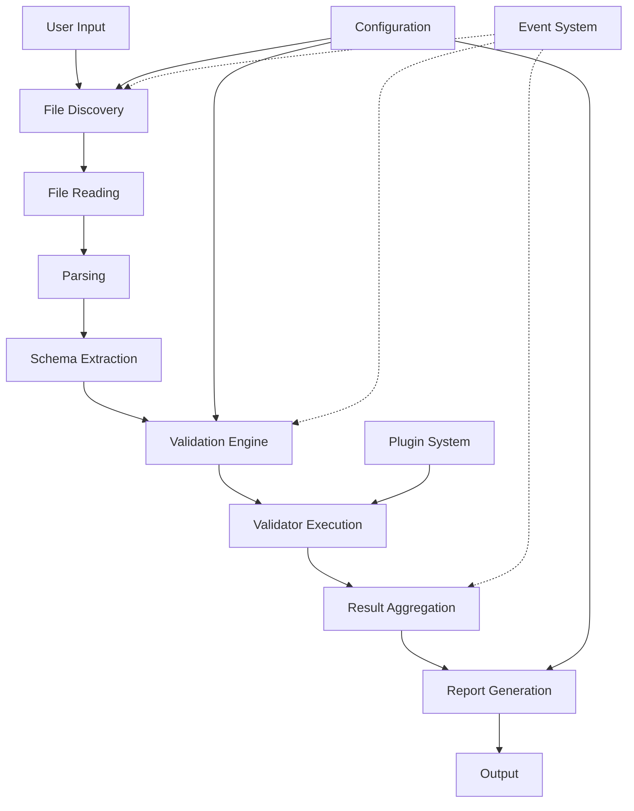

# Validation Data Flow

## Overview

This document describes the complete data flow through the Story Linter validation system, from initial file discovery to final report generation. Understanding this flow is crucial for debugging, optimization, and extending the validation framework.

## High-Level Flow



## Detailed Flow Stages

### 1. Input Processing

```typescript
interface ValidationInput {
  files?: string[]
  patterns?: string[]
  directories?: string[]
  options?: ValidationOptions
}

class InputProcessor {
  async process(input: ValidationInput): Promise<ProcessedInput> {
    // Normalize paths
    const normalizedPaths = this.normalizePaths(input)
    
    // Apply configuration
    const config = await this.loadConfiguration(normalizedPaths.root)
    
    // Merge options
    const options = this.mergeOptions(
      config.validation,
      input.options
    )
    
    return {
      paths: normalizedPaths,
      config,
      options
    }
  }
}
```

### 2. File Discovery

```typescript
interface FileDiscoveryFlow {
  // Input
  patterns: string[]
  excludePatterns: string[]
  baseDirectory: string
  
  // Processing
  async discover(): Promise<DiscoveredFile[]> {
    const candidates = await this.glob(this.patterns)
    const filtered = this.applyExclusions(candidates)
    const validated = await this.validateFiles(filtered)
    
    return validated.map(file => ({
      path: file,
      relativePath: this.getRelativePath(file),
      stats: this.getFileStats(file),
      type: this.detectFileType(file)
    }))
  }
}
```

### 3. File Reading and Parsing

```typescript
interface FileProcessingFlow {
  async processFile(file: DiscoveredFile): Promise<ParsedFile> {
    // Emit event
    await this.events.emit('file:processing', { file })
    
    // Read content
    const content = await this.readFile(file.path)
    
    // Detect encoding
    const encoding = this.detectEncoding(content)
    
    // Parse based on file type
    const parser = this.getParser(file.type)
    const parsed = await parser.parse(content, {
      encoding,
      path: file.path
    })
    
    // Cache result
    this.cache.set(file.path, {
      content: parsed,
      hash: this.hash(content),
      timestamp: Date.now()
    })
    
    return {
      file,
      content: parsed,
      metadata: this.extractMetadata(parsed)
    }
  }
}
```

### 4. Schema Extraction Flow

```typescript
interface SchemaExtractionFlow {
  async extractSchemas(
    files: ParsedFile[]
  ): Promise<ExtractedSchemas> {
    const schemas: ExtractedSchemas = {
      characters: new Map(),
      locations: new Map(),
      timeline: [],
      relationships: new Graph(),
      themes: new Set()
    }
    
    for (const file of files) {
      // Extract entities
      const entities = await this.extractEntities(file)
      this.mergeEntities(schemas, entities)
      
      // Extract relationships
      const relationships = await this.extractRelationships(file)
      this.mergeRelationships(schemas, relationships)
      
      // Extract timeline
      const events = await this.extractEvents(file)
      this.mergeEvents(schemas, events)
    }
    
    // Post-process schemas
    await this.resolveReferences(schemas)
    await this.inferImplicitRelationships(schemas)
    
    return schemas
  }
}
```

### 5. Validation Execution Flow

```typescript
interface ValidationExecutionFlow {
  async validate(
    files: ParsedFile[],
    schemas: ExtractedSchemas
  ): Promise<ValidationResult[]> {
    const context = this.createValidationContext(files, schemas)
    const validators = await this.loadValidators()
    const results: ValidationResult[] = []
    
    // Pre-validation phase
    await this.events.emit('validation:started', {
      files: files.map(f => f.file.path),
      validators: validators.map(v => v.name)
    })
    
    // Execute validators
    for (const validator of validators) {
      if (this.shouldRunValidator(validator, context)) {
        const result = await this.executeValidator(
          validator,
          context
        )
        results.push(result)
        
        // Update context with results
        context.addResult(validator.name, result)
      }
    }
    
    // Post-validation phase
    await this.events.emit('validation:completed', {
      results,
      duration: context.getDuration()
    })
    
    return results
  }
}
```

### 6. Validator Execution Detail

```typescript
interface ValidatorExecution {
  async executeValidator(
    validator: Validator,
    context: ValidationContext
  ): Promise<ValidationResult> {
    const startTime = Date.now()
    const issues: ValidationIssue[] = []
    
    try {
      // Initialize validator
      await validator.initialize(context)
      
      // Run validation
      for (const file of context.files) {
        if (validator.shouldValidateFile(file)) {
          const fileIssues = await validator.validateFile(
            file,
            context
          )
          issues.push(...fileIssues)
        }
      }
      
      // Run cross-file validation if supported
      if (validator.validateCrossFile) {
        const crossFileIssues = await validator.validateCrossFile(
          context
        )
        issues.push(...crossFileIssues)
      }
      
      // Finalize validation
      await validator.finalize(context)
      
      return {
        validator: validator.name,
        status: 'success',
        issues,
        duration: Date.now() - startTime,
        metadata: validator.getMetadata()
      }
    } catch (error) {
      return {
        validator: validator.name,
        status: 'error',
        error: error as Error,
        issues,
        duration: Date.now() - startTime
      }
    }
  }
}
```

### 7. Result Aggregation Flow

```typescript
interface ResultAggregationFlow {
  async aggregate(
    results: ValidationResult[]
  ): Promise<AggregatedResults> {
    const aggregated: AggregatedResults = {
      totalIssues: 0,
      issuesByFile: new Map(),
      issuesBySeverity: new Map(),
      issuesByValidator: new Map(),
      summary: {
        errors: 0,
        warnings: 0,
        info: 0,
        hints: 0
      }
    }
    
    // Process each result
    for (const result of results) {
      this.processResult(result, aggregated)
    }
    
    // Calculate statistics
    aggregated.statistics = this.calculateStatistics(aggregated)
    
    // Apply filters
    aggregated.filtered = await this.applyFilters(
      aggregated,
      this.config.filters
    )
    
    // Sort and prioritize
    aggregated.prioritized = this.prioritizeIssues(
      aggregated.filtered
    )
    
    return aggregated
  }
}
```

### 8. Report Generation Flow

```typescript
interface ReportGenerationFlow {
  async generateReport(
    results: AggregatedResults,
    format: OutputFormat
  ): Promise<GeneratedReport> {
    // Select formatter
    const formatter = this.getFormatter(format)
    
    // Prepare report data
    const reportData = await this.prepareReportData(results)
    
    // Apply templates
    const templated = await this.applyTemplates(
      reportData,
      formatter.templates
    )
    
    // Format output
    const formatted = await formatter.format(templated)
    
    // Post-process
    const processed = await this.postProcess(formatted, {
      colorize: this.config.output.color,
      truncate: this.config.output.maxLength,
      highlight: this.config.output.highlight
    })
    
    return {
      content: processed,
      format,
      metadata: {
        generatedAt: new Date(),
        duration: results.statistics.totalDuration,
        issueCount: results.totalIssues
      }
    }
  }
}
```

## Data Transformation Pipeline

### File Content Transformation

```typescript
interface ContentTransformation {
  // Raw file content
  raw: string
  
  // Parsed structure
  parsed: {
    frontMatter?: any
    content: string
    structure: DocumentStructure
  }
  
  // Extracted elements
  extracted: {
    headings: Heading[]
    paragraphs: Paragraph[]
    lists: List[]
    codeBlocks: CodeBlock[]
    links: Link[]
    images: Image[]
  }
  
  // Semantic analysis
  semantic: {
    entities: Entity[]
    relationships: Relationship[]
    events: Event[]
    metadata: Metadata
  }
}
```

### Validation Context Evolution

```typescript
interface ContextEvolution {
  // Initial context
  initial: {
    files: string[]
    options: ValidationOptions
    config: Configuration
  }
  
  // After file processing
  processed: {
    parsedFiles: ParsedFile[]
    fileIndex: Map<string, ParsedFile>
    crossReferences: CrossReferenceMap
  }
  
  // After schema extraction
  withSchema: {
    schemas: ExtractedSchemas
    schemaIndex: SchemaIndex
    validationRules: ValidationRule[]
  }
  
  // During validation
  validating: {
    currentValidator: string
    currentFile?: string
    accumulatedIssues: ValidationIssue[]
    validatorState: Map<string, any>
  }
  
  // Final context
  final: {
    results: ValidationResult[]
    summary: ValidationSummary
    recommendations: Recommendation[]
  }
}
```

## Performance Considerations

### Streaming Processing

```typescript
class StreamingValidationFlow {
  async *validateStream(
    fileStream: AsyncIterable<string>
  ): AsyncGenerator<ValidationUpdate> {
    const buffer: ParsedFile[] = []
    const batchSize = 10
    
    for await (const file of fileStream) {
      // Process file
      const parsed = await this.processFile(file)
      buffer.push(parsed)
      
      // Yield progress update
      yield {
        type: 'progress',
        file,
        processed: true
      }
      
      // Process batch when full
      if (buffer.length >= batchSize) {
        const results = await this.validateBatch(buffer)
        
        yield {
          type: 'results',
          results
        }
        
        buffer.length = 0
      }
    }
    
    // Process remaining files
    if (buffer.length > 0) {
      const results = await this.validateBatch(buffer)
      
      yield {
        type: 'results',
        results
      }
    }
    
    yield {
      type: 'complete'
    }
  }
}
```

### Parallel Processing

```typescript
class ParallelValidationFlow {
  async validateParallel(
    files: string[],
    concurrency: number = 4
  ): Promise<ValidationResult[]> {
    const queue = new PQueue({ concurrency })
    const results: ValidationResult[] = []
    
    // Create tasks
    const tasks = files.map(file => 
      queue.add(async () => {
        const parsed = await this.processFile(file)
        const result = await this.validateFile(parsed)
        results.push(result)
        
        this.events.emit('file:validated', {
          file,
          result
        })
      })
    )
    
    // Wait for completion
    await Promise.all(tasks)
    
    return results
  }
}
```

## Error Handling Flow

### Error Propagation

```typescript
interface ErrorFlow {
  // File-level errors
  fileError: {
    file: string
    phase: 'read' | 'parse' | 'validate'
    error: Error
    recovery: RecoveryStrategy
  }
  
  // Validator errors
  validatorError: {
    validator: string
    file?: string
    error: Error
    partial?: ValidationResult
  }
  
  // System errors
  systemError: {
    component: string
    error: Error
    context: any
    fatal: boolean
  }
}

class ErrorHandler {
  async handle(error: ErrorFlow): Promise<ErrorResolution> {
    // Log error
    this.logger.error(error)
    
    // Attempt recovery
    const recovery = await this.attemptRecovery(error)
    
    if (recovery.success) {
      return {
        recovered: true,
        result: recovery.result
      }
    }
    
    // Determine if we can continue
    if (this.canContinue(error)) {
      return {
        recovered: false,
        continue: true,
        partial: recovery.partial
      }
    }
    
    // Fatal error
    throw new ValidationError(
      'Fatal validation error',
      error
    )
  }
}
```

## State Management

### Validation State

```typescript
interface ValidationState {
  // Global state
  global: {
    phase: ValidationPhase
    startTime: number
    filesProcessed: number
    totalFiles: number
    issues: ValidationIssue[]
  }
  
  // Per-file state
  files: Map<string, FileState>
  
  // Per-validator state
  validators: Map<string, ValidatorState>
  
  // Cache state
  cache: {
    hits: number
    misses: number
    size: number
  }
}

class StateManager {
  private state: ValidationState
  
  transition(
    from: ValidationPhase,
    to: ValidationPhase
  ): void {
    if (!this.isValidTransition(from, to)) {
      throw new Error(`Invalid transition: ${from} -> ${to}`)
    }
    
    this.state.global.phase = to
    this.events.emit('state:transition', { from, to })
  }
  
  updateFileState(
    file: string,
    update: Partial<FileState>
  ): void {
    const current = this.state.files.get(file) || {}
    this.state.files.set(file, { ...current, ...update })
  }
}
```

## Monitoring and Metrics

### Flow Metrics

```typescript
interface FlowMetrics {
  // Timing metrics
  timing: {
    total: number
    fileDiscovery: number
    parsing: number
    schemaExtraction: number
    validation: number
    reporting: number
  }
  
  // Throughput metrics
  throughput: {
    filesPerSecond: number
    issuesPerSecond: number
    bytesPerSecond: number
  }
  
  // Resource metrics
  resources: {
    memoryUsage: number
    cpuUsage: number
    diskIO: number
  }
  
  // Quality metrics
  quality: {
    cacheHitRate: number
    errorRate: number
    validatorEfficiency: Map<string, number>
  }
}

class MetricsCollector {
  collect(): FlowMetrics {
    return {
      timing: this.collectTimingMetrics(),
      throughput: this.calculateThroughput(),
      resources: this.measureResources(),
      quality: this.assessQuality()
    }
  }
}
```

## Future Enhancements

1. **Incremental Processing**
   - Only process changed files
   - Maintain validation state between runs
   - Smart dependency tracking

2. **Distributed Validation**
   - Split work across multiple processes
   - Network-based validation clusters
   - Cloud-based validation services

3. **Real-time Validation**
   - Validate as you type
   - Instant feedback
   - Progressive enhancement

4. **Machine Learning Integration**
   - Predictive issue detection
   - Smart issue prioritization
   - Automated fix suggestions