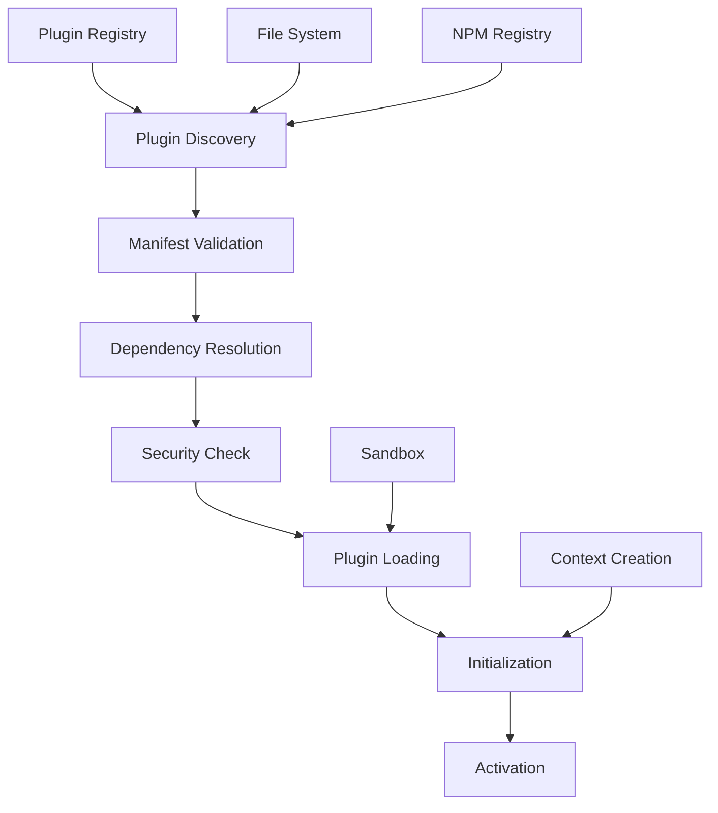

# Plugin Loading

## Overview

This document describes the plugin loading mechanism for the Story Linter, covering discovery, validation, dependency resolution, initialization, and runtime management of plugins.

## Loading Pipeline



## Plugin Discovery

### Discovery Sources

```typescript
interface PluginDiscovery {
  sources: PluginSource[]
  
  async discover(): Promise<DiscoveredPlugin[]> {
    const plugins: DiscoveredPlugin[] = []
    
    for (const source of this.sources) {
      const discovered = await source.discover()
      plugins.push(...discovered)
    }
    
    return this.deduplicatePlugins(plugins)
  }
}

interface PluginSource {
  type: 'local' | 'npm' | 'registry' | 'url'
  discover(): Promise<DiscoveredPlugin[]>
}
```

### Local Plugin Discovery

```typescript
class LocalPluginSource implements PluginSource {
  constructor(
    private paths: string[],
    private patterns: string[] = ['**/plugin.json']
  ) {}
  
  async discover(): Promise<DiscoveredPlugin[]> {
    const plugins: DiscoveredPlugin[] = []
    
    for (const basePath of this.paths) {
      // Search for plugin manifests
      const manifestPaths = await this.findManifests(
        basePath,
        this.patterns
      )
      
      for (const manifestPath of manifestPaths) {
        try {
          const plugin = await this.loadPluginInfo(manifestPath)
          plugins.push(plugin)
        } catch (error) {
          this.logger.warn(
            `Failed to load plugin at ${manifestPath}:`,
            error
          )
        }
      }
    }
    
    return plugins
  }
  
  private async loadPluginInfo(
    manifestPath: string
  ): Promise<DiscoveredPlugin> {
    const manifest = await this.readManifest(manifestPath)
    const pluginDir = path.dirname(manifestPath)
    
    return {
      manifest,
      location: {
        type: 'local',
        path: pluginDir
      },
      metadata: {
        discoveredAt: new Date(),
        source: 'local'
      }
    }
  }
}
```

### NPM Plugin Discovery

```typescript
class NPMPluginSource implements PluginSource {
  private readonly PLUGIN_PREFIX = '@story-linter/plugin-'
  
  async discover(): Promise<DiscoveredPlugin[]> {
    // Check installed packages
    const installed = await this.getInstalledPackages()
    
    // Filter plugin packages
    const pluginPackages = installed.filter(pkg =>
      pkg.name.startsWith(this.PLUGIN_PREFIX) ||
      pkg.keywords?.includes('story-linter-plugin')
    )
    
    // Load plugin information
    const plugins: DiscoveredPlugin[] = []
    
    for (const pkg of pluginPackages) {
      try {
        const plugin = await this.loadNPMPlugin(pkg)
        plugins.push(plugin)
      } catch (error) {
        this.logger.warn(
          `Failed to load NPM plugin ${pkg.name}:`,
          error
        )
      }
    }
    
    return plugins
  }
  
  private async loadNPMPlugin(
    pkg: NPMPackage
  ): Promise<DiscoveredPlugin> {
    const packagePath = require.resolve(
      `${pkg.name}/package.json`
    )
    const pluginDir = path.dirname(packagePath)
    const manifest = await this.loadManifestFromPackage(pkg)
    
    return {
      manifest,
      location: {
        type: 'npm',
        packageName: pkg.name,
        version: pkg.version,
        path: pluginDir
      },
      metadata: {
        discoveredAt: new Date(),
        source: 'npm',
        npmMetadata: {
          version: pkg.version,
          author: pkg.author,
          license: pkg.license
        }
      }
    }
  }
}
```

## Manifest Validation

### Schema Validation

```typescript
interface ManifestValidator {
  private schema: JSONSchema
  
  async validate(
    manifest: any
  ): Promise<ValidationResult<PluginManifest>> {
    // Structural validation
    const structural = await this.validateStructure(manifest)
    if (!structural.valid) {
      return structural
    }
    
    // Semantic validation
    const semantic = await this.validateSemantics(
      structural.data!
    )
    if (!semantic.valid) {
      return semantic
    }
    
    // Version compatibility
    const compatibility = await this.validateCompatibility(
      structural.data!
    )
    
    return compatibility
  }
  
  private async validateStructure(
    manifest: any
  ): Promise<ValidationResult<PluginManifest>> {
    const validator = new Ajv()
    const validate = validator.compile(this.schema)
    
    if (validate(manifest)) {
      return {
        valid: true,
        data: manifest as PluginManifest
      }
    }
    
    return {
      valid: false,
      errors: validate.errors?.map(e => ({
        path: e.instancePath,
        message: e.message || 'Validation error'
      }))
    }
  }
  
  private async validateSemantics(
    manifest: PluginManifest
  ): Promise<ValidationResult<PluginManifest>> {
    const errors: ValidationError[] = []
    
    // Validate plugin ID format
    if (!this.isValidPluginId(manifest.id)) {
      errors.push({
        path: '/id',
        message: 'Invalid plugin ID format'
      })
    }
    
    // Validate version format
    if (!semver.valid(manifest.version)) {
      errors.push({
        path: '/version',
        message: 'Invalid semantic version'
      })
    }
    
    // Validate main entry point
    if (!await this.fileExists(manifest.main)) {
      errors.push({
        path: '/main',
        message: 'Main entry point not found'
      })
    }
    
    return {
      valid: errors.length === 0,
      data: manifest,
      errors
    }
  }
}
```

### Compatibility Checking

```typescript
interface CompatibilityChecker {
  async check(
    manifest: PluginManifest
  ): Promise<CompatibilityResult> {
    const issues: CompatibilityIssue[] = []
    
    // Check Story Linter version
    if (manifest.engines?.storyLinter) {
      const required = manifest.engines.storyLinter
      const current = this.getStoryLinterVersion()
      
      if (!semver.satisfies(current, required)) {
        issues.push({
          type: 'version',
          severity: 'error',
          message: `Requires Story Linter ${required}, ` +
                  `but current version is ${current}`
        })
      }
    }
    
    // Check Node.js version
    if (manifest.engines?.node) {
      const required = manifest.engines.node
      const current = process.version
      
      if (!semver.satisfies(current, required)) {
        issues.push({
          type: 'runtime',
          severity: 'warning',
          message: `Requires Node.js ${required}, ` +
                  `but current version is ${current}`
        })
      }
    }
    
    // Check API compatibility
    const apiIssues = await this.checkAPICompatibility(manifest)
    issues.push(...apiIssues)
    
    return {
      compatible: !issues.some(i => i.severity === 'error'),
      issues
    }
  }
}
```

## Dependency Resolution

### Dependency Graph Building

```typescript
interface DependencyResolver {
  async resolve(
    plugins: DiscoveredPlugin[]
  ): Promise<ResolvedDependencies> {
    const graph = new DependencyGraph()
    
    // Build dependency graph
    for (const plugin of plugins) {
      graph.addNode(plugin.manifest.id, plugin)
      
      // Add dependencies
      for (const dep of plugin.manifest.dependencies || []) {
        graph.addDependency(
          plugin.manifest.id,
          dep.id,
          dep.version
        )
      }
    }
    
    // Check for cycles
    const cycles = graph.findCycles()
    if (cycles.length > 0) {
      throw new DependencyCycleError(cycles)
    }
    
    // Resolve versions
    const resolved = await this.resolveVersions(graph)
    
    // Generate load order
    const loadOrder = graph.topologicalSort()
    
    return {
      graph,
      resolved,
      loadOrder
    }
  }
}
```

### Version Resolution

```typescript
class VersionResolver {
  async resolveVersions(
    graph: DependencyGraph
  ): Promise<VersionResolution> {
    const resolution = new Map<string, string>()
    const conflicts: VersionConflict[] = []
    
    for (const [pluginId, requirements] of graph.getRequirements()) {
      try {
        const version = this.findBestVersion(
          pluginId,
          requirements
        )
        resolution.set(pluginId, version)
      } catch (error) {
        conflicts.push({
          plugin: pluginId,
          requirements,
          error: error as Error
        })
      }
    }
    
    if (conflicts.length > 0) {
      throw new VersionConflictError(conflicts)
    }
    
    return {
      versions: resolution,
      satisfied: true
    }
  }
  
  private findBestVersion(
    pluginId: string,
    requirements: VersionRequirement[]
  ): string {
    const available = this.getAvailableVersions(pluginId)
    
    // Find versions that satisfy all requirements
    const satisfying = available.filter(version =>
      requirements.every(req =>
        semver.satisfies(version, req.range)
      )
    )
    
    if (satisfying.length === 0) {
      throw new Error(
        `No version of ${pluginId} satisfies all requirements`
      )
    }
    
    // Return the highest satisfying version
    return semver.maxSatisfying(
      satisfying,
      '*'
    )!
  }
}
```

## Security Validation

### Permission Checking

```typescript
interface SecurityValidator {
  async validate(
    plugin: DiscoveredPlugin
  ): Promise<SecurityValidation> {
    const issues: SecurityIssue[] = []
    
    // Check requested permissions
    const permissions = plugin.manifest.permissions || []
    for (const permission of permissions) {
      const check = await this.checkPermission(permission)
      if (!check.allowed) {
        issues.push({
          type: 'permission',
          severity: check.severity,
          permission,
          reason: check.reason
        })
      }
    }
    
    // Scan for security risks
    const risks = await this.scanForRisks(plugin)
    issues.push(...risks)
    
    // Check signatures if enabled
    if (this.config.requireSignatures) {
      const signature = await this.verifySignature(plugin)
      if (!signature.valid) {
        issues.push({
          type: 'signature',
          severity: 'error',
          reason: signature.reason
        })
      }
    }
    
    return {
      secure: !issues.some(i => i.severity === 'error'),
      issues
    }
  }
}
```

### Risk Analysis

```typescript
class RiskAnalyzer {
  async analyze(
    plugin: DiscoveredPlugin
  ): Promise<RiskAssessment> {
    const risks: Risk[] = []
    
    // Analyze code patterns
    const codeRisks = await this.analyzeCode(plugin)
    risks.push(...codeRisks)
    
    // Check dependencies
    const depRisks = await this.analyzeDependencies(plugin)
    risks.push(...depRisks)
    
    // Check network usage
    const networkRisks = await this.analyzeNetworkUsage(plugin)
    risks.push(...networkRisks)
    
    // Calculate risk score
    const score = this.calculateRiskScore(risks)
    
    return {
      score,
      risks,
      recommendation: this.getRecommendation(score)
    }
  }
  
  private async analyzeCode(
    plugin: DiscoveredPlugin
  ): Promise<Risk[]> {
    const risks: Risk[] = []
    const dangerousPatterns = [
      /eval\s*\(/,
      /Function\s*\(/,
      /require\s*\([^'"]/,
      /child_process/,
      /\bfs\b.*\bunlink/
    ]
    
    const code = await this.readPluginCode(plugin)
    
    for (const pattern of dangerousPatterns) {
      if (pattern.test(code)) {
        risks.push({
          type: 'code',
          pattern: pattern.toString(),
          severity: 'high',
          description: `Dangerous pattern detected: ${pattern}`
        })
      }
    }
    
    return risks
  }
}
```

## Plugin Loading

### Dynamic Loading

```typescript
class PluginLoader {
  async load(
    plugin: ResolvedPlugin
  ): Promise<LoadedPlugin> {
    // Create sandbox
    const sandbox = await this.createSandbox(plugin)
    
    // Load plugin module
    const module = await this.loadModule(
      plugin,
      sandbox
    )
    
    // Validate plugin interface
    const validated = await this.validateInterface(module)
    
    // Create plugin instance
    const instance = await this.createInstance(
      validated,
      sandbox
    )
    
    return {
      plugin,
      instance,
      sandbox,
      status: PluginStatus.Loaded
    }
  }
  
  private async loadModule(
    plugin: ResolvedPlugin,
    sandbox: PluginSandbox
  ): Promise<any> {
    const entryPoint = path.resolve(
      plugin.location.path,
      plugin.manifest.main
    )
    
    try {
      // Load in sandbox
      return await sandbox.require(entryPoint)
    } catch (error) {
      throw new PluginLoadError(
        `Failed to load plugin ${plugin.manifest.id}`,
        error as Error
      )
    }
  }
}
```

### Sandbox Creation

```typescript
class SandboxFactory {
  create(
    plugin: ResolvedPlugin
  ): PluginSandbox {
    const permissions = plugin.manifest.permissions || []
    
    return new PluginSandbox({
      // Resource limits
      limits: {
        memory: this.getMemoryLimit(plugin),
        cpu: this.getCPULimit(plugin),
        timeout: this.getTimeout(plugin)
      },
      
      // API restrictions
      apis: this.createRestrictedAPIs(permissions),
      
      // File system restrictions
      filesystem: {
        root: plugin.location.path,
        allowedPaths: this.getAllowedPaths(plugin),
        readonly: !permissions.includes('fs.write')
      },
      
      // Network restrictions
      network: {
        enabled: permissions.includes('network.access'),
        allowedHosts: this.getAllowedHosts(plugin)
      }
    })
  }
  
  private createRestrictedAPIs(
    permissions: string[]
  ): RestrictedAPIs {
    return {
      fs: this.createRestrictedFS(permissions),
      process: this.createRestrictedProcess(permissions),
      http: this.createRestrictedHTTP(permissions),
      child_process: null // Always blocked
    }
  }
}
```

## Initialization

### Plugin Initialization

```typescript
class PluginInitializer {
  async initialize(
    loaded: LoadedPlugin
  ): Promise<InitializedPlugin> {
    // Create plugin context
    const context = await this.createContext(loaded)
    
    // Initialize plugin
    try {
      await loaded.instance.initialize?.(context)
    } catch (error) {
      throw new PluginInitializationError(
        `Failed to initialize plugin ${loaded.plugin.manifest.id}`,
        error as Error
      )
    }
    
    // Register capabilities
    await this.registerCapabilities(loaded, context)
    
    // Set up monitoring
    this.setupMonitoring(loaded)
    
    return {
      ...loaded,
      context,
      status: PluginStatus.Initialized
    }
  }
  
  private async createContext(
    loaded: LoadedPlugin
  ): Promise<PluginContext> {
    return {
      plugin: {
        id: loaded.plugin.manifest.id,
        version: loaded.plugin.manifest.version,
        directory: loaded.plugin.location.path
      },
      
      // Core APIs
      validation: this.createValidationAPI(loaded),
      schema: this.createSchemaAPI(loaded),
      fileSystem: this.createFileSystemAPI(loaded),
      configuration: this.createConfigurationAPI(loaded),
      
      // Extension points
      extensionPoints: this.createExtensionPointAPI(loaded),
      
      // Communication
      events: this.createEventAPI(loaded),
      commands: this.createCommandAPI(loaded),
      
      // Storage
      storage: this.createStorageAPI(loaded),
      
      // Utilities
      logger: this.createLoggerAPI(loaded),
      utilities: this.createUtilityAPI(loaded)
    }
  }
}
```

### Capability Registration

```typescript
class CapabilityRegistrar {
  async register(
    plugin: InitializedPlugin
  ): Promise<void> {
    const capabilities = plugin.instance.capabilities
    
    if (!capabilities) return
    
    // Register validators
    if (capabilities.provides?.validators) {
      for (const validator of capabilities.provides.validators) {
        await this.registerValidator(plugin, validator)
      }
    }
    
    // Register extractors
    if (capabilities.provides?.extractors) {
      for (const extractor of capabilities.provides.extractors) {
        await this.registerExtractor(plugin, extractor)
      }
    }
    
    // Register formatters
    if (capabilities.provides?.formatters) {
      for (const formatter of capabilities.provides.formatters) {
        await this.registerFormatter(plugin, formatter)
      }
    }
    
    // Register commands
    if (capabilities.provides?.commands) {
      for (const command of capabilities.provides.commands) {
        await this.registerCommand(plugin, command)
      }
    }
  }
}
```

## Activation

### Plugin Activation

```typescript
class PluginActivator {
  async activate(
    initialized: InitializedPlugin
  ): Promise<ActivePlugin> {
    // Check dependencies are active
    await this.checkDependencies(initialized)
    
    // Activate plugin
    try {
      await initialized.instance.activate(
        initialized.context
      )
    } catch (error) {
      throw new PluginActivationError(
        `Failed to activate plugin ${initialized.plugin.manifest.id}`,
        error as Error
      )
    }
    
    // Start monitoring
    this.startMonitoring(initialized)
    
    // Emit activation event
    await this.events.emit('plugin:activated', {
      pluginId: initialized.plugin.manifest.id
    })
    
    return {
      ...initialized,
      status: PluginStatus.Active,
      activatedAt: new Date()
    }
  }
}
```

## Hot Reloading

### Reload Strategy

```typescript
class PluginReloader {
  async reload(
    pluginId: string
  ): Promise<void> {
    const current = this.getPlugin(pluginId)
    if (!current) {
      throw new Error(`Plugin ${pluginId} not found`)
    }
    
    // Deactivate current instance
    await this.deactivate(current)
    
    // Clear from cache
    this.clearFromCache(current)
    
    // Reload manifest
    const manifest = await this.reloadManifest(
      current.plugin.location
    )
    
    // Check if reload is safe
    if (!this.isSafeToReload(current.manifest, manifest)) {
      throw new Error(
        'Plugin changes require full restart'
      )
    }
    
    // Load new version
    const loaded = await this.load({
      manifest,
      location: current.plugin.location
    })
    
    // Initialize and activate
    const initialized = await this.initialize(loaded)
    const activated = await this.activate(initialized)
    
    // Update registry
    this.updateRegistry(pluginId, activated)
  }
}
```

## Error Recovery

### Load Failure Handling

```typescript
class LoadErrorHandler {
  async handle(
    error: PluginLoadError,
    plugin: DiscoveredPlugin
  ): Promise<LoadRecovery> {
    // Log detailed error
    this.logger.error(
      `Plugin load failed: ${plugin.manifest.id}`,
      {
        error,
        plugin: plugin.manifest,
        location: plugin.location
      }
    )
    
    // Attempt recovery strategies
    const strategies = [
      this.tryAlternativeVersion.bind(this),
      this.tryCompatibilityMode.bind(this),
      this.tryMinimalMode.bind(this)
    ]
    
    for (const strategy of strategies) {
      try {
        const result = await strategy(plugin, error)
        if (result.success) {
          return result
        }
      } catch (strategyError) {
        continue
      }
    }
    
    // No recovery possible
    return {
      success: false,
      plugin: null,
      fallback: this.getFallback(plugin)
    }
  }
}
```

## Performance Optimization

### Lazy Loading

```typescript
class LazyPluginLoader {
  private loadPromises = new Map<string, Promise<LoadedPlugin>>()
  
  async load(
    plugin: ResolvedPlugin
  ): Promise<LoadedPlugin> {
    const id = plugin.manifest.id
    
    // Check if already loading
    if (this.loadPromises.has(id)) {
      return this.loadPromises.get(id)!
    }
    
    // Start loading
    const loadPromise = this.performLoad(plugin)
    this.loadPromises.set(id, loadPromise)
    
    try {
      const loaded = await loadPromise
      return loaded
    } finally {
      this.loadPromises.delete(id)
    }
  }
  
  private async performLoad(
    plugin: ResolvedPlugin
  ): Promise<LoadedPlugin> {
    // Actual loading logic
    return this.loader.load(plugin)
  }
}
```

### Parallel Loading

```typescript
class ParallelPluginLoader {
  async loadAll(
    plugins: ResolvedPlugin[]
  ): Promise<LoadedPlugin[]> {
    // Group by dependency level
    const levels = this.groupByDependencyLevel(plugins)
    const loaded: LoadedPlugin[] = []
    
    // Load each level in parallel
    for (const level of levels) {
      const levelPromises = level.map(plugin =>
        this.load(plugin)
      )
      
      const levelLoaded = await Promise.all(levelPromises)
      loaded.push(...levelLoaded)
    }
    
    return loaded
  }
}
```

## Monitoring

### Plugin Metrics

```typescript
interface PluginMetrics {
  // Performance metrics
  loadTime: number
  initTime: number
  activationTime: number
  
  // Resource usage
  memoryUsage: number
  cpuUsage: number
  
  // Activity metrics
  apiCalls: Map<string, number>
  eventsEmitted: number
  commandsExecuted: number
  
  // Error metrics
  errors: number
  warnings: number
  crashes: number
}

class PluginMonitor {
  monitor(plugin: ActivePlugin): void {
    // Track API calls
    this.interceptAPICalls(plugin)
    
    // Monitor resources
    this.monitorResources(plugin)
    
    // Track errors
    this.trackErrors(plugin)
    
    // Periodic health checks
    this.scheduleHealthChecks(plugin)
  }
}
```

## Future Enhancements

1. **Advanced Sandboxing**
   - WebAssembly isolation
   - V8 isolates
   - Container-based plugins

2. **Plugin Marketplace**
   - Central registry
   - Automated testing
   - Security scanning

3. **Development Experience**
   - Hot module replacement
   - Debug protocol
   - Performance profiling

4. **Enterprise Features**
   - Plugin signing
   - Corporate registry
   - Audit logging