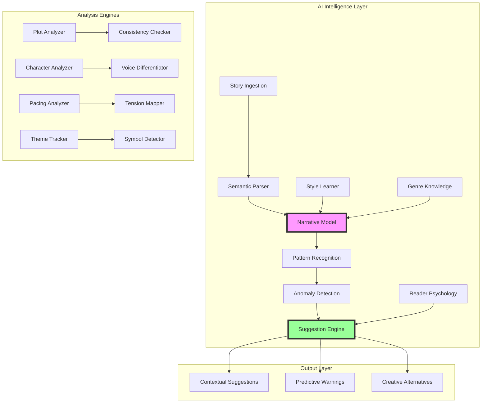

# AI Story Intelligence

## Overview

AI Story Intelligence transforms story-linter from a rule-based validator into an intelligent writing partner. Using advanced language models and narrative understanding, it can predict plot issues, suggest improvements, and help authors maintain consistency not just in facts but in tone, pacing, and emotional resonance.

## Requirements

### Functional Requirements

1. **Narrative Understanding**
   - Deep semantic analysis of story content
   - Intent recognition beyond surface patterns
   - Metaphor and symbolism detection
   - Theme extraction and tracking
   - Subtext analysis

2. **Predictive Analysis**
   - Plot hole prediction before they occur
   - Character motivation consistency
   - Reader confusion point detection
   - Pacing issue identification
   - Emotional arc optimization

3. **Intelligent Suggestions**
   - Context-aware writing suggestions
   - Character voice consistency helpers
   - Plot development alternatives
   - Tension and conflict enhancement
   - Resolution satisfaction scoring

4. **Learning Capabilities**
   - Learn author's unique style
   - Adapt to genre conventions
   - Understand series-specific rules
   - Track reader feedback patterns
   - Evolve with the narrative

5. **Creative Collaboration**
   - "What if" scenario generation
   - Alternative plot path exploration
   - Character development suggestions
   - World-building consistency checking
   - Dialogue improvement recommendations

### Non-Functional Requirements

1. **Privacy & Security**
   - Local model options
   - Encrypted cloud processing
   - No training on user data
   - Configurable data retention
   - GDPR compliance

2. **Performance**
   - Real-time suggestions
   - Batch processing for full novels
   - Incremental analysis
   - Resource-aware processing

3. **Explainability**
   - Clear reasoning for suggestions
   - Confidence scores
   - Citation of examples
   - Adjustable sensitivity

## Use Cases

### UC1: Plot Hole Prevention
**Actor**: Author  
**Precondition**: Writing complex multi-thread narrative  
**Flow**:
1. Author writes scene where character uses ability
2. AI detects ability was never established
3. AI suggests where to introduce ability
4. AI shows impact on other scenes
5. Author accepts suggestion placement
6. AI helps write introduction scene

**Postcondition**: Consistent ability introduction

### UC2: Character Voice Coaching
**Actor**: Author  
**Precondition**: Multiple POV characters  
**Flow**:
1. Author writes dialogue for Character B
2. AI detects voice sounds like Character A
3. AI shows Character B's voice patterns
4. AI suggests dialogue adjustments
5. Author refines with AI guidance

**Postcondition**: Distinct character voices

### UC3: Emotional Arc Analysis
**Actor**: Author  
**Precondition**: Complete manuscript  
**Flow**:
1. Author requests emotional arc analysis
2. AI maps emotional journey by chapter
3. AI identifies flat or jarring sections
4. AI suggests intensification points
5. Author adjusts based on insights

**Postcondition**: Optimized emotional journey

### UC4: Reader Confusion Prediction
**Actor**: Author  
**Precondition**: Complex plot with reveals  
**Flow**:
1. AI analyzes information distribution
2. AI identifies potential confusion points
3. AI suggests clarification moments
4. AI maintains mystery while adding clarity
5. Author implements subtle hints

**Postcondition**: Clear yet mysterious narrative

## Architecture



## AI Capabilities

### 1. Plot Coherence Analysis
```typescript
interface PlotAnalysis {
  // Causal chain validation
  causalChains: CausalRelationship[];
  
  // Unresolved threads
  openThreads: PlotThread[];
  
  // Satisfaction scoring
  resolutionScore: number;
  
  // Chekhov's guns
  unfiredGuns: SetupWithoutPayoff[];
  
  // Deus ex machina detection
  unmotivatedResolutions: UnearendResolution[];
}
```

### 2. Character Psychology Modeling
```typescript
interface CharacterPsychology {
  // Personality traits
  traits: BigFiveProfile;
  
  // Motivation consistency
  motivations: MotivationGraph;
  
  // Behavioral predictions
  likelyActions: PredictedBehavior[];
  
  // Growth trajectory
  characterArc: DevelopmentPath;
  
  // Relationship dynamics
  relationships: InteractionModel;
}
```

### 3. Reader Experience Modeling
```typescript
interface ReaderExperience {
  // Confusion probability by section
  confusionMap: HeatMap;
  
  // Engagement prediction
  engagementCurve: TimeSeries;
  
  // Emotional journey
  emotionalArc: EmotionGraph;
  
  // Satisfaction factors
  satisfactionDrivers: Factor[];
}
```

## Example Interactions

### Plot Hole Detection
```
🤖 AI Alert: Potential Plot Hole Detected

In Chapter 12, Sarah uses her telekinetic powers to escape.
However, these powers were never established earlier.

📊 Reader Confusion Risk: 87%

Suggestions:
1. Add a scene in Chapter 3 where Sarah discovers her powers
2. Include hints in Chapters 5-7 about strange occurrences
3. Have another character mention family history in Chapter 8

Would you like me to:
[Generate Introduction Scene] [Show Impact Analysis] [Ignore]
```

### Character Voice Analysis
```
🎭 Character Voice Inconsistency

Marcus (usually formal) sounds casual in this dialogue:
"Yeah, totally gonna check that out later, dude."

Marcus's established voice patterns:
- Formal vocabulary (87% of dialogue)
- Complete sentences (94% of dialogue)  
- Rarely uses slang (2% of dialogue)

Suggested revision:
"I shall certainly investigate that matter at a later time."

[Accept] [Modify] [Keep Original] [Analyze Context]
```

### Pacing Optimization
```
📈 Pacing Analysis Complete

Current pacing profile:
Chapters 1-3: ████████ High tension
Chapters 4-8: ██       Low tension  ⚠️ 
Chapters 9-10: ████████ High tension

Issue: 5 consecutive low-tension chapters may lose readers

Suggestions:
- Add subplot climax in Chapter 6
- Move character revelation from Ch 11 to Ch 7
- Introduce time pressure in Chapter 5

[Show Detailed Analysis] [Apply Suggestions] [Manual Adjust]
```

## Configuration

```yaml
# .story-linter.yml
ai:
  # AI provider
  provider: "local" # local, openai, anthropic, cohere
  
  # Model selection
  model:
    size: "medium" # small, medium, large
    specialization: "fiction" # fiction, screenplay, game
    
  # Analysis settings
  analysis:
    depth: "comprehensive" # quick, standard, comprehensive
    focus:
      - plot_coherence
      - character_consistency
      - pacing_optimization
      - reader_experience
      
  # Suggestion settings
  suggestions:
    aggressiveness: "moderate" # conservative, moderate, aggressive
    style_matching: true
    genre_awareness: true
    
  # Privacy settings
  privacy:
    local_only: false
    anonymize_content: true
    retention_days: 30
    
  # Performance
  performance:
    batch_size: 50 # pages
    cache_embeddings: true
    gpu_acceleration: true
```

## Integration with Core Features

### 1. Enhanced Schema Extraction
- AI understands implicit patterns
- Recognizes narrative devices
- Learns genre conventions
- Detects unique style elements

### 2. Intelligent Validation
- Beyond rule matching
- Contextual understanding
- Intent recognition
- Nuanced error detection

### 3. Smart Suggestions
- Context-aware fixes
- Style-preserving edits
- Creative alternatives
- Impact analysis

## Future Capabilities

### 1. Multi-Modal Understanding
- Cover art consistency
- Character appearance tracking
- Map and diagram validation
- Audio narration prep

### 2. Cross-Cultural Adaptation
- Cultural sensitivity checking
- Localization assistance
- Market-specific adjustments
- Global reader modeling

### 3. Collaborative AI
- Co-writing capabilities
- Brainstorming partner
- Writer's block assistance
- Style experiments

## Ethical Considerations

1. **Authorship** - AI assists, never replaces
2. **Originality** - Encourages unique voice
3. **Privacy** - Respects creative process
4. **Transparency** - Clear about AI involvement
5. **Control** - Author has final say