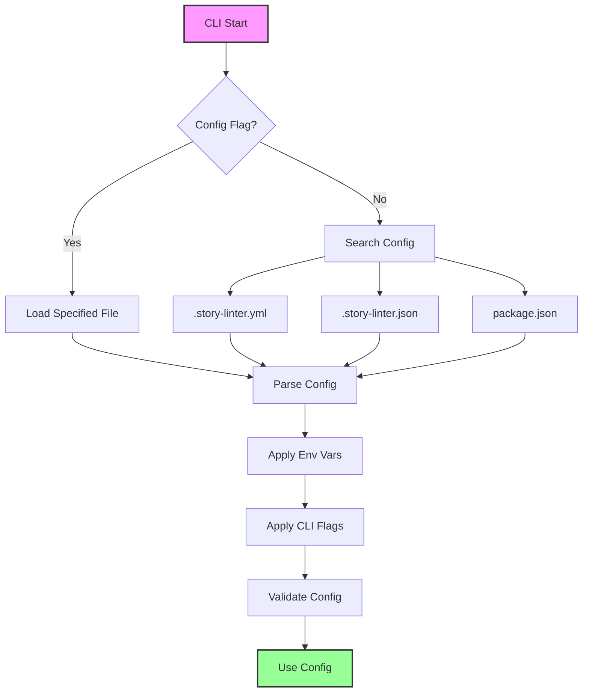

# CLI Interface

## Overview

The story-linter CLI provides a user-friendly command-line interface for all validation operations. It supports various commands for extraction, validation, watching files, and managing configurations. The CLI is designed to be intuitive for authors while providing powerful options for advanced users.

## Requirements

### Functional Requirements

1. **Core Commands**
   - `extract` - Extract schema from narrative files
   - `validate` - Run validation against files
   - `watch` - Watch files and validate on change
   - `init` - Initialize configuration
   - `explain` - Explain specific errors

2. **Command Options**
   - File selection (globs, specific files)
   - Output format selection
   - Severity filtering
   - Plugin selection
   - Configuration overrides

3. **User Experience**
   - Colored output for readability
   - Progress indicators for long operations
   - Clear error messages
   - Exit codes for CI/CD integration
   - Interactive prompts when needed

4. **Configuration**
   - Load from multiple sources (file, env, flags)
   - Configuration precedence rules
   - Configuration validation
   - Show effective configuration

### Non-Functional Requirements

1. **Performance**
   - Fast startup time (< 500ms)
   - Responsive to user input
   - Efficient file handling
   - Minimal dependencies

2. **Compatibility**
   - Cross-platform (Windows, macOS, Linux)
   - Node.js 16+ support
   - Shell completion support
   - Pipe-friendly output

3. **Developer Experience**
   - Self-documenting help
   - Man page generation
   - Debug mode
   - Verbose logging options

## Use Cases

### UC1: First Time Setup
**Actor**: New User  
**Precondition**: story-linter installed globally  
**Flow**:
1. User runs `story-linter init`
2. CLI asks about project type
3. CLI asks about file locations
4. CLI asks about desired validators
5. CLI generates configuration file
6. CLI shows next steps

**Postcondition**: Project configured for story-linter

### UC2: Quick Validation
**Actor**: Author  
**Precondition**: Configuration exists  
**Flow**:
1. Author runs `story-linter`
2. CLI loads configuration
3. CLI validates all files
4. CLI shows summary results
5. CLI exits with appropriate code

**Postcondition**: Validation complete

### UC3: Targeted Validation
**Actor**: Author  
**Precondition**: Wants to check specific file  
**Flow**:
1. Author runs `story-linter validate chapter-5.md`
2. CLI validates single file
3. CLI shows detailed results
4. Author sees specific issues

**Postcondition**: Single file validated

### UC4: CI Integration
**Actor**: CI System  
**Precondition**: Repository with story files  
**Flow**:
1. CI runs `story-linter validate --format=json --no-colors`
2. CLI outputs JSON to stdout
3. CI parses JSON results
4. CI acts on exit code

**Postcondition**: CI build status updated

### UC5: Error Investigation
**Actor**: Author  
**Precondition**: Validation error occurred  
**Flow**:
1. Author runs `story-linter explain CHAR001`
2. CLI shows detailed error explanation
3. CLI shows examples of the error
4. CLI shows how to fix
5. CLI shows configuration options

**Postcondition**: Author understands error

## Acceptance Criteria

1. **Commands**
   - ✅ Basic validate command implemented
   - ✅ Help available via --help
   - ✅ Options properly parsed (commander.js)
   - ✅ Exits with correct codes (0/1)
   - ❌ Other commands not implemented (extract, watch, init, explain, config)

2. **Output**
   - ✅ Colored output by default (chalk)
   - ✅ Colors disabled with --no-color
   - ✅ Progress shown for long operations (ora)
   - ✅ Results clearly formatted

3. **Configuration**
   - ✅ Loads from .story-linter.yml
   - ❌ Environment variables not implemented
   - ✅ Command flags work (--config, --format, etc)
   - ❌ Config source display not implemented

4. **Error Handling**
   - ✅ Clear error messages
   - ⚠️ Limited fix suggestions
   - ✅ No stack traces in normal mode
   - ✅ Debug mode shows full errors (DEBUG env)

## Implementation Status

### ✅ Completed
- `validate` command with file/directory support
- Multiple output formats (text, JSON, HTML)
- Progress indicators during validation
- Colored terminal output
- Command-line option parsing
- Exit codes for CI/CD
- SOLID refactoring with clean architecture

### ⚠️ Partially Complete
- Limited to validate command only
- Basic error messages (could be more helpful)
- Configuration loading (basic support)

### ❌ Not Implemented
- `init` command for project setup
- `extract` command for schema extraction
- `watch` command for file monitoring
- `explain` command for error details
- `config` command to show configuration
- Shell completion
- Man page generation
- Interactive prompts

## Test Plan

### Unit Tests
1. Command parsing
2. Option validation
3. Configuration loading
4. Output formatting

### Integration Tests
1. Full command execution
2. File operations
3. Plugin loading
4. Error scenarios

### End-to-End Tests
1. New project setup
2. Various validation scenarios
3. CI/CD simulation
4. Interactive mode

### User Acceptance Tests
1. First-time user experience
2. Error message clarity
3. Performance perception
4. Documentation accuracy

## Command Reference

```bash
# Main command
story-linter [command] [options]

# Commands
Commands:
  init                 Initialize story-linter in current directory
  extract [files...]   Extract schema from narrative files
  validate [files...]  Validate narrative files
  watch [files...]     Watch files and validate on change
  explain <code>       Explain an error code in detail
  config               Show effective configuration

# Global Options
Options:
  -c, --config <file>  Path to config file (default: .story-linter.yml)
  -f, --format <type>  Output format: text|json|html (default: text)
  --no-colors          Disable colored output
  -q, --quiet          Suppress non-error output
  -v, --verbose        Show detailed output
  --debug              Enable debug mode
  -h, --help          Show help
  -V, --version       Show version

# Extract Command
story-linter extract [options] [files...]
  -i, --interactive    Review and confirm patterns
  -u, --update        Update existing schema
  -o, --output <file>  Output schema file (default: .story-schema.json)

# Validate Command  
story-linter validate [options] [files...]
  -w, --watch          Watch mode
  -s, --severity <level>  Minimum severity: error|warning|info
  --fix                Auto-fix fixable errors
  --validators <list>  Comma-separated validator list

# Examples
story-linter                          # Validate all files
story-linter validate chapter-*.md    # Validate specific files
story-linter extract --interactive    # Extract with review
story-linter validate --format=json   # JSON output for CI
story-linter explain CHAR001          # Explain error code
```

## Output Formats

### Text Format (Default)
```
story-linter v1.0.0

Validating 10 files...

✗ chapter-01.md
  error  CHAR001  line 42  Character "Tuxilles" appears too early
    Expected: Tuxicles (for chapters 1-2)
    
  warning  TIME001  line 67  Inconsistent date format
    Found: "January 1st, 2024"
    Expected: "2024-01-01"

✓ chapter-02.md

Summary:
  Files: 10 (8 passed, 2 failed)
  Errors: 1
  Warnings: 1
  
❌ Validation failed
```

### JSON Format
```json
{
  "version": "1.0.0",
  "timestamp": "2024-01-15T10:30:00Z",
  "summary": {
    "files": { "total": 10, "passed": 8, "failed": 2 },
    "errors": 1,
    "warnings": 1,
    "info": 0
  },
  "results": [
    {
      "file": "chapter-01.md",
      "errors": [
        {
          "code": "CHAR001",
          "line": 42,
          "severity": "error",
          "message": "Character \"Tuxilles\" appears too early",
          "expected": "Tuxicles"
        }
      ]
    }
  ]
}
```

## Configuration Loading



## Error Codes

| Code | Severity | Description |
|------|----------|-------------|
| CONF001 | Error | Invalid configuration file |
| CONF002 | Error | Missing required configuration |
| FILE001 | Error | File not found |
| FILE002 | Error | Cannot read file |
| PLUG001 | Error | Plugin not found |
| PLUG002 | Error | Plugin initialization failed |
| CHAR001 | Error | Character consistency violation |
| TIME001 | Warning | Timeline inconsistency |
| REFS001 | Warning | Broken reference |

## Shell Completion

```bash
# Bash
story-linter completion bash > ~/.bashrc

# Zsh
story-linter completion zsh > ~/.zshrc

# Fish
story-linter completion fish > ~/.config/fish/completions/story-linter.fish
```

## Environment Variables

| Variable | Description |
|----------|-------------|
| STORY_LINTER_CONFIG | Configuration file path |
| STORY_LINTER_COLORS | Enable/disable colors (0/1) |
| STORY_LINTER_DEBUG | Enable debug mode |
| STORY_LINTER_CACHE_DIR | Cache directory location |
| NO_COLOR | Standard no-color env var |