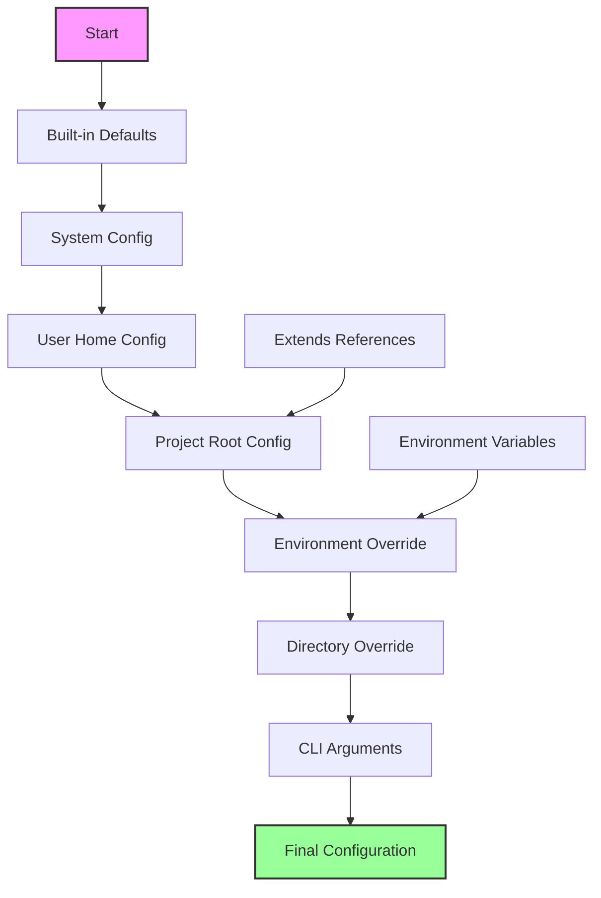

# Configuration System

## Overview

The Configuration System provides flexible, hierarchical configuration management for story-linter. It supports multiple configuration sources, environment-specific overrides, and validation of configuration values. The system is designed to be simple for basic use cases while supporting complex multi-environment setups.

## Requirements

### Functional Requirements

1. **Configuration Sources**
   - File-based configuration (.story-linter.yml, .story-linter.json)
   - Package.json configuration section
   - Environment variables
   - Command-line arguments
   - Default values

2. **Configuration Hierarchy**
   - Project root configuration
   - Directory-specific overrides
   - User home directory defaults
   - System-wide defaults

3. **Configuration Validation**
   - Schema validation
   - Type checking
   - Required field validation
   - Plugin configuration validation

4. **Configuration Discovery**
   - Automatic discovery in project tree
   - Explicit path specification
   - Configuration inheritance
   - Merge strategies

5. **Dynamic Configuration**
   - Environment-based configuration
   - Conditional configuration
   - Variable interpolation
   - Configuration functions

### Non-Functional Requirements

1. **Usability**
   - Clear documentation
   - Helpful error messages
   - Configuration scaffolding
   - Migration tools

2. **Performance**
   - Fast configuration loading
   - Caching of parsed configuration
   - Lazy evaluation
   - Minimal file I/O

3. **Security**
   - No code execution in config files
   - Path traversal prevention
   - Sensitive data handling
   - Environment variable sanitization

## Use Cases

### UC1: Basic Configuration
**Actor**: Author  
**Precondition**: New project  
**Flow**:
1. Author runs `story-linter init`
2. System creates basic .story-linter.yml
3. Author edits configuration
4. System validates on next run

**Postcondition**: Project configured

### UC2: Multi-Environment Setup
**Actor**: Team  
**Precondition**: Different validation needs per environment  
**Flow**:
1. Team creates base configuration
2. Team creates .story-linter.dev.yml
3. Team creates .story-linter.ci.yml
4. System loads based on STORY_LINTER_ENV

**Postcondition**: Environment-specific validation

### UC3: Shared Configuration
**Actor**: Organization  
**Precondition**: Multiple projects with similar rules  
**Flow**:
1. Org publishes @myorg/story-linter-config
2. Projects extend shared config
3. Projects override specific values
4. System merges configurations

**Postcondition**: Consistent org-wide configuration

### UC4: Directory Overrides
**Actor**: Author  
**Precondition**: Different rules for different sections  
**Flow**:
1. Author creates chapters/.story-linter.yml
2. Author specifies stricter rules
3. System applies overrides for chapters/
4. Other directories use root config

**Postcondition**: Directory-specific validation

## Acceptance Criteria

1. **Loading**
   - ✅ Finds configuration automatically
   - ✅ Loads from YAML files
   - ❌ Loads from JSON or package.json (not implemented)
   - ❌ Directory-specific overrides (not implemented)
   - ✅ Basic merge support

2. **Validation**
   - ⚠️ Basic validation only
   - ❌ Schema validation not implemented
   - ❌ Clear error messages needed
   - ✅ Validates plugin configurations

3. **Features**
   - ❌ Supports extends keyword (not implemented)
   - ❌ Environment variable interpolation (not implemented)
   - ❌ Conditional configuration (not implemented)
   - ✅ Comments in YAML

4. **Performance**
   - ✅ Caches parsed configuration
   - ✅ Loads quickly
   - ✅ Minimal memory usage
   - ❌ Watches for changes (not implemented)

## Implementation Status

### ✅ Completed
- Basic YAML configuration loading
- Configuration caching
- Validator configuration support
- Default configuration values

### ⚠️ Partially Complete
- **SOLID Violations**: ConfigLoader directly uses fs/promises instead of DI
- **Missing Tests**: No unit tests for ConfigLoader
- Limited validation of configuration values
- Basic error handling only

### ❌ Not Implemented
- Multiple configuration sources (JSON, package.json)
- Configuration inheritance (extends)
- Environment variables
- Directory-specific overrides
- Schema validation
- Watch mode for configuration changes

## Test Plan

### Unit Tests
1. Configuration loading
2. Merge strategies
3. Validation logic
4. Variable interpolation

### Integration Tests
1. Multi-source loading
2. Environment handling
3. Plugin configuration
4. Error scenarios

### End-to-End Tests
1. Fresh project setup
2. Complex inheritance
3. Environment switching
4. Migration scenarios

## Configuration Schema

```yaml
# .story-linter.yml
version: "1.0"

# Extend another configuration
extends: "@myorg/story-linter-config"

# File selection
files:
  include:
    - "**/*.md"
    - "**/*.txt"
  exclude:
    - "**/node_modules/**"
    - "**/.git/**"
    - "**/build/**"

# Global settings
settings:
  # Severity level
  severity: warning  # error | warning | info
  
  # Performance
  parallel: true
  workers: 4
  cache: true
  
  # Output
  output:
    format: text  # text | json | html
    colors: true
    verbose: false
    
  # Error handling
  stopOnError: false
  maxErrors: 100

# Validator configurations
validators:
  # Built-in validators
  character-consistency:
    enabled: true
    severity: error
    config:
      tracking:
        evolution: true
        relationships: true
      exceptions:
        - pattern: "metaphorical reference"
          ignore: true
  
  timeline-validator:
    enabled: true
    config:
      dateFormat: "YYYY-MM-DD"
      requireChronological: true
  
  # Custom validators
  "@myorg/custom-validator":
    enabled: true
    config:
      customOption: value

# Schema extraction
schema:
  enabled: true
  output: ".story-schema.json"
  interactive: true
  confidence:
    threshold: 0.85
    requireReview: 0.5

# Environment-specific overrides
environments:
  development:
    settings:
      verbose: true
      cache: false
    validators:
      "*":
        severity: warning
  
  ci:
    settings:
      output:
        format: json
        colors: false
      stopOnError: true
    validators:
      "*":
        severity: error

# Conditional configuration
when:
  - condition: "env.CI == 'true'"
    config:
      settings:
        output:
          format: json
  
  - condition: "files.count > 1000"
    config:
      settings:
        parallel: true
        workers: 8
```

## Configuration Loading Order



## Configuration Precedence

1. CLI arguments (highest)
2. Environment variables
3. Directory-specific config
4. Environment-specific config
5. Project root config
6. User home config
7. System config
8. Built-in defaults (lowest)

## Variable Interpolation

```yaml
# Environment variables
files:
  include:
    - "${STORY_DIR}/**/*.md"

# Built-in variables
schema:
  output: "${projectDir}/.story-schema.json"

# Custom variables
variables:
  chapterDir: "./chapters"
  
files:
  include:
    - "${chapterDir}/**/*.md"
```

## Configuration API

```typescript
interface ConfigurationSystem {
  // Load configuration
  load(options?: LoadOptions): Promise<Configuration>;
  
  // Validate configuration
  validate(config: unknown): ValidationResult;
  
  // Get effective configuration
  getEffective(path?: string): Configuration;
  
  // Watch for changes
  watch(callback: ConfigChangeCallback): Disposable;
  
  // Configuration builder
  builder(): ConfigurationBuilder;
}

interface Configuration {
  version: string;
  files: FileSelection;
  settings: GlobalSettings;
  validators: ValidatorConfigs;
  schema: SchemaConfig;
  environments?: EnvironmentConfigs;
  when?: ConditionalConfig[];
}

interface LoadOptions {
  configPath?: string;
  environment?: string;
  overrides?: Partial<Configuration>;
}
```

## Error Messages

```
❌ Configuration Error: .story-linter.yml

  Line 15: Invalid validator name "@myorg/validator"
    
    validators:
      "@myorg/validator":  # <- Package not found
        enabled: true
    
  Did you mean "@myorg/story-validator"?
  
  To install: npm install @myorg/story-validator

❌ Configuration Error: Type mismatch

  Line 8: Expected boolean for 'parallel', got string
  
    settings:
      parallel: "yes"  # <- Should be: true
      
  Valid values: true, false
```

## Migration Support

```bash
# Migrate from v0.x to v1.0
story-linter migrate --from 0.x --to 1.0

# Validate configuration without running
story-linter config validate

# Show effective configuration
story-linter config show

# Show configuration source
story-linter config show --sources
```

## Implementation Plan

### Complexity: 🔥🔥 (Medium)
**Reasoning**: Well-defined patterns, but needs careful design for hierarchy and merging

### Time Estimate: 2-3 weeks (1 developer)
- Core loading logic: 1 week
- Validation & merging: 1 week
- Advanced features: 3-5 days

### Dependencies

#### Upstream (Required Before)
- **File Utils** - Basic file operations

#### Downstream (Enables)
- **Everything** - All features need configuration
- **Validation Framework** - Uses config
- **CLI Interface** - Loads config
- **Schema Extraction** - Stores settings

### Task Breakdown

#### Phase 1: Core Loading (Week 1)
1. **File Discovery** (2 days)
   - Search up directory tree
   - Check standard locations
   - Handle missing files
   - Platform-specific paths

2. **Parser Integration** (1 day)
   - YAML parsing
   - JSON parsing
   - JS/TS config support
   - Error handling

3. **Basic Merging** (2 days)
   - Deep merge implementation
   - Array handling strategies
   - Precedence rules
   - Type preservation

#### Phase 2: Advanced Features (Week 2)
1. **Extends System** (1.5 days)
   - Package resolution
   - Circular dependency detection
   - Caching extends
   - Version checking

2. **Variable System** (1.5 days)
   - Environment variables
   - Built-in variables
   - Custom variables
   - Interpolation engine

3. **Conditional Config** (2 days)
   - Condition evaluation
   - Dynamic application
   - Performance optimization
   - Security sandboxing

#### Phase 3: Polish (Days 11-15)
1. **Validation** (2 days)
   - Schema validation
   - Type checking
   - Plugin config validation
   - Error messages

2. **Performance** (1 day)
   - Caching layer
   - Lazy evaluation
   - Watch mode
   - Memory optimization

3. **Developer Experience** (2 days)
   - Init command
   - Migration tools
   - Documentation
   - Examples

### Technical Decisions

1. **Config Format**:
   - YAML (human-friendly)
   - JSON (universal)
   - JS/TS (programmable)
   - Recommendation: YAML primary, all supported

2. **Merge Strategy**:
   - Deep merge objects
   - Replace arrays by default
   - Concat with special syntax
   - Recommendation: Configurable per field

3. **Validation Library**:
   - Joi (mature)
   - Yup (modern)
   - Zod (TypeScript-first)
   - Recommendation: Zod for TS integration

### Risk Mitigation

1. **Config Complexity**
   - Risk: Too many options confuse users
   - Mitigation: Good defaults, starter templates

2. **Performance Issues**
   - Risk: Slow with many extends
   - Mitigation: Aggressive caching

3. **Security Concerns**
   - Risk: Code execution in config
   - Mitigation: No eval, sandboxed conditions

### Success Metrics

- Config load time < 50ms
- Zero security vulnerabilities
- 95%+ config validation accuracy
- Clear error messages
- Easy migration path