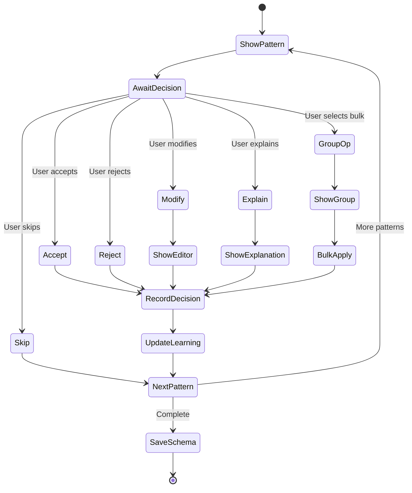

# Interactive Mode

## Overview

Interactive Mode provides a guided, conversational interface for schema extraction and validation configuration. It helps authors understand detected patterns, make decisions about edge cases, and teach the system about their narrative's unique rules. This mode transforms story-linter from a static analyzer into a learning system.

## Requirements

### Functional Requirements

1. **Pattern Review Interface**
   - Display detected patterns clearly
   - Show confidence scores
   - Provide examples from text
   - Allow batch operations
   - Support undo/redo

2. **Decision Recording**
   - Capture user decisions
   - Store explanations
   - Remember for future runs
   - Export decision log
   - Import previous decisions

3. **Learning System**
   - Update patterns based on feedback
   - Adjust confidence scores
   - Suggest similar patterns
   - Learn from corrections
   - Improve over time

4. **User Experience**
   - Clear prompts
   - Keyboard shortcuts
   - Progress indication
   - Save and resume
   - Help system

5. **Integration**
   - Works with all commands
   - Optional activation
   - Scriptable responses
   - CI-friendly mode

### Non-Functional Requirements

1. **Usability**
   - Intuitive navigation
   - Responsive interface
   - Clear instructions
   - Accessible design
   - Internationalization

2. **Performance**
   - Instant response
   - Efficient rendering
   - Minimal memory use
   - Background processing

3. **Reliability**
   - Session recovery
   - Data persistence
   - Error recovery
   - Graceful degradation

## Use Cases

### UC1: First Schema Extraction
**Actor**: New Author  
**Precondition**: Narrative files exist, no schema  
**Flow**:
1. Author runs `story-linter extract -i`
2. System shows first pattern
3. Author reviews and decides
4. System shows next pattern
5. Author can group similar patterns
6. Process continues to completion
7. System generates schema

**Postcondition**: Schema created with author input

### UC2: Pattern Clarification
**Actor**: Author  
**Precondition**: Ambiguous pattern detected  
**Flow**:
1. System shows pattern with low confidence
2. System shows examples from text
3. Author selects classification
4. Author optionally explains
5. System learns from explanation
6. System suggests similar patterns

**Postcondition**: Pattern correctly classified

### UC3: Bulk Operations
**Actor**: Experienced Author  
**Precondition**: Many similar patterns  
**Flow**:
1. System groups similar patterns
2. Author selects "Apply to all"
3. System shows preview
4. Author confirms
5. System applies to group

**Postcondition**: Multiple patterns handled efficiently

### UC4: Teaching Mode
**Actor**: Author  
**Precondition**: System made wrong classification  
**Flow**:
1. Author runs validation
2. System shows error
3. Author disputes error
4. System enters teaching mode
5. Author explains correct interpretation
6. System updates rules

**Postcondition**: System learns correct rule

## Acceptance Criteria

1. **Interface**
   - ✓ Clear pattern presentation
   - ✓ Keyboard navigation
   - ✓ Mouse support
   - ✓ Progress indicator

2. **Functionality**
   - ✓ All patterns reviewable
   - ✓ Decisions saved
   - ✓ Resume capability
   - ✓ Undo/redo working

3. **Learning**
   - ✓ Patterns update based on feedback
   - ✓ Confidence scores adjust
   - ✓ Similar patterns recognized
   - ✓ Explanations stored

4. **Performance**
   - ✓ < 100ms response time
   - ✓ Handles 1000+ patterns
   - ✓ Memory efficient
   - ✓ No UI lag

## Test Plan

### Unit Tests
1. Pattern presentation logic
2. Decision recording
3. Learning algorithms
4. State management

### Integration Tests
1. Full interactive flow
2. Resume functionality
3. Export/import
4. Error handling

### Usability Tests
1. New user experience
2. Keyboard navigation
3. Screen reader compatibility
4. Error message clarity

### End-to-End Tests
1. Complete extraction flow
2. Teaching mode scenarios
3. Bulk operations
4. Edge cases

## Interactive Flow



## User Interface

### Pattern Review Screen
```
┌─────────────────────────────────────────────────────────────┐
│ Pattern Review (42 of 156)                    [===>       ] │
├─────────────────────────────────────────────────────────────┤
│                                                             │
│ Pattern Type: Character Reference                           │
│ Confidence: 72% (Medium)                                    │
│                                                             │
│ Pattern: "You were someone's {CHARACTER} once"             │
│                                                             │
│ Examples:                                                   │
│   • chapter-10.md:426                                       │
│     "You were someone's Tuxrates once."                    │
│                                                             │
│   • chapter-12.md:89                                        │
│     "You were someone's teacher once."                     │
│                                                             │
│ Suggested Classification: Metaphorical Reference            │
│                                                             │
├─────────────────────────────────────────────────────────────┤
│ (A)ccept  (R)eject  (M)odify  (E)xplain  (S)kip           │
│ (G)roup similar  (U)ndo  (?) Help  (Q)uit & Save          │
└─────────────────────────────────────────────────────────────┘
```

### Explanation Dialog
```
┌─────────────────────────────────────────────────────────────┐
│ Explain This Pattern                                        │
├─────────────────────────────────────────────────────────────┤
│                                                             │
│ Please explain what this pattern represents:               │
│                                                             │
│ > This is a metaphorical reference where the narrator is   │
│   speaking to future teachers, reminding them they were    │
│   once students themselves. It's not a literal character   │
│   reference but a philosophical statement.                  │
│                                                             │
│ Select all that apply:                                      │
│ [x] Metaphorical usage                                      │
│ [ ] Retrospective reference                                │
│ [ ] Preview/foreshadowing                                  │
│ [x] Teaching/wisdom                                         │
│ [ ] Other: ________________                                │
│                                                             │
├─────────────────────────────────────────────────────────────┤
│                    (S)ave  (C)ancel                         │
└─────────────────────────────────────────────────────────────┘
```

### Bulk Operation Screen
```
┌─────────────────────────────────────────────────────────────┐
│ Group Operation                                             │
├─────────────────────────────────────────────────────────────┤
│                                                             │
│ Found 23 similar patterns:                                  │
│                                                             │
│ [x] "You were someone's {CHARACTER} once"                  │
│ [x] "Remember when you were {CHARACTER}"                   │
│ [x] "Back when I was {CHARACTER}"                          │
│ [x] "{CHARACTER} would have done the same"                 │
│ [ ] "The ghost of {CHARACTER} whispered"                   │
│     ... 18 more                                            │
│                                                             │
│ Apply classification to selected:                           │
│ ( ) Metaphorical Reference                                  │
│ (•) Retrospective Reference                                 │
│ ( ) Character Evolution                                     │
│ ( ) Other: ________________                                │
│                                                             │
├─────────────────────────────────────────────────────────────┤
│ (A)pply to Selected  (S)elect All  (C)lear  (B)ack        │
└─────────────────────────────────────────────────────────────┘
```

## Configuration

```yaml
# .story-linter.yml
interactive:
  # Enable interactive mode by default
  enabled: true
  
  # Batch size for review
  batchSize: 10
  
  # Auto-accept high confidence patterns
  autoAccept:
    enabled: true
    threshold: 0.95
  
  # Session management
  session:
    saveProgress: true
    resumePrompt: true
    timeout: 1800  # 30 minutes
  
  # UI preferences
  ui:
    colors: true
    unicode: true
    animations: true
    
  # Keyboard shortcuts
  shortcuts:
    accept: ['a', 'y']
    reject: ['r', 'n']
    modify: ['m', 'e']
    skip: ['s', 'space']
```

## Decision Storage

```json
{
  "version": "1.0.0",
  "timestamp": "2024-01-15T10:30:00Z",
  "decisions": [
    {
      "pattern": "You were someone's {CHARACTER} once",
      "decision": "accept",
      "classification": "metaphorical",
      "explanation": "Philosophical statement about teaching",
      "confidence": 0.95,
      "tags": ["metaphor", "teaching"],
      "examples": [
        {
          "file": "chapter-10.md",
          "line": 426,
          "text": "You were someone's Tuxrates once."
        }
      ]
    }
  ],
  "settings": {
    "autoAccepted": 45,
    "manuallyReviewed": 23,
    "rejected": 5,
    "modified": 3
  }
}
```

## API

```typescript
interface InteractiveMode {
  // Start interactive session
  start(patterns: Pattern[]): Promise<InteractiveSession>;
  
  // Resume previous session
  resume(sessionId: string): Promise<InteractiveSession>;
  
  // Get decision history
  getHistory(): DecisionHistory;
}

interface InteractiveSession {
  // Current pattern
  current(): Pattern | null;
  
  // Navigation
  next(): void;
  previous(): void;
  goto(index: number): void;
  
  // Actions
  accept(classification?: string): void;
  reject(reason?: string): void;
  modify(newPattern: Pattern): void;
  explain(explanation: string, tags?: string[]): void;
  skip(): void;
  
  // Bulk operations
  groupSimilar(): Pattern[];
  applyToGroup(decision: Decision, patterns: Pattern[]): void;
  
  // Session management
  save(): void;
  complete(): Schema;
}
```

## Keyboard Shortcuts

| Key | Action | Description |
|-----|--------|-------------|
| a, y | Accept | Accept current pattern |
| r, n | Reject | Reject current pattern |
| m | Modify | Modify pattern details |
| e | Explain | Add explanation |
| s, Space | Skip | Skip to next pattern |
| g | Group | Find similar patterns |
| u | Undo | Undo last decision |
| U | Redo | Redo undone decision |
| ? | Help | Show help screen |
| q | Quit | Save and exit |
| Q | Force Quit | Exit without saving |
| / | Search | Search patterns |
| j, ↓ | Next | Next pattern |
| k, ↑ | Previous | Previous pattern |

## Implementation Plan

### Complexity: 🔥🔥🔥 (Medium-High)
**Reasoning**: Complex UI state management, learning algorithms, session persistence

### Time Estimate: 3 weeks (1 developer)
- UI Framework: 1 week
- Learning System: 1 week
- Polish & Testing: 1 week

### Dependencies

#### Upstream (Required Before)
- **Schema Extraction** - Provides patterns to review
- **CLI Interface** - Hosts interactive mode

#### Downstream (Enables)
- **Better Validation** - More accurate with user input
- **AI Integration** - Training data from decisions

### Success Metrics
- 95% user task completion rate
- < 30 min to review novel patterns
- < 100ms UI response time
- 90% decision persistence accuracy