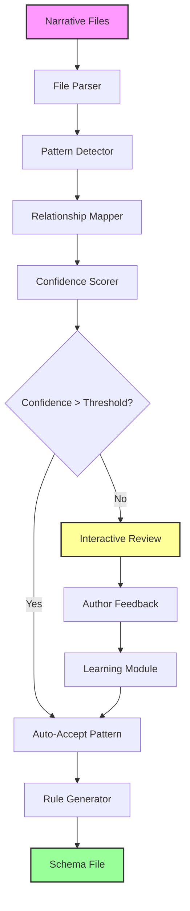

# Schema Extraction

## Overview

Schema Extraction is the core intelligence of story-linter. It automatically analyzes narrative content to identify patterns, relationships, and rules that define your story's structure. Instead of manually coding validation rules, the system learns from your existing narrative.

## Requirements

### Functional Requirements

1. **Pattern Detection**
   - Identify character names and their variations
   - Detect character evolution/transformation patterns
   - Recognize temporal markers and timeline references
   - Find recurring narrative structures
   - Identify metadata patterns (e.g., code blocks, special sections)

2. **Relationship Mapping**
   - Character relationships and interactions
   - Timeline dependencies
   - Location connections
   - Plot thread interconnections

3. **Rule Generation**
   - Convert detected patterns into validation rules
   - Identify exceptions and special cases
   - Generate confidence scores for patterns

4. **Interactive Learning**
   - Present ambiguous patterns for author clarification
   - Learn from author feedback
   - Refine patterns based on corrections

### Non-Functional Requirements

1. **Performance**
   - Process 1000+ files in under 10 seconds
   - Incremental analysis for large projects
   - Efficient pattern matching algorithms

2. **Accuracy**
   - 95%+ accuracy in pattern detection
   - Low false positive rate
   - Configurable confidence thresholds

3. **Usability**
   - Clear presentation of detected patterns
   - Easy-to-understand rule descriptions
   - Intuitive feedback mechanism

## Use Cases

### UC1: Initial Schema Generation
**Actor**: Author  
**Precondition**: Narrative files exist in project  
**Flow**:
1. Author runs `story-linter extract`
2. System analyzes all narrative files
3. System detects patterns and relationships
4. System presents findings for review
5. Author confirms/corrects patterns
6. System generates schema file

**Postcondition**: Schema file created with learned rules

### UC2: Incremental Learning
**Actor**: Author  
**Precondition**: Schema exists, new content added  
**Flow**:
1. Author adds new chapter/content
2. Author runs `story-linter extract --update`
3. System analyzes new content
4. System identifies new patterns or conflicts
5. Author resolves conflicts
6. System updates schema

**Postcondition**: Schema updated with new patterns

### UC3: Pattern Clarification
**Actor**: Author  
**Precondition**: Ambiguous pattern detected  
**Flow**:
1. System detects pattern with low confidence
2. System prompts author for clarification
3. Author explains pattern intent
4. System records explanation
5. System updates confidence and rules

**Postcondition**: Pattern classified with author intent

## Acceptance Criteria

1. **Pattern Detection**
   - ✓ Detects all character names mentioned 3+ times
   - ✓ Identifies 90%+ of character transformations
   - ✓ Recognizes standard date/time formats
   - ✓ Finds cross-file references

2. **Interactive Mode**
   - ✓ Presents unclear patterns for review
   - ✓ Accepts author feedback
   - ✓ Remembers previous decisions
   - ✓ Allows bulk approval/rejection

3. **Schema Generation**
   - ✓ Produces valid JSON schema
   - ✓ Includes confidence scores
   - ✓ Documents pattern sources
   - ✓ Supports versioning

4. **Performance**
   - ✓ Completes in < 10s for 1000 files
   - ✓ Shows progress indicator
   - ✓ Supports cancellation
   - ✓ Handles large files (>1MB)

## Test Plan

### Unit Tests
1. Pattern detection algorithms
2. Confidence scoring logic
3. Schema generation functions
4. Rule conversion logic

### Integration Tests
1. Full extraction pipeline
2. Interactive mode flow
3. Schema update process
4. Multi-format support

### End-to-End Tests
1. GitScrolls example extraction
2. Novel series extraction
3. Screenplay extraction
4. Documentation extraction

### Performance Tests
1. Large file handling (10MB+)
2. Many files (10,000+)
3. Complex patterns
4. Memory usage

## Data Flow



## Pattern Types

### Character Patterns
```typescript
interface CharacterPattern {
  type: 'character';
  name: string;
  aliases: string[];
  firstAppearance: FileLocation;
  transformations: Transformation[];
  confidence: number;
}
```

### Timeline Patterns
```typescript
interface TimelinePattern {
  type: 'timeline';
  markers: TimeMarker[];
  format: string; // e.g., "YYYY-MM-DD"
  relative: boolean; // "three days later"
  confidence: number;
}
```

### Structural Patterns
```typescript
interface StructuralPattern {
  type: 'structure';
  pattern: string; // regex or template
  purpose: 'metadata' | 'preview' | 'retrospective' | 'other';
  examples: string[];
  confidence: number;
}
```

## Configuration

```yaml
# .story-linter.yml
extraction:
  # Minimum occurrences to consider a pattern
  minOccurrences: 3
  
  # Confidence threshold for auto-acceptance
  confidenceThreshold: 0.85
  
  # Pattern types to extract
  patterns:
    - characters
    - timeline
    - structure
    - relationships
  
  # Interactive mode settings
  interactive:
    enabled: true
    batchSize: 10
    timeout: 300 # seconds
  
  # Performance settings
  performance:
    maxFileSize: 10MB
    parallel: true
    workers: 4
```

## Example Output

```json
{
  "version": "1.0.0",
  "generated": "2024-01-15T10:30:00Z",
  "patterns": {
    "characters": [
      {
        "name": "Tuxicles",
        "aliases": ["Young Tuxicles"],
        "evolution": {
          "to": "Tuxrates",
          "trigger": "questioning phase",
          "chapters": ["03", "04"]
        },
        "confidence": 0.95
      }
    ],
    "timeline": [
      {
        "marker": "December 2024",
        "event": "Authentication failure",
        "references": ["05-Wounding-of-Hubris.md:L45"],
        "confidence": 0.90
      }
    ],
    "structures": [
      {
        "pattern": "You were someone's {CHARACTER} once",
        "purpose": "metaphorical",
        "examples": ["10-Where-Heroes.md:L426"],
        "confidence": 0.88
      }
    ]
  }
}
```

## Implementation Plan

### Complexity: 🔥🔥🔥🔥 (High)
**Reasoning**: Requires NLP, pattern recognition, machine learning concepts, and interactive UI

### Time Estimate: 6-8 weeks (1 developer)
- Core extraction engine: 3 weeks
- Interactive mode: 2 weeks  
- Learning system: 2 weeks
- Testing & refinement: 1 week

### Dependencies

#### Upstream (Required Before)
- **Validation Framework** - Need plugin architecture
- **Configuration System** - Store extraction settings
- **File Processing Utils** - Parse narrative files

#### Downstream (Enables)
- **All Validators** - They use extracted schemas
- **AI Integration** - Builds on pattern detection
- **Visualization** - Visualizes extracted patterns

### Task Breakdown

#### Phase 1: Core Pattern Detection (Week 1-2)
1. **File Parser Integration** (3 days)
   - Set up unified/remark pipeline
   - Extract text content and structure
   - Handle multiple file formats
   - Build AST traversal

2. **Character Detection** (3 days)
   - Implement NER (Named Entity Recognition)
   - Detect character name patterns
   - Track name variations/aliases
   - Build character occurrence map

3. **Timeline Extraction** (2 days)
   - Date/time pattern recognition
   - Relative time markers ("later", "before")
   - Chronological ordering
   - Timeline event correlation

4. **Structure Analysis** (2 days)
   - Identify recurring patterns
   - Detect metadata sections
   - Find preview/retrospective patterns
   - Extract narrative devices

#### Phase 2: Relationship Mapping (Week 3)
1. **Character Relationships** (2 days)
   - Co-occurrence analysis
   - Interaction detection
   - Relationship type inference
   - Network graph building

2. **Plot Thread Detection** (2 days)
   - Topic modeling
   - Thread continuity tracking
   - Convergence point detection
   - Thread importance scoring

3. **Location Mapping** (1 day)
   - Place name extraction
   - Location relationships
   - Movement patterns
   - Setting importance

#### Phase 3: Rule Generation (Week 4)
1. **Pattern Confidence Scoring** (2 days)
   - Statistical analysis
   - Frequency calculation
   - Context weighting
   - Anomaly detection

2. **Rule Conversion** (2 days)
   - Pattern to rule transformation
   - Exception identification
   - Rule optimization
   - Validation rule generation

3. **Schema Generation** (1 day)
   - JSON schema creation
   - Version management
   - Documentation generation
   - Export functionality

#### Phase 4: Interactive Mode (Week 5-6)
1. **UI Framework** (3 days)
   - Terminal UI setup (Inquirer.js)
   - Pattern presentation
   - Navigation system
   - Progress tracking

2. **Review Workflow** (3 days)
   - Pattern queuing
   - Decision recording
   - Bulk operations
   - Undo/redo system

3. **Feedback Integration** (2 days)
   - User input processing
   - Pattern adjustment
   - Confidence recalculation
   - Learning persistence

4. **Session Management** (2 days)
   - Save/resume capability
   - Progress persistence
   - Crash recovery
   - Multi-session support

#### Phase 5: Learning System (Week 7-8)
1. **ML Model Integration** (3 days)
   - Pattern similarity calculation
   - Classification improvement
   - Feedback training
   - Model persistence

2. **Pattern Evolution** (3 days)
   - Historical tracking
   - Pattern merging
   - Conflict resolution
   - Version control

3. **Performance Optimization** (2 days)
   - Caching strategy
   - Incremental analysis
   - Parallel processing
   - Memory management

4. **Testing & Documentation** (2 days)
   - Unit test coverage
   - Integration tests
   - Performance benchmarks
   - User documentation

### Technical Decisions

1. **NLP Library**: 
   - Option A: compromise/natural (lightweight)
   - Option B: spaCy via Python bridge (powerful)
   - Recommendation: Start with compromise, upgrade if needed

2. **Pattern Storage**:
   - JSON for human readability
   - SQLite for complex queries
   - Recommendation: JSON with optional SQLite cache

3. **Interactive UI**:
   - Inquirer.js for prompts
   - Blessed for complex TUI
   - Recommendation: Inquirer.js for simplicity

### Risk Mitigation

1. **Pattern Detection Accuracy**
   - Risk: Low accuracy in genre fiction
   - Mitigation: Genre-specific training data

2. **Performance with Large Works**
   - Risk: Slow on 500k+ word novels
   - Mitigation: Streaming processing, caching

3. **User Fatigue in Interactive Mode**
   - Risk: Too many patterns to review
   - Mitigation: Smart grouping, confidence thresholds

### Success Metrics

- Pattern detection accuracy > 85%
- Interactive review < 30 min for novel
- Schema generation < 10 seconds
- User satisfaction > 4/5 stars
```