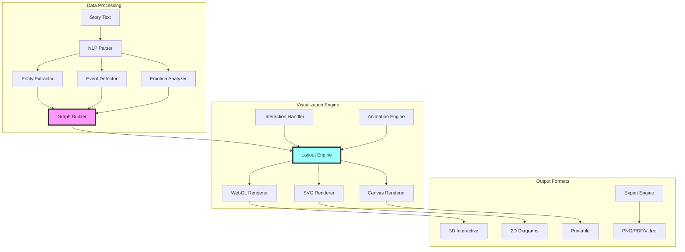

# Story Visualization

## Overview

Story Visualization transforms abstract narrative structures into interactive, visual representations. Authors can see their stories from new perspectives - character journey maps, plot thread weaving, emotional landscapes, and narrative topology. This feature makes complex story structures intuitive and reveals patterns invisible in text.

## Requirements

### Functional Requirements

1. **Character Journey Visualization**
   - Interactive character path through story
   - Relationship network graphs
   - Character arc trajectories
   - Emotional state evolution
   - Scene presence mapping

2. **Plot Structure Mapping**
   - 3D story structure visualization
   - Parallel plot thread viewing
   - Tension/conflict heat maps
   - Pacing rhythm visualization
   - Narrative device highlighting

3. **Timeline Visualization**
   - Multi-track timeline display
   - Flashback/flash-forward mapping
   - Simultaneous event tracking
   - Time dilation visualization
   - Historical period overlay

4. **World Building Maps**
   - Geographic location tracking
   - Character movement paths
   - Setting relationship diagrams
   - Resource/power flow
   - Cultural boundary mapping

5. **Emotional Landscape**
   - Mood progression graphs
   - Reader emotion prediction
   - Tonal consistency mapping
   - Atmosphere visualization
   - Thematic density display

### Non-Functional Requirements

1. **Interactivity**
   - Smooth zooming/panning
   - Real-time updates
   - Clickable elements
   - Customizable views
   - Export capabilities

2. **Performance**
   - Handle novel-length works
   - 60fps interactions
   - Progressive loading
   - GPU acceleration
   - Efficient memory use

3. **Accessibility**
   - Screen reader support
   - Keyboard navigation
   - High contrast modes
   - Alternative text views
   - Motion preferences

## Visual Representations

### 1. Character Constellation
```
         [Tuxicles]
         /    |    \
    (learns) (challenges) (mirrors)
       /      |         \
[Linus]  [Fork-Bearer]  [Tuxippides]
    |         |              |
(wisdom)  (freedom)     (warning)
    |         |              |
    └─────────┴──────────────┘
              |
         [Tuxilles]
              |
         (teaches)
              |
          [Jamie]
```

### 2. Story Topology
```
      Tension ▲
             │     ╱╲
             │    ╱  ╲___╱╲
             │   ╱         ╲
             │  ╱           ╲___
             │ ╱                 ╲
             │╱                   ╲
             └────────────────────► Chapter
             1  2  3  4  5  6  7  8
             
    Rising Action → Climax → Resolution
```

### 3. Plot Thread Weaving
```
Chapter:  1   2   3   4   5   6   7   8
Thread A: ●───●───────●───●───────────●
Thread B:     ●───●───●───────●───●
Thread C:         ●───────●───●───●───●
Thread D:                 ●───●───────●
          └─────────┴─────────┴───────┘
               Convergence Points
```

## Use Cases

### UC1: Story Structure Analysis
**Actor**: Author  
**Precondition**: Complete manuscript  
**Flow**:
1. Author opens Visualization panel
2. Selects "Story Structure" view
3. System generates 3D story map
4. Author rotates to see plot threads
5. Author identifies structural issues
6. Clicks on weak points for details

**Postcondition**: Clear structural understanding

### UC2: Character Relationship Mapping
**Actor**: Author  
**Precondition**: Complex character web  
**Flow**:
1. Author selects "Character Network"
2. System displays relationship graph
3. Author adjusts time slider
4. Relationships evolve visually
5. Author spots missing connections
6. Adds notes for new scenes

**Postcondition**: Complete relationship map

### UC3: Pacing Optimization
**Actor**: Author  
**Precondition**: Pacing concerns  
**Flow**:
1. Author opens "Pacing Rhythm" view
2. System shows tension graph
3. Author sees flat sections
4. Hovers for scene details
5. Drags to reorder scenes
6. Preview new pacing curve

**Postcondition**: Optimized story rhythm

### UC4: World Navigation
**Actor**: Reader/Author  
**Precondition**: Complex world  
**Flow**:
1. Opens "World Map" view
2. Sees character journey paths
3. Clicks timeline controls
4. Watches character movement
5. Explores location details
6. Exports for reference

**Postcondition**: Clear world understanding

## Technical Architecture



## Visualization Types

### 1. Narrative Topology
```typescript
interface NarrativeTopology {
  // 3D landscape of story
  peaks: ClimaxPoint[];
  valleys: QuietMoment[];
  ridges: TensionLine[];
  paths: CharacterJourney[];
  
  // Customization
  heightMetric: 'tension' | 'emotion' | 'pacing';
  colorScheme: 'mood' | 'character' | 'timeline';
  
  // Interaction
  cameraPosition: Vector3;
  selectedElement: StoryElement;
}
```

### 2. Character Constellation
```typescript
interface CharacterConstellation {
  // Node properties
  characters: CharacterNode[];
  relationships: RelationshipEdge[];
  
  // Time-based changes
  timeline: TimelineFrame[];
  currentFrame: number;
  
  // Visual properties
  layout: 'force' | 'hierarchical' | 'circular';
  edgeStyle: 'curved' | 'straight' | 'organic';
}
```

### 3. Emotional Heatmap
```typescript
interface EmotionalHeatmap {
  // Data grid
  chapters: Chapter[];
  emotions: EmotionType[];
  intensity: number[][];
  
  // Display options
  colorScale: ColorScale;
  smoothing: boolean;
  annotations: Annotation[];
}
```

## Interactive Features

### 1. Time Scrubbing
- Drag timeline to see story evolution
- Watch character relationships change
- See plot threads emerge/resolve
- Track emotional journey

### 2. Filtering
- Show/hide specific characters
- Filter by plot thread
- Isolate time periods
- Focus on locations

### 3. Annotation
- Add visual notes
- Mark problem areas
- Highlight successes
- Plan changes

### 4. Comparison
- Before/after editing
- Alternative versions
- Genre standards
- Reader feedback overlay

## Configuration

```yaml
# .story-linter.yml
visualization:
  # Default views
  defaultView: "topology"
  
  # Rendering settings
  rendering:
    quality: "high" # low, medium, high
    antialiasing: true
    shadows: true
    particleEffects: true
    
  # Color schemes
  colors:
    theme: "dark" # light, dark, custom
    emotionPalette: "warm"
    characterColors: "auto" # auto, manual
    
  # Performance
  performance:
    gpuAcceleration: true
    levelOfDetail: "adaptive"
    maxNodes: 10000
    
  # Export settings
  export:
    formats: ["png", "svg", "pdf", "video"]
    resolution: "4k"
    includeInteractivity: true
```

## Integration Examples

### VS Code Integration
```typescript
// Open visualization in side panel
vscode.commands.registerCommand('storyLinter.showVisualization', () => {
  const panel = vscode.window.createWebviewPanel(
    'storyVisualization',
    'Story Structure',
    vscode.ViewColumn.Two,
    { enableScripts: true }
  );
  
  panel.webview.html = getVisualizationHTML();
});
```

### Web Dashboard
```html
<div id="story-viz-container">
  <canvas id="story-topology"></canvas>
  <div class="controls">
    <input type="range" id="timeline-scrubber">
    <select id="view-selector">
      <option>Topology</option>
      <option>Character Network</option>
      <option>Timeline</option>
    </select>
  </div>
</div>
```

## Export Formats

### 1. Static Images
- High-res topology maps
- Character relationship diagrams
- Timeline infographics
- Emotional journey charts

### 2. Interactive Web
- Embeddable widgets
- Standalone web apps
- Share links
- Reader exploration tools

### 3. Video
- Animated story evolution
- Character journey animations
- Timelapse of edits
- Presentation mode

### 4. Print
- Chapter divider art
- Reference posters
- Writing room decoration
- Publisher materials

## Future Enhancements

### 1. VR/AR Story Space
- Walk through your story
- Manipulate plot in 3D
- Character meetings in space
- Immersive editing

### 2. AI-Enhanced Views
- Suggested visual improvements
- Auto-layout optimization
- Pattern recognition
- Anomaly highlighting

### 3. Collaborative Viewing
- Multi-author cursors
- Shared annotations
- Real-time changes
- Version comparison

### 4. Reader Analytics
- Actual reading paths
- Attention heatmaps
- Emotional responses
- Completion tracking