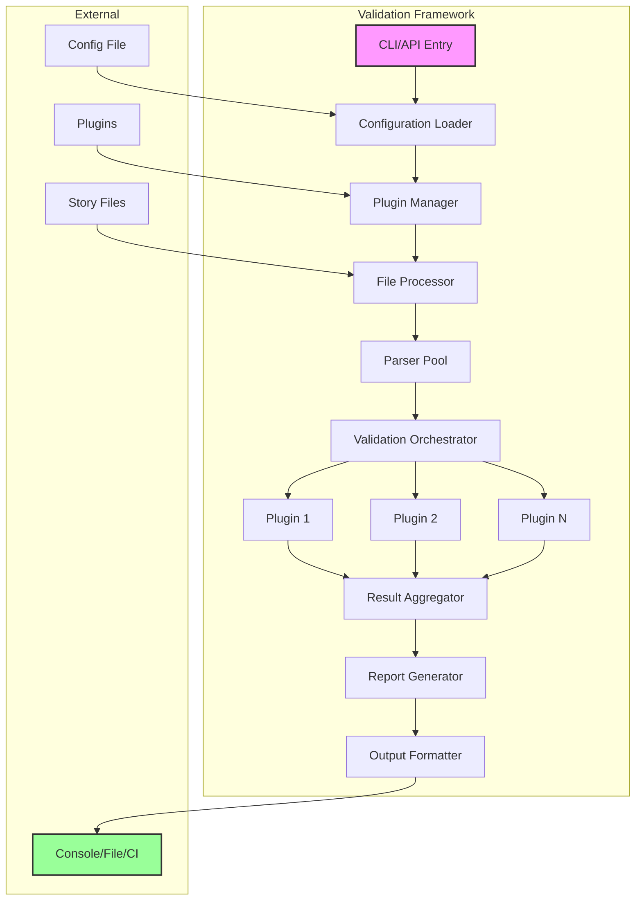

# Validation Framework

## Overview

The Validation Framework is the core engine that runs validation rules against narrative content. It provides a plugin-based architecture where validators can be composed, configured, and extended. The framework handles file processing, error aggregation, reporting, and performance optimization.

## Requirements

### Functional Requirements

1. **Plugin Management**
   - Load and initialize validator plugins
   - Manage plugin dependencies
   - Handle plugin configuration
   - Support dynamic plugin loading

2. **File Processing**
   - Parse multiple file formats (Markdown, plain text, JSON)
   - Handle large files efficiently
   - Support glob patterns for file selection
   - Process files in parallel

3. **Validation Execution**
   - Run validators in optimal order
   - Share parsed data between validators
   - Aggregate results from multiple validators
   - Support validation levels (error, warning, info)

4. **Error Reporting**
   - Detailed error messages with context
   - File path and line number references
   - Suggested fixes when available
   - Multiple output formats (JSON, text, HTML)

5. **Performance Optimization**
   - Cache parsed files
   - Incremental validation
   - Parallel processing
   - Early termination on critical errors

### Non-Functional Requirements

1. **Extensibility**
   - Simple plugin API
   - TypeScript support
   - Hook system for customization
   - Event-driven architecture

2. **Performance**
   - < 1 second for small projects
   - Linear scaling with file count
   - Memory efficient
   - Streamable results

3. **Reliability**
   - Graceful error handling
   - Validation continues despite individual failures
   - Detailed error logs
   - Rollback capability

## Use Cases

### UC1: Basic Validation Run
**Actor**: Author  
**Precondition**: Story files and configuration exist  
**Flow**:
1. Author runs `story-linter validate`
2. Framework loads configuration
3. Framework discovers and loads plugins
4. Framework processes files
5. Validators run against parsed content
6. Framework aggregates results
7. Framework outputs report

**Postcondition**: Validation report generated

### UC2: Targeted Validation
**Actor**: Author  
**Precondition**: Specific files need validation  
**Flow**:
1. Author runs `story-linter validate chapter-05.md`
2. Framework loads only necessary validators
3. Framework processes single file
4. Validators check specific file
5. Framework reports focused results

**Postcondition**: Single file validation complete

### UC3: CI/CD Integration
**Actor**: CI System  
**Precondition**: Story files in repository  
**Flow**:
1. CI runs `story-linter validate --format=json`
2. Framework runs all validations
3. Framework outputs machine-readable results
4. CI parses results
5. CI fails build if errors exist

**Postcondition**: Build status reflects validation results

### UC4: Watch Mode Development
**Actor**: Author  
**Precondition**: Author actively writing  
**Flow**:
1. Author runs `story-linter validate --watch`
2. Framework monitors file changes
3. On change, framework re-validates affected files
4. Framework shows incremental results
5. Author fixes issues in real-time

**Postcondition**: Continuous validation during writing

## Acceptance Criteria

1. **Plugin System**
   - ✅ Loads plugins from node_modules
   - ✅ Supports local plugins
   - ✅ Handles plugin errors gracefully
   - ⚠️ Respects plugin dependencies (basic support)

2. **File Processing**
   - ✅ Supports .md files
   - ❌ .txt, .json support not implemented
   - ✅ Handles UTF-8
   - ❌ UTF-16 not implemented
   - ⚠️ Processes files (performance not optimized)
   - ✅ Memory efficient with streaming

3. **Validation**
   - ✅ Runs all configured validators
   - ✅ Aggregates results correctly
   - ✅ Respects severity levels
   - ✅ Provides actionable error messages

4. **Output**
   - ✅ Supports text, JSON, HTML formats (via CLI)
   - ✅ Includes summary statistics
   - ✅ Groups errors by type/file
   - ⚠️ Provides fix suggestions (limited)

## Implementation Status

### ✅ Completed
- Base validator interface and abstract class
- Plugin registration system (`use()` method)
- File discovery with glob patterns
- Validation orchestration
- Result aggregation
- Event system for progress tracking
- Metadata extraction framework
- Configuration loading from YAML

### ⚠️ Partially Complete
- **SOLID Violations**: ValidationFramework has too many responsibilities
- **No DI**: Framework creates its own dependencies instead of injection
- **Missing Tests**: No unit tests for ValidationFramework itself
- Performance optimization not implemented
- Watch mode not implemented

### ❌ Not Implemented
- Parallel processing with worker threads
- Incremental validation
- Advanced caching strategies
- Plugin dependency resolution
- Multiple file format support beyond Markdown

## Test Plan

### Unit Tests
1. Plugin loader functionality
2. File parser modules
3. Result aggregation logic
4. Error formatting

### Integration Tests
1. Multi-plugin validation
2. Large file processing
3. Various file formats
4. Error scenarios

### End-to-End Tests
1. GitScrolls full validation
2. Performance benchmarks
3. CI/CD simulation
4. Watch mode operation

### Performance Tests
1. 10,000 file project
2. 100MB single file
3. 50 concurrent validators
4. Memory leak detection

## Architecture



## Core Interfaces

```typescript
interface ValidationFramework {
  // Load and configure the framework
  initialize(config: FrameworkConfig): Promise<void>;
  
  // Register validators
  use(validator: Validator | ValidatorConstructor): void;
  
  // Run validation
  validate(options?: ValidationOptions): Promise<ValidationResult>;
  
  // Watch mode
  watch(paths: string[], callback: WatchCallback): Watcher;
}

interface Validator {
  name: string;
  version: string;
  
  // Metadata extraction (called during file streaming)
  getMetadataExtractors?(): Record<string, MetadataExtractor>;
  
  // Validator lifecycle
  initialize?(context: ValidatorContext): Promise<void>;
  validate(files: ParsedFile[], config: any): Promise<ValidationOutput>;
  destroy?(): Promise<void>;
}

type MetadataExtractor = (content: string, context: ExtractionContext) => ExtractedData;

interface ValidatorContext {
  // Shared utilities
  logger: Logger;
  cache: Cache;
  
  // Access to other validator results
  getResults(validatorName: string): ValidationOutput | undefined;
  
  // Schema access
  getSchema(): StorySchema;
}

interface ValidationOutput {
  validator: string;
  errors: ValidationError[];
  warnings: ValidationWarning[];
  info: ValidationInfo[];
  metrics?: ValidationMetrics;
}
```

## Configuration

```yaml
# .story-linter.yml
framework:
  # File processing
  files:
    include:
      - "**/*.md"
      - "**/*.txt"
    exclude:
      - "**/node_modules/**"
      - "**/.*"
  
  # Performance
  performance:
    parallel: true
    workers: 4
    cache: true
    cacheLocation: ".story-linter-cache"
  
  # Validation settings
  validation:
    stopOnError: false
    severity: "warning" # minimum severity to report
    
  # Output
  output:
    format: "text" # text, json, html
    groupBy: "file" # file, validator, severity
    verbose: false
    colors: true

# Validator configurations
validators:
  character-consistency:
    enabled: true
    config:
      # validator-specific config
  
  timeline-validator:
    enabled: true
    config:
      # validator-specific config
```

## Error Format

```typescript
interface ValidationError {
  // Identity
  code: string;           // "CHAR001"
  type: string;           // "character-consistency"
  
  // Location
  file: string;           // "chapter-01.md"
  line?: number;          // 42
  column?: number;        // 15
  
  // Details
  severity: 'error' | 'warning' | 'info';
  message: string;        // Human-readable error
  context?: string;       // Line content or snippet
  
  // Fix information
  fixable?: boolean;
  suggestion?: string;    // How to fix
  replacement?: string;   // Automated fix content
}
```

## Performance Considerations

1. **Hybrid Caching Strategy**
   - Stream large files (>100KB) without caching content
   - Cache small files entirely for repeated access
   - Always cache extracted metadata with source locations
   - Track line/column/offset for precise error reporting
   - Plugin-defined metadata extractors run during streaming

2. **Metadata Location Tracking**
   ```typescript
   interface MetadataLocation {
     line: number;
     column: number;
     offset: number;  // byte offset for seeking
   }
   ```

3. **Parallel Processing**
   - Worker threads for CPU-intensive tasks
   - Concurrent file I/O
   - Validator parallelization

4. **Incremental Validation**
   - Track file changes via hash
   - Re-validate only affected files
   - Reuse cached metadata when file unchanged

5. **Memory Management**
   - Stream-first approach for large files
   - LRU cache with configurable size limits
   - Dispose parsed content, keep only metadata

## Implementation Plan

### Complexity: 🔥🔥🔥 (Medium-High)
**Reasoning**: Core architecture requiring careful design, plugin system, performance optimization

### Time Estimate: 4-5 weeks (1 developer)
- Core framework: 2 weeks
- Plugin system: 1 week
- Performance optimization: 1 week
- Testing & documentation: 1 week

### Dependencies

#### Upstream (Required Before)
- **Configuration System** - Load validator configs
- **File Processing Utils** - Basic file operations

#### Downstream (Enables)
- **All Validators** - Built on this framework
- **CLI Interface** - Uses framework API
- **Watch Mode** - Extends framework
- **VS Code Extension** - Integrates framework

### Task Breakdown

#### Phase 1: Core Architecture (Week 1)
1. **Base Interfaces** (2 days)
   - Define Validator interface
   - Create ValidationResult types
   - Design plugin contract
   - Error type hierarchy

2. **File Processing Pipeline** (2 days)
   - File discovery system
   - Format detection
   - Parsing pipeline
   - Cache management

3. **Framework Core** (1 day)
   - Main validation orchestrator
   - Configuration loader
   - Logger setup
   - Event system

#### Phase 2: Plugin System (Week 2)
1. **Plugin Loader** (2 days)
   - Dynamic import system
   - Dependency resolution
   - Version checking
   - Error isolation

2. **Plugin Lifecycle** (2 days)
   - Initialization hooks
   - Context injection
   - Resource management
   - Cleanup handling

3. **Plugin Communication** (1 day)
   - Shared context
   - Inter-plugin messaging
   - Result sharing
   - Event propagation

#### Phase 3: Validation Engine (Week 3)
1. **Orchestration Logic** (2 days)
   - Execution order optimization
   - Parallel execution
   - Dependency handling
   - Progress tracking

2. **Result Aggregation** (2 days)
   - Error collection
   - Deduplication
   - Severity handling
   - Summary generation

3. **Error Enhancement** (1 day)
   - Context extraction
   - Fix suggestions
   - Error grouping
   - Related information

#### Phase 4: Performance (Week 4)
1. **Caching System** (2 days)
   - File parse cache
   - Result cache
   - Incremental validation
   - Cache invalidation

2. **Parallel Processing** (2 days)
   - Worker thread pool
   - Task distribution
   - Result collection
   - Memory management

3. **Optimization** (1 day)
   - Profiling
   - Bottleneck identification
   - Algorithm optimization
   - Memory optimization

#### Phase 5: Polish (Week 5)
1. **Error Handling** (2 days)
   - Graceful degradation
   - Plugin crash isolation
   - Recovery mechanisms
   - Error reporting

2. **Testing Suite** (2 days)
   - Unit tests
   - Integration tests
   - Performance tests
   - Plugin test harness

3. **Documentation** (1 day)
   - API documentation
   - Plugin guide
   - Architecture docs
   - Examples

### Technical Decisions

1. **Plugin Architecture**:
   - Option A: Simple require() plugins
   - Option B: Webpack-style plugin system
   - Option C: VS Code-style activation events
   - Recommendation: VS Code-style for flexibility

2. **Concurrency Model**:
   - Worker threads for CPU-bound tasks
   - Async/await for I/O
   - Process pool for isolation
   - Recommendation: Hybrid approach

3. **Caching Strategy**:
   - In-memory LRU cache
   - Disk cache for large files
   - Redis for distributed setup
   - Recommendation: Layered caching

### Risk Mitigation

1. **Plugin Compatibility**
   - Risk: Plugin version conflicts
   - Mitigation: Strict semver, isolated contexts

2. **Performance Degradation**
   - Risk: Slow with many validators
   - Mitigation: Profiling, optimization passes

3. **Memory Leaks**
   - Risk: Long-running processes leak
   - Mitigation: Resource tracking, cleanup

### Success Metrics

- Plugin load time < 100ms
- 1000 file validation < 10s
- Memory usage < 500MB
- Zero crashes from plugin errors
- 90%+ code coverage

### API Design Preview

```typescript
// Simple, powerful API
const linter = new StoryLinter({
  plugins: ['character', 'timeline'],
  config: '.story-linter.yml'
});

const results = await linter.validate('**/*.md');

// Or programmatic
const framework = new ValidationFramework();
framework.use(new CharacterValidator());
framework.use(new TimelineValidator());

const results = await framework.validate({
  files: ['chapter-*.md'],
  parallel: true
});
```