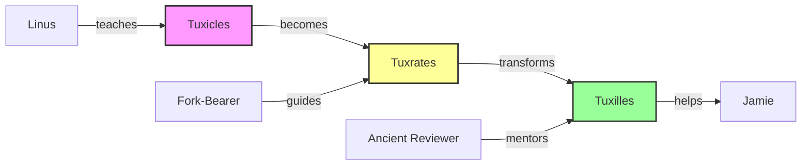

# VS Code Extension

## Overview

The Story Linter VS Code Extension brings real-time narrative validation directly into the world's most popular code editor. Authors can see issues as they write, get intelligent suggestions, and navigate their narrative structure without leaving their writing environment. The extension transforms VS Code into a powerful narrative development environment.

## Requirements

### Functional Requirements

1. **Real-time Validation**
   - Validate on type with debouncing
   - Show inline warnings/errors
   - Update problem panel
   - Squiggly underlines for issues
   - Hover information for details

2. **Navigation Features**
   - Story outline view
   - Character reference finder
   - Timeline navigator
   - Plot thread tracker
   - Go to definition for characters

3. **Intelligent Assistance**
   - Auto-completion for character names
   - Consistency suggestions
   - Quick fixes for common issues
   - Refactoring support (rename character)
   - Code actions for fixes

4. **Visualization**
   - Character relationship graph
   - Timeline visualization
   - Plot thread diagram
   - Story structure overview
   - Minimap annotations

5. **Integration**
   - Sync with CLI configuration
   - Git integration for history
   - Multi-root workspace support
   - Remote development support
   - Live Share compatibility

### Non-Functional Requirements

1. **Performance**
   - < 50ms response time
   - Minimal memory footprint
   - Background processing
   - Efficient file watching

2. **User Experience**
   - Intuitive UI
   - Customizable appearance
   - Keyboard shortcuts
   - Command palette integration

3. **Compatibility**
   - VS Code 1.75+
   - All platforms
   - Theme compatibility
   - Extension compatibility

## Use Cases

### UC1: Writing with Validation
**Actor**: Author  
**Precondition**: Extension installed, project open  
**Flow**:
1. Author writes new paragraph
2. Extension validates in background
3. Issue appears as squiggly line
4. Author hovers for details
5. Author applies quick fix
6. Issue resolved instantly

**Postcondition**: Clean, validated text

### UC2: Character Navigation
**Actor**: Author  
**Precondition**: Multi-chapter story  
**Flow**:
1. Author right-clicks character name
2. Selects "Find All References"
3. Extension shows all mentions
4. Author navigates to specific mention
5. Author sees context

**Postcondition**: Easy character tracking

### UC3: Story Visualization
**Actor**: Author  
**Precondition**: Complex narrative  
**Flow**:
1. Author opens Story View
2. Selects "Character Relationships"
3. Extension shows interactive graph
4. Author clicks on relationship
5. Extension shows relevant passages

**Postcondition**: Visual understanding

### UC4: Collaborative Writing
**Actor**: Writing Team  
**Precondition**: Shared repository  
**Flow**:
1. Author A makes changes
2. Author B pulls changes
3. Extension shows validation issues
4. Extension highlights conflicts
5. Team resolves together

**Postcondition**: Consistent narrative

## Visual Design

### Editor Integration
```
┌─────────────────────────────────────────────────────────────┐
│ chapter-05.md                                    ⚠️ 2  ❌ 1 │
├─────────────────────────────────────────────────────────────┤
│ 1  | # Chapter 5: The Transformation                        │
│ 2  |                                                         │
│ 3  | Young Tuxilles walked through the temple gates.        │
│    |        ~~~~~~~~                                         │
│    |        ❌ Character "Tuxilles" appears too early       │
│ 4  |                                                         │
│ 5  | He remembered when the Fork-Bearer had taught him.     │
│    |                     ~~~~~~~~~~~~                        │
│    |                     ⚠️ Character not yet introduced    │
├─────────────────────────────────────────────────────────────┤
│ Problems | Output | Debug Console | Terminal                 │
├─────────────────────────────────────────────────────────────┤
│ ❌ chapter-05.md:3 Character "Tuxilles" appears too early  │
│    Expected: "Tuxrates" for chapters 3-4                    │
│    Quick Fix: Replace with "Tuxrates"                      │
│                                                             │
│ ⚠️  chapter-05.md:5 Character "Fork-Bearer" referenced      │
│    before introduction in chapter-04.md                     │
└─────────────────────────────────────────────────────────────┘
```

### Story Outline View
```
┌─────────────────────────────────┐
│ STORY OUTLINE                   │
├─────────────────────────────────┤
│ 📖 My Story                     │
│ ├─ 📑 Characters (15)           │
│ │  ├─ 👤 Tuxicles              │
│ │  │  ├─ First: ch-01.md:10    │
│ │  │  ├─ Becomes: Tuxrates     │
│ │  │  └─ References: 45        │
│ │  ├─ 👤 Tuxrates              │
│ │  └─ 👤 Tuxilles              │
│ ├─ 🕐 Timeline                  │
│ │  ├─ December 2024            │
│ │  ├─ January 2025             │
│ │  └─ May 2025                 │
│ └─ 🧵 Plot Threads (8)          │
│    ├─ Authentication Failure    │
│    └─ The Transformation       │
└─────────────────────────────────┘
```

### Character Relationship Graph


## Features

### 1. IntelliSense for Stories
```typescript
// Auto-completion for character names
"Tux|" → suggests ["Tuxicles", "Tuxrates", "Tuxilles"]

// Smart suggestions based on context
"In chapter 1, |" → suggests ["Tuxicles"] not ["Tuxilles"]

// Location awareness
"They met at the |" → suggests known locations
```

### 2. Code Actions
```typescript
// Quick fixes
- Replace incorrect character name
- Add character introduction
- Fix timeline inconsistency
- Update outdated reference

// Refactoring
- Rename character globally
- Extract scene to new chapter
- Reorder chapters
- Merge similar characters
```

### 3. Diagnostic Integration
```typescript
interface StoryDiagnostic extends vscode.Diagnostic {
  // Standard diagnostic info
  range: vscode.Range;
  severity: vscode.DiagnosticSeverity;
  message: string;
  
  // Story-specific info
  storyCode: string;  // "CHAR001"
  validator: string;  // "character-consistency"
  quickFixes?: QuickFix[];
  relatedInfo?: vscode.DiagnosticRelatedInformation[];
}
```

### 4. Custom Views
- **Story Outline** - Hierarchical story structure
- **Character List** - All characters with stats
- **Timeline View** - Visual timeline
- **Validation Report** - Current issues
- **Schema Explorer** - Browse extracted patterns

## Configuration

```json
{
  "storyLinter.enable": true,
  "storyLinter.validateOnType": true,
  "storyLinter.validateOnSave": true,
  "storyLinter.showInlineHints": true,
  "storyLinter.severity": {
    "character": "error",
    "timeline": "warning",
    "reference": "information"
  },
  "storyLinter.autoFix": {
    "onSave": false,
    "suggestions": true
  },
  "storyLinter.appearance": {
    "decorations": true,
    "statusBar": true,
    "problemMatcher": true
  },
  "storyLinter.advanced": {
    "debounceDelay": 500,
    "maxProblems": 100,
    "trace": "off"
  }
}
```

## Extension API

```typescript
// For other extensions to integrate
export interface StoryLinterAPI {
  // Validation
  validate(document: vscode.TextDocument): Promise<StoryDiagnostic[]>;
  validateWorkspace(): Promise<Map<string, StoryDiagnostic[]>>;
  
  // Schema
  getSchema(): Promise<StorySchema>;
  updateSchema(patterns: Pattern[]): Promise<void>;
  
  // Navigation
  findCharacterReferences(name: string): Promise<vscode.Location[]>;
  getCharacterInfo(name: string): Promise<CharacterInfo>;
  
  // Visualization
  getRelationshipGraph(): Promise<GraphData>;
  getTimeline(): Promise<TimelineData>;
}

// Extension activation
export function activate(context: vscode.ExtensionContext) {
  // Register providers
  context.subscriptions.push(
    vscode.languages.registerCodeActionsProvider('markdown', 
      new StoryCodeActionProvider()),
    vscode.languages.registerCompletionItemProvider('markdown',
      new StoryCompletionProvider()),
    vscode.languages.registerDefinitionProvider('markdown',
      new CharacterDefinitionProvider())
  );
  
  // Register views
  const outlineProvider = new StoryOutlineProvider();
  vscode.window.createTreeView('storyOutline', {
    treeDataProvider: outlineProvider
  });
  
  // Start validation
  const validator = new BackgroundValidator();
  validator.start();
}
```

## Implementation Plan

### Complexity: 🔥🔥🔥 (Medium-High)
**Reasoning**: VS Code API knowledge required, complex UI components, performance critical

### Time Estimate: 4 weeks (1 developer)
- Extension setup & basics: 1 week
- Validation integration: 1 week
- UI components: 1 week
- Polish & publishing: 1 week

### Dependencies

#### Upstream (Required Before)
- **Validation Framework** - Core validation
- **CLI Interface** - Reuse validation logic
- **Watch Mode** - Real-time validation

#### Downstream (Enables)
- **Collaborative writing** - Multi-cursor support
- **Cloud sync** - Settings sync
- **Mobile companion** - Remote editing

### Technical Decisions

1. **Language Server Protocol**
   - Separate process for validation
   - Better performance
   - Reusable for other editors
   - Recommendation: Yes for v2

2. **Webview Technology**
   - React for complex views
   - Plain HTML for simple
   - VS Code toolkit
   - Recommendation: React for graphs

3. **State Management**
   - VS Code Memento
   - Extension context
   - External storage
   - Recommendation: Memento + context

### Success Metrics

- < 50ms validation feedback
- < 100ms autocomplete
- < 200MB memory usage
- 4.5+ star rating
- 1000+ installs first month

## Marketplace Listing

**Name**: Story Linter for VS Code  
**ID**: story-linter.vscode-story-linter  
**Description**: Real-time narrative validation and assistance for fiction writers  
**Categories**: Linters, Other  
**Tags**: writing, fiction, validation, narrative, story  

**Features**:
- ✨ Real-time validation as you write
- 🔍 Find character references instantly  
- 🎯 Smart auto-completion
- 🛠️ Quick fixes for common issues
- 📊 Visualize story structure
- 🎨 Customizable validation rules
- 🚀 Lightning fast performance
- 🌍 Multi-language support

**Requirements**:
- VS Code 1.75.0 or higher
- Node.js 16+ (for language server)