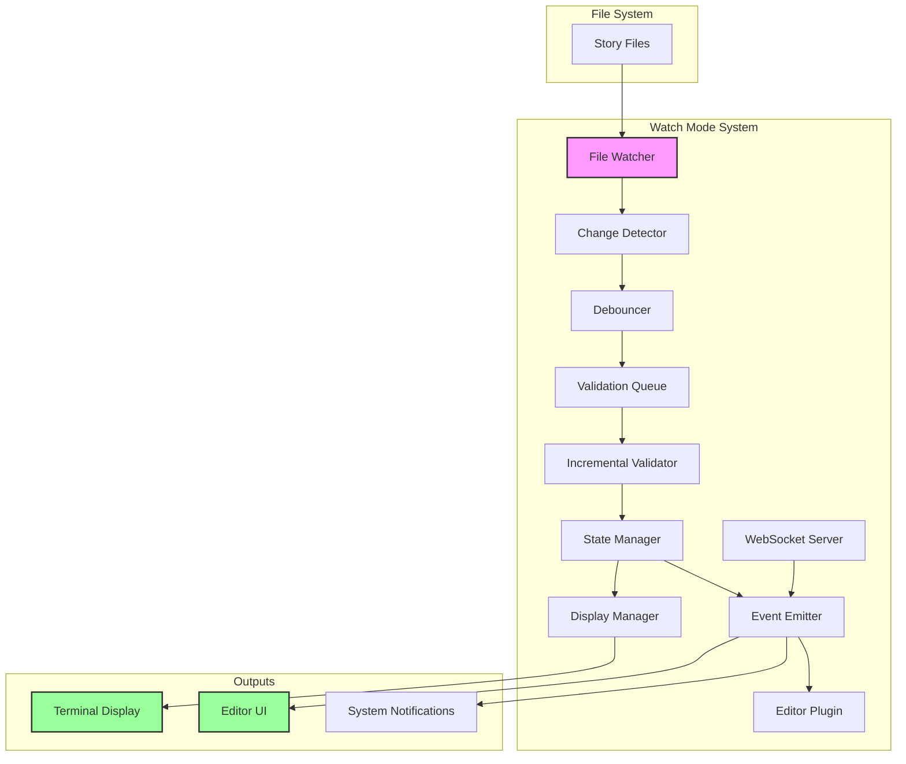

# Watch Mode

## Overview

Watch Mode provides real-time validation as authors write. It monitors file changes, incrementally validates modified content, and provides immediate feedback. This mode transforms story-linter from a post-writing check into an active writing assistant, catching inconsistencies as they're introduced.

## Requirements

### Functional Requirements

1. **File Monitoring**
   - Watch specified files/directories
   - Detect file changes (create, modify, delete)
   - Handle file renames
   - Support ignore patterns
   - Recursive directory watching

2. **Incremental Validation**
   - Validate only changed files
   - Update dependent validations
   - Maintain validation state
   - Clear results for deleted files
   - Handle rapid changes

3. **Real-time Feedback**
   - Display results immediately
   - Update terminal display
   - Show validation progress
   - Highlight new issues
   - Clear resolved issues

4. **Performance Optimization**
   - Debounce rapid changes
   - Efficient file watching
   - Minimal CPU usage
   - Smart cache invalidation
   - Parallel validation

5. **Integration Features**
   - Editor integration support
   - WebSocket server option
   - Status bar information
   - System notifications
   - Sound alerts (optional)

### Non-Functional Requirements

1. **Responsiveness**
   - < 500ms to start validation
   - < 2s for average file validation
   - Smooth UI updates
   - No blocking operations

2. **Reliability**
   - Handle file system errors
   - Recover from crashes
   - Persistent watch state
   - Memory leak prevention

3. **Usability**
   - Clear status indicators
   - Easy to start/stop
   - Configurable sensitivity
   - Quiet mode option

## Use Cases

### UC1: Writing Session
**Actor**: Author  
**Precondition**: Project configured  
**Flow**:
1. Author runs `story-linter watch`
2. System shows initial validation
3. Author edits chapter-5.md
4. System detects change
5. System validates chapter-5.md
6. System updates display
7. Author sees issues immediately

**Postcondition**: Real-time validation active

### UC2: Multi-file Refactoring
**Actor**: Author  
**Precondition**: Watch mode active  
**Flow**:
1. Author renames character globally
2. System detects multiple changes
3. System validates affected files
4. System shows updated results
5. Author sees impact across files

**Postcondition**: All changes validated

### UC3: Editor Integration
**Actor**: Author  
**Precondition**: Editor plugin installed  
**Flow**:
1. Author opens project in editor
2. Plugin starts watch mode
3. Author writes new content
4. Plugin shows inline warnings
5. Author fixes issues immediately

**Postcondition**: Seamless editor integration

### UC4: CI Development
**Actor**: Developer  
**Precondition**: Working on validation rules  
**Flow**:
1. Dev runs watch with test files
2. Dev modifies validation logic
3. System re-runs validations
4. Dev sees immediate effect
5. Dev iterates quickly

**Postcondition**: Rapid development cycle

## Acceptance Criteria

1. **File Watching**
   - ✓ Detects all file changes
   - ✓ Handles 1000+ files
   - ✓ Supports all platforms
   - ✓ Respects ignore patterns

2. **Validation**
   - ✓ Incremental updates work
   - ✓ Dependency tracking accurate
   - ✓ Results update < 2s
   - ✓ Memory usage stable

3. **Display**
   - ✓ Clear status indicators
   - ✓ Results well organized
   - ✓ Terminal responsive
   - ✓ Colors enhance readability

4. **Integration**
   - ✓ WebSocket server works
   - ✓ Editor plugins connect
   - ✓ API documented
   - ✓ Events emitted correctly

## Test Plan

### Unit Tests
1. File watcher logic
2. Change detection
3. Debounce algorithm
4. State management

### Integration Tests
1. Multi-file scenarios
2. Rapid change handling
3. Large project watching
4. Error recovery

### Performance Tests
1. CPU usage monitoring
2. Memory leak detection
3. Large file handling
4. Many file changes

### End-to-End Tests
1. Full writing session
2. Editor integration
3. CI/CD workflow
4. Cross-platform

## Watch Mode Display

### Initial State
```
story-linter watch

Watching 45 files in /Users/author/my-story
Press Ctrl+C to stop

✓ All files valid

Status: Watching for changes...
Last check: 2024-01-15 10:30:45
```

### After File Change
```
story-linter watch

Watching 45 files in /Users/author/my-story
Press Ctrl+C to stop

✗ Validation errors found

chapter-05.md (modified 2s ago)
  error  CHAR001  line 42  Character "Tuxilles" appears too early
    Expected: Tuxrates (for chapters 3-4)
    
✓ 44 other files valid

Status: Watching for changes...
Last check: 2024-01-15 10:32:15
Next: Auto-fix available (press 'f')
```

### Multiple Changes
```
story-linter watch

Watching 45 files in /Users/author/my-story
Press Ctrl+C to stop

⠼ Validating 3 changed files...

Recent changes:
  10:32:45  chapter-05.md     modified
  10:32:46  chapter-06.md     modified  
  10:32:47  characters.yml    modified

Status: Validating...
```

## Architecture



## Configuration

```yaml
# .story-linter.yml
watch:
  # Debounce delay (ms)
  debounce: 300
  
  # File watching
  files:
    include:
      - "**/*.md"
      - "**/*.txt"
    exclude:
      - "**/node_modules/**"
      - "**/.git/**"
      - "**/tmp/**"
  
  # Display options
  display:
    clearScreen: true
    showTimestamps: true
    groupByFile: true
    maxErrors: 20
    
  # Performance
  performance:
    maxConcurrent: 4
    useFsEvents: true  # macOS
    usePolling: false  # fallback
    pollingInterval: 1000
    
  # Integration
  integration:
    webSocket:
      enabled: false
      port: 7890
      host: "localhost"
    
    notifications:
      enabled: true
      onError: true
      onSuccess: false
      
  # Auto-actions
  auto:
    fix: false
    clear: true
    restart: true
```

## API

```typescript
interface WatchMode {
  // Start watching
  start(options?: WatchOptions): Promise<Watcher>;
  
  // Get current watcher
  current(): Watcher | null;
}

interface Watcher extends EventEmitter {
  // Control
  stop(): void;
  pause(): void;
  resume(): void;
  
  // State
  getFiles(): string[];
  getStatus(): WatchStatus;
  getResults(): ValidationResults;
  
  // Actions
  validateAll(): Promise<void>;
  validateFile(path: string): Promise<void>;
  clearResults(): void;
  
  // Events
  on(event: 'change', handler: (path: string) => void): this;
  on(event: 'validation-start', handler: (files: string[]) => void): this;
  on(event: 'validation-end', handler: (results: ValidationResults) => void): this;
  on(event: 'error', handler: (error: Error) => void): this;
}

interface WatchStatus {
  watching: boolean;
  files: number;
  lastCheck: Date;
  pending: string[];
  errors: number;
  warnings: number;
}
```

## WebSocket Protocol

```typescript
// Server -> Client messages
interface ValidationMessage {
  type: 'validation';
  file: string;
  results: ValidationResult[];
  timestamp: string;
}

interface StatusMessage {
  type: 'status';
  watching: boolean;
  files: number;
  errors: number;
  warnings: number;
}

// Client -> Server messages
interface ValidateMessage {
  type: 'validate';
  files?: string[];  // optional specific files
}

interface ConfigMessage {
  type: 'config';
  config: Partial<WatchConfig>;
}
```

## Performance Strategies

### 1. Intelligent Debouncing
```typescript
// Adaptive debounce based on file size
const debounceTime = Math.min(
  baseDebounce + (fileSize / 1000), // +1ms per KB
  maxDebounce
);
```

### 2. Dependency Tracking
```typescript
// Only re-validate affected files
interface DependencyGraph {
  [file: string]: string[];  // files that depend on this file
}

// When chapter-01.md changes, also validate:
// - Files that reference chapter-01.md
// - Character consistency across all files
// - Timeline validation for subsequent chapters
```

### 3. Incremental State
```typescript
interface IncrementalState {
  // Previous validation results
  cache: Map<string, ValidationResult>;
  
  // File checksums
  checksums: Map<string, string>;
  
  // Last validation time
  timestamps: Map<string, Date>;
}
```

## Terminal Controls

| Key | Action | Description |
|-----|--------|-------------|
| Ctrl+C | Stop | Stop watching and exit |
| r | Restart | Re-validate all files |
| c | Clear | Clear current results |
| f | Fix | Auto-fix if available |
| p | Pause | Pause watching |
| Space | Resume | Resume watching |
| v | Verbose | Toggle verbose mode |
| q | Quiet | Toggle quiet mode |
| ? | Help | Show commands |

## Integration Examples

### VS Code Extension
```json
{
  "story-linter.watchMode": {
    "autoStart": true,
    "showStatusBar": true,
    "showProblems": true,
    "showInlineHints": true
  }
}
```

### Git Hook
```bash
#!/bin/bash
# .git/hooks/pre-commit

# Run watch mode in check mode
story-linter watch --check --timeout=5

if [ $? -ne 0 ]; then
  echo "❌ Story validation failed"
  exit 1
fi
```

## Implementation Plan

### Complexity: 🔥🔥 (Medium)
**Reasoning**: Well-understood file watching patterns, but needs careful performance tuning

### Time Estimate: 2 weeks (1 developer)
- File watching setup: 3 days
- Incremental validation: 4 days
- Display & integration: 3 days

### Dependencies

#### Upstream (Required Before)
- **Validation Framework** - Core validation engine
- **CLI Interface** - Hosts watch command

#### Downstream (Enables)
- **VS Code Extension** - Uses watch mode
- **Real-time collaboration** - WebSocket foundation

### Success Metrics
- < 500ms change detection
- < 2s validation update
- < 5% CPU usage idle
- Zero memory leaks
- 95% change detection accuracy