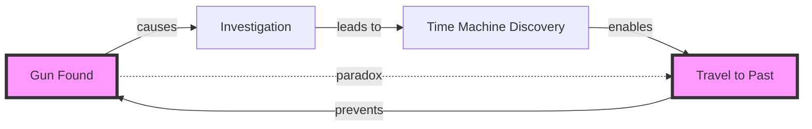

# Temporal Narrative Engine

## Vision

The Temporal Narrative Engine understands and validates time in all its narrative complexity - from simple chronologies to complex time travel paradoxes, parallel timelines, and non-linear storytelling. It's the ultimate time-keeper for your stories.

## Core Capabilities

### 1. Timeline Comprehension

**Multi-Timeline Tracking**:
```
Timeline A (Primary):        ═══════╤═══════╤═══════
                                    │       │
Timeline B (Dream):          ······╱·······╲·······
                                  ╱         ╲
Timeline C (Flashback):    ╭─────╯           ╰─────╮
                          Past              Present
```

**Temporal Relationships**:
- Sequential: Event A → Event B
- Parallel: Event A || Event B
- Causal: Event A ⟹ Event B
- Retroactive: Event B ⟲ Event A
- Quantum: Event A ⟨?⟩ Event B

### 2. Time Travel Validation

**Paradox Detection**:
```yaml
paradox-alert:
  type: "grandfather"
  severity: "story-breaking"
  chapter: 14
  description: "Character prevents own birth"
  
  resolution-options:
    - "Stable time loop"
    - "Alternate timeline creation"
    - "Observer effect nullification"
    - "Predestination fulfillment"
```

**Consistency Rules**:
```typescript
interface TimeTravel {
  model: 'fixed' | 'dynamic' | 'multiverse' | 'quantum';
  rules: {
    canChangePass: boolean;
    createsBranches: boolean;
    paradoxResolution: ParadoxStrategy;
    butterflyEffect: 'none' | 'limited' | 'full';
  };
}
```

### 3. Non-Linear Navigation

**Story Time vs. Narrative Time**:
```
Story Time (Chronological):
[Birth]--[School]--[First Job]--[Marriage]--[Death]

Narrative Time (As Told):
[Death]--[Marriage]--[Birth]--[First Job]--[School]
   ↓         ↓          ↓          ↓           ↓
  Ch.1     Ch.2       Ch.3       Ch.4        Ch.5
```

**Reading Path Optimization**:
- Suggest optimal reading order
- Track reader's temporal position
- Provide timeline visualization
- Prevent spoiler exposure

### 4. Temporal Anchor System

**Fixed Points**:
```typescript
interface TemporalAnchor {
  id: string;
  description: string;
  date: Date | RelativeTime;
  immutable: boolean;
  references: Reference[];
  
  validate(): ValidationResult {
    // Ensure all references align
    // Check for contradictions
    // Verify accessibility
  }
}
```

**Relative Time Tracking**:
- "Three days after the storm"
- "Before the war ended"
- "When she was young"
- "In the old days"

### 5. Character Age Matrix

**Temporal Character Tracking**:
```
         Chapter:  1    5    10   15   20
Character        Age  Age  Age  Age  Age
─────────────────────────────────────────
Sarah:           25   27   23   30   35
(time travel)         ↓    ↑         ↑
                    normal │      jump to future
                          flashback

John:            30   32   --   37   42
(linear)                  died

Maria:           ??   28   28   28   28
(immortal)           revealed as centuries old
```

### 6. Temporal Linguistics

**Tense Consistency**:
```typescript
interface TenseAnalyzer {
  detectTense(paragraph: string): Tense;
  validateConsistency(chapter: Chapter): TenseReport;
  suggestCorrections(issues: TenseIssue[]): Correction[];
  
  handleSpecialCases: {
    flashback: TenseRules;
    prophecy: TenseRules;
    timeTravel: TenseRules;
    dream: TenseRules;
  };
}
```

**Temporal Markers**:
- Explicit: "On June 5th, 2025"
- Relative: "Two weeks later"
- Contextual: "After the harvest"
- Emotional: "In happier times"

### 7. Quantum Narrative States

**Schrödinger's Plot**:
```yaml
quantum-state:
  event: "The Box Opening"
  states:
    - outcome: "Cat alive"
      probability: 0.5
      timeline: A
    - outcome: "Cat dead"
      probability: 0.5
      timeline: B
  
  resolution:
    chapter: 20
    observer: "Main Character"
    collapsed-to: "Cat alive"
```

**Parallel Possibility Tracking**:
- Multiple simultaneous timelines
- Reader choice dependent
- Probability wave functions
- Observation collapse points

## Advanced Features

### 1. Temporal Heat Maps

```
Chapter Heat Map (Temporal Activity)
Ch1:  ████████░░ (80% present)
Ch2:  ██░░░░░░░░ (20% flashback)
Ch3:  ░░░░██████ (80% future)
Ch4:  ████████░░ (80% present)
Ch5:  ██████████ (100% time vortex)
```

### 2. Causality Graphs



### 3. Timeline Merge Assistant

```typescript
class TimelineMerger {
  async mergeTimelines(
    primary: Timeline,
    secondary: Timeline,
    mergePoint: TemporalAnchor
  ): Promise<MergedTimeline> {
    // Identify conflicts
    const conflicts = this.findConflicts(primary, secondary);
    
    // Resolve automatically where possible
    const resolved = await this.autoResolve(conflicts);
    
    // Present remaining to user
    const manual = await this.getUserResolution(
      conflicts.filter(c => !resolved.includes(c))
    );
    
    return this.createMergedTimeline(primary, secondary, resolved, manual);
  }
}
```

### 4. Temporal Debugging

**Time Inspector**:
```
🔍 Temporal Inspection: Chapter 12, Paragraph 3

Issue: Character age inconsistency
- Sarah stated as 25 in Chapter 1 (January)
- Sarah stated as 30 in Chapter 12 (March)
- Only 2 months passed

Possible Fixes:
1. ✓ Change age to 26 in Chapter 12
2. ⚡ Add time skip between chapters
3. 🌀 Introduce time dilation event
4. 📝 Revise timeline
```

### 5. Narrative Time Machine

**What-If Engine**:
```typescript
interface WhatIfScenario {
  change: {
    chapter: number;
    event: string;
    alteration: string;
  };
  
  rippleEffects: Effect[];
  plotImpact: Impact;
  characterAffected: Character[];
  
  preview(): NarrativePreview;
  apply(): void;
  revert(): void;
}
```

## Use Cases

### 1. Complex Series Management
Managing a 10-book series with multiple POVs:
- Track 50+ character ages
- Maintain historical consistency
- Validate prophecy fulfillment
- Ensure event sequencing

### 2. Time Travel Stories
- Prevent paradoxes
- Track loop iterations
- Validate cause-effect chains
- Maintain rule consistency

### 3. Non-Linear Narratives
- Ensure revelation timing
- Prevent premature spoilers
- Guide reader experience
- Maintain mystery integrity

### 4. Historical Fiction
- Verify historical accuracy
- Track real vs. fictional events
- Maintain period consistency
- Validate anachronisms

## Implementation Architecture

### Temporal Database Schema
```sql
CREATE TABLE temporal_events (
  id UUID PRIMARY KEY,
  narrative_id UUID,
  story_time TIMESTAMP,
  narrative_position INTEGER,
  duration INTERVAL,
  timeline_id UUID,
  confidence FLOAT
);

CREATE TABLE timelines (
  id UUID PRIMARY KEY,
  narrative_id UUID,
  name VARCHAR(255),
  type VARCHAR(50),
  parent_timeline UUID,
  branch_point UUID REFERENCES temporal_events(id)
);

CREATE TABLE temporal_rules (
  narrative_id UUID,
  rule_type VARCHAR(50),
  rule_data JSONB,
  priority INTEGER
);
```

### Machine Learning Components

```python
class TemporalNN:
    """Neural network for temporal pattern recognition"""
    
    def __init__(self):
        self.sequence_model = LSTM(...)
        self.paradox_detector = ParadoxNet(...)
        self.age_tracker = AgeRegressionNet(...)
    
    def analyze_timeline(self, narrative: Narrative) -> TemporalAnalysis:
        # Extract temporal markers
        markers = self.extract_markers(narrative)
        
        # Build timeline
        timeline = self.sequence_model.process(markers)
        
        # Detect anomalies
        anomalies = self.paradox_detector.scan(timeline)
        
        return TemporalAnalysis(timeline, anomalies)
```

## Visualization Systems

### 1. 4D Story Map
- 3D space + time dimension
- Character paths through spacetime
- Event collision detection
- Timeline branching visualization

### 2. Temporal Subway Map
```
Past Station ——————● Central Present ●—————— Future Junction
                   |                |
                   | Memory Lane    | Prophecy Express
                   |                |
              Flashback            Vision
              Terminal             Platform
```

### 3. Causality Web
Interactive graph showing:
- Cause-effect relationships
- Temporal dependencies
- Paradox loops
- Critical path events

## Future Possibilities

### 1. Temporal Style Guide
- Genre-specific time rules
- Cultural time perspectives
- Narrative time signatures
- Temporal pacing optimization

### 2. Reader Time Tracking
- Reading speed analysis
- Optimal chapter lengths
- Tension timing
- Cliffhanger placement

### 3. Collaborative Time
- Multi-author synchronization
- Shared timeline editing
- Conflict prevention
- Real-time updates

### 4. Temporal AI Assistant
```typescript
const temporalAI = {
  suggestTimeSkip: (context) => {
    // Analyze pacing
    // Suggest optimal skip
    // Generate transition
  },
  
  resolveParadox: (paradox) => {
    // Analyze type
    // Generate solutions
    // Maintain consistency
  },
  
  optimizeChronology: (events) => {
    // Reorder for impact
    // Maintain causality
    // Enhance mystery
  }
};
```

The Temporal Narrative Engine transforms time from a story constraint into a creative tool, ensuring temporal consistency while enabling innovative narrative structures that play with time itself.